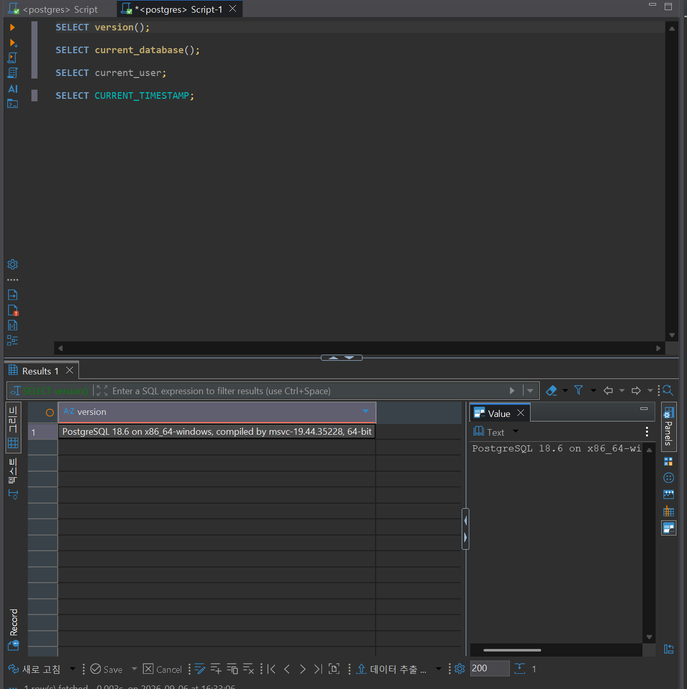
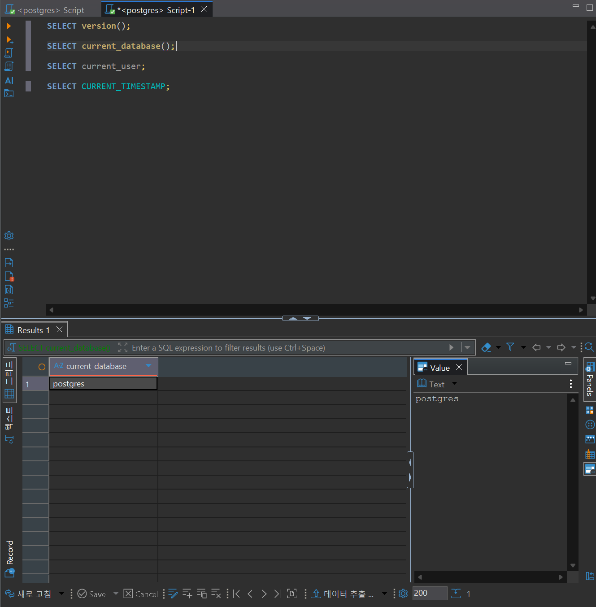
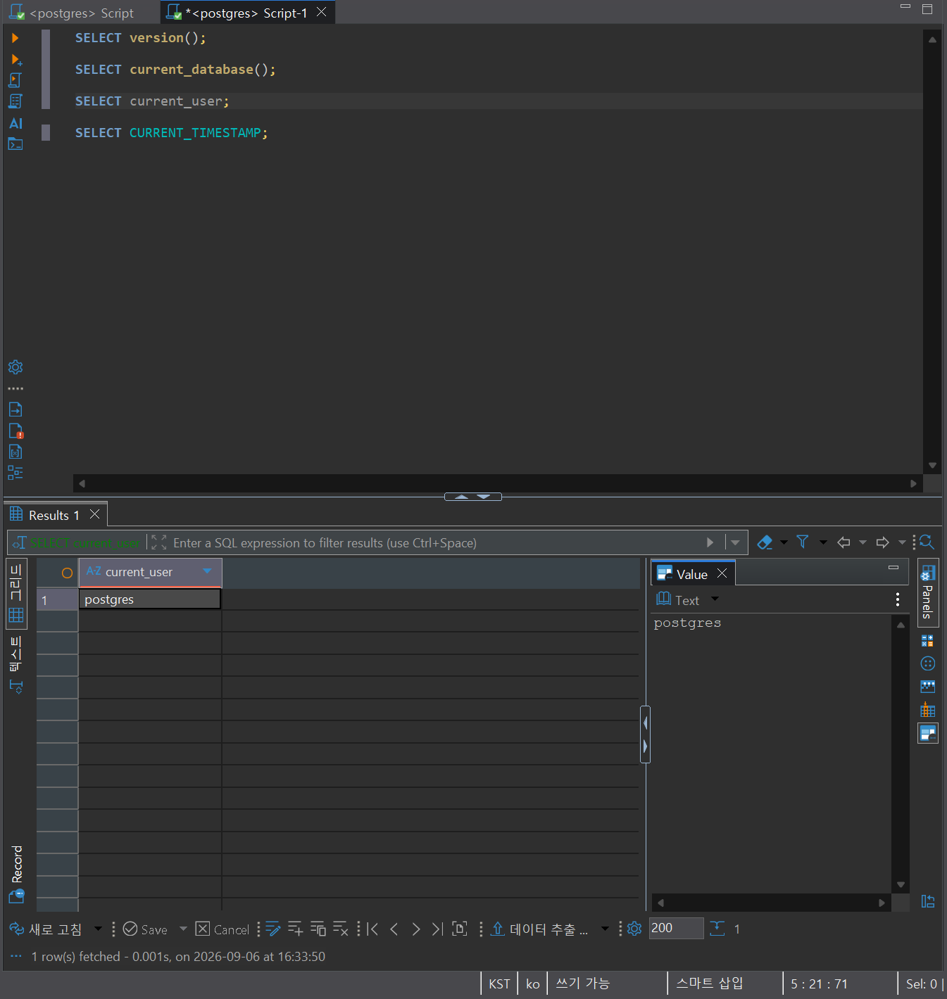
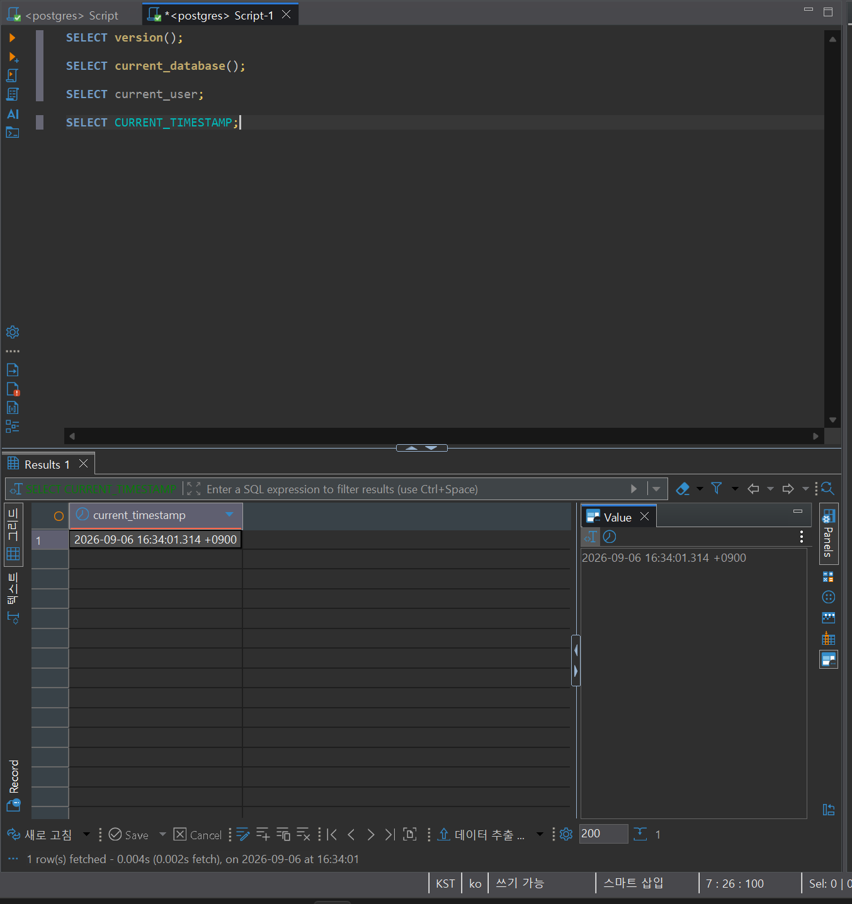
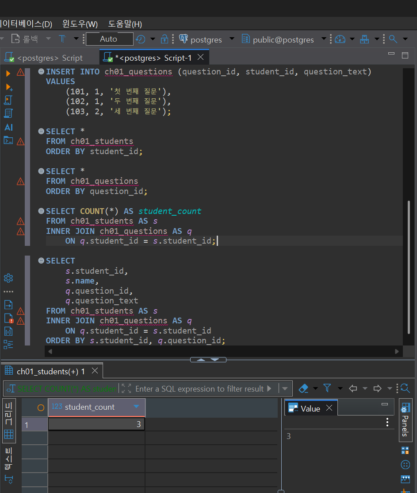
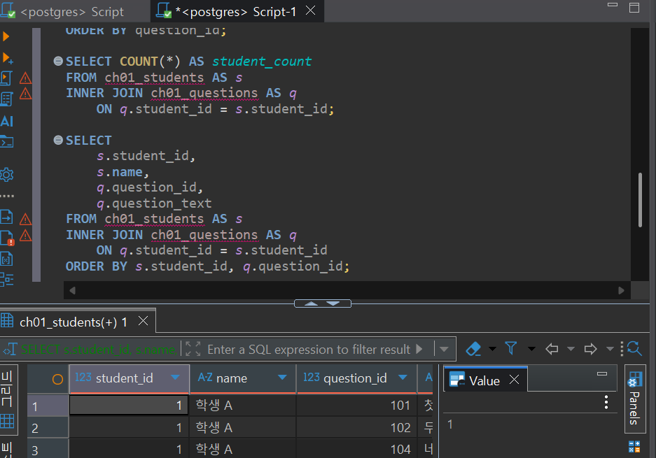
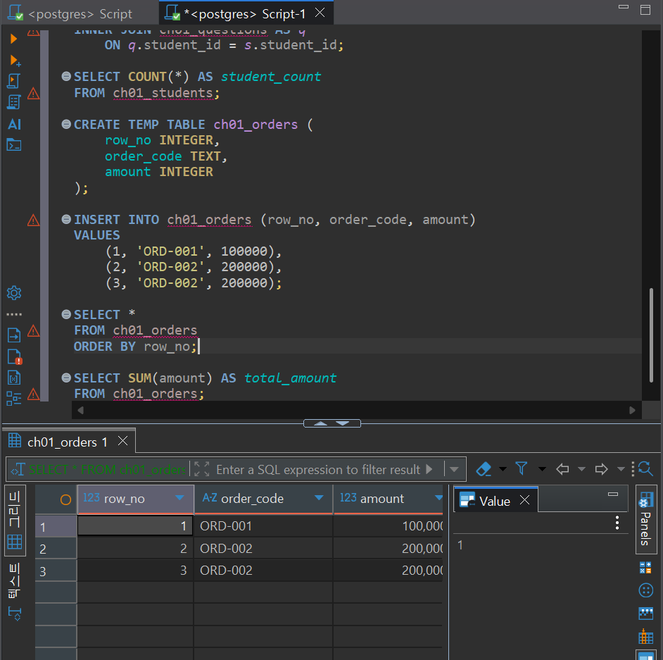
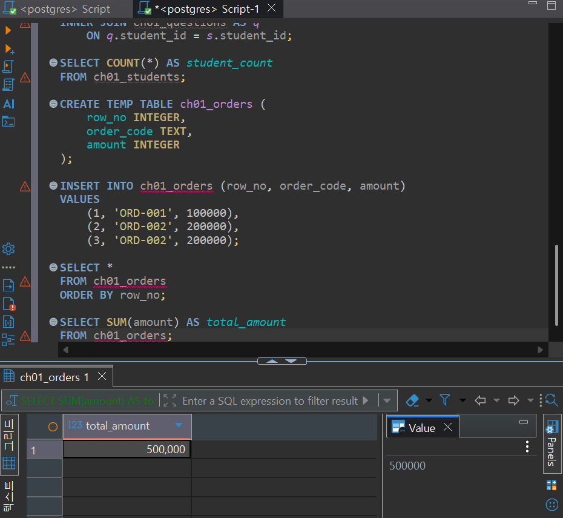
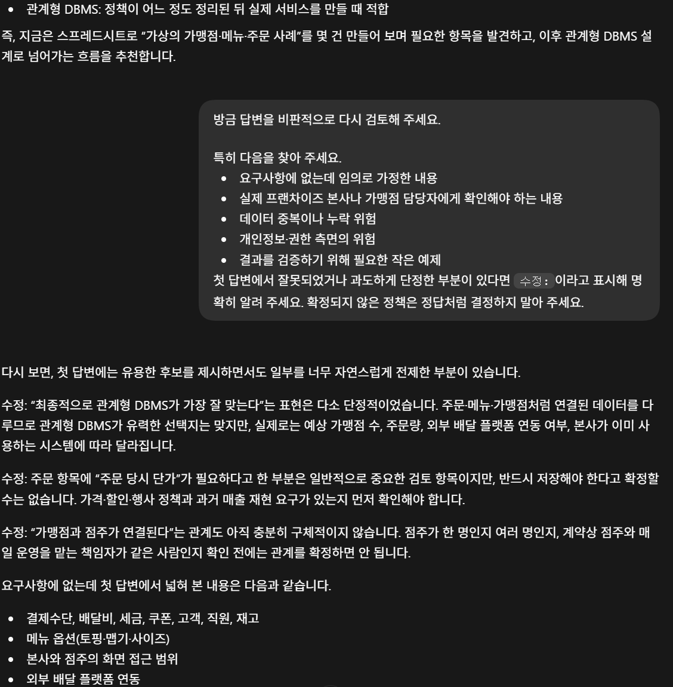

# Chapter 01 확장 실습 답안 템플릿

> **과제:** AI 시대에 데이터베이스를 왜 배워야 하는가  
> **사용 방법:** 이 파일을 내려받아 **본인의 GitHub 저장소**에 `chapter01_answer.md`라는 이름으로 저장한 뒤 답안을 작성합니다.  
> **제출 방법:** LMS에는 파일을 업로드하지 않고, **본인 GitHub 저장소의 `chapter01_answer.md` 파일 URL**을 제출합니다.

---

## 0. 학생 정보

| 항목 | 작성 내용 |
| --- | --- |
| 학번 | 2021-12964 |
| 이름 | 김경모 |
| GitHub 계정 | rudah7725 |
| 과제 작성일 | 2026-09-06 |
| 사용한 AI 도구 | ChatGPT |

> 실제 비밀번호, API Key, 전체 DB 접속 URL, 개인정보는 이 파일이나 캡처 화면에 기록하지 않습니다.

---

# 1. PostgreSQL 실행 환경 확인

## 1-1. 실행한 SQL

```sql
SELECT version();
SELECT current_database();
SELECT current_user;
SELECT CURRENT_TIMESTAMP;
```

## 1-2. 실행 결과 기록

```text
PostgreSQL 버전: PostgreSQL 18.6 on x86_64-windows, compiled by msvc-19.44.35228, 64-bit
현재 데이터베이스: postgres
현재 사용자: postgres
현재 시각: 2026-09-06 17:04:36.349 +0900
```

## 1-3. 내가 확인한 내용

1. SQL을 작성하는 프로그램과 PostgreSQL은 같은 프로그램인가요?

```text
나의 답: SQL을 작성하는 DBeaver는 SQL 작성 및 결과를 확인하는 프로그램이고, PostgreSQL은 데이터를 저장하고 SQL을 처리하는 DBMS이므로 둘은 같은 프로그램이 아니다.
```

2. `current_database()` 결과는 무엇을 의미하나요?

```text
나의 답:postgres는 현재 이 SQL 스크립트가 연결되어 있는 데이터베이스의 이름을 의미한다.
```

3. SQL이 실행되었다는 사실만으로 데이터 내용도 올바르다고 할 수 있나요?

```text
나의 답: 아니오. SQL이 실행되었다는 것은 문법이나 실행 환경에 오류가 없었다는 뜻일 뿐이며, 데이터의 중복, 누락 여부와 조회 기준이 요구사항에 맞는지는 따로 확인해야 한다.
```

## 1-4. 증거 화면

아래 경로에 캡처 이미지를 저장하는 것을 권장합니다.

```text
assignments/chapter01/images/step01_environment.png
```

이미지를 저장했다면 아래 링크의 파일명을 실제 파일명에 맞게 수정합니다.

```markdown

```

**이미지 삽입 위치:**

<!-- 아래 줄의 주석을 지우고 실제 이미지 Markdown을 넣어도 됩니다. -->









---

# 2. Chapter 01 핵심 내용 복습

교재 문장을 그대로 복사하지 말고 자신의 말로 작성합니다.

| 본문의 핵심 | 나의 설명 |
| --- | --- |
| AI가 SQL을 만들어도 DB를 배워야 한다 | AI가 SQL 초안을 만들어줄 수는 있지만, 무엇을 저장할지 정확히 정하고, 결과가 내 의도와 맞아야 하기에 사람이 직접 판단하여야 한다. |
| 데이터 구조가 중요하다 | 데이터 사이의 관계와 한 행의 의미를 잘못 정하면 중복이나 누락이 발생할 수 있다. |
| SQL 결과를 검증해야 한다 | SQL을 실행하였을 때 JOIN, 조건, 집계 기준이 틀리면 원하는 결과가 발생하지 않을 수 있다. |
| 데이터 품질이 AI 답변 품질에 영향을 준다 | 중복 또는 누락된 데이터를 AI가 분석하면 그에 따른 결과도 잘못될 수 있다. |
| 저장 방식은 데이터 양만 보고 선택하지 않는다 | 데이터 양이 적어도 여러 사람이 수정하거나 관계, 권한, 이력이 중요하면 DBMS가 더 적절할 수 있다. |

## 가장 중요하다고 생각한 한 문장

```text
SQL이 오류 없이 실행됐다는 사실보다, 그 결과가 왜 발생하였고, 무엇이 중복 또는 누락되었는지 여부를 확인하는 일이 더 중요하다.
```

---

# 3. 실행 성공과 결과 정확성의 차이

## 3-1. SQL 실행 전 예상

학생 A는 질문 2개, 학생 B는 질문 1개, 학생 C는 질문이 없습니다.

```text
전체 학생 수: 3 명
전체 질문 수: 3 개
질문이 있는 학생 수: 2 명
질문이 없는 학생 수: 1 명
```

## 3-2. 임시 테이블 생성 및 데이터 입력 완료 확인

- [X] `ch01_students` 생성
- [X] `ch01_questions` 생성
- [X] 학생 3명 입력
- [X] 질문 3건 입력
- [X] 두 테이블의 데이터를 직접 조회

## 3-3. 잘못된 학생 수 SQL 실행 결과

실행한 SQL:

```sql
SELECT COUNT(*) AS student_count
FROM ch01_students AS s
INNER JOIN ch01_questions AS q
    ON q.student_id = s.student_id;
```

실행 결과:

```text
3
```

## 3-4. JOIN 상세 결과 관찰

```text
학생 A가 나타난 행 수: 2
학생 B가 나타난 행 수: 1
학생 C가 나타난 행 수: 0
```

다음 질문에 답합니다.

### Q1. 학생 C가 왜 결과에서 사라졌나요?

```text
INNER JOIN은 두 테이블에서 student_id가 연결되는 행만 남긴다. 학생 C는 질문 테이블에 연결되는 행이 없으므로 결과에서 제외되었다.
```

### Q2. 학생 A가 왜 여러 행으로 나타났나요?

```text
학생 A는 질문을 2건 작성했다. 질문 한 건마다 학생 A의 정보와 연결된 행이 하나씩 만들어지므로 학생 A가 총 2행으로 나타났다.
```

### Q3. 위 `COUNT(*)`가 실제로 세고 있었던 것은 무엇인가요?

```text
COUNT(*)는 고유한 학생 수가 아니라 INNER JOIN 후 만들어진 학생-질문 연결 행의 수를 세고 있었다. 현재는 질문이 3건이라 결과가 3이 되었다.
```

### Q4. 결과 숫자가 우연히 실제 학생 수와 같아도 바로 믿으면 안 되는 이유는 무엇인가요?

```text
현재 데이터에서는 학생 A의 2행과 학생 B의 1행을 합친 값이 3이라 실제 학생 수와 우연히 같았다. 하지만 질문 수가 바뀌면 JOIN 결과 행 수는 달라지고 실제 학생 수는 그대로일 수 있으므로 숫자만 보고 결과가 맞다고 판단하면 안 된다.
```

## 3-5. 질문 한 건을 추가한 뒤 다시 실행

추가한 데이터:

```text
question_id가 104이고, student_id가 1인 학생 A의 '네 번째 질문'을 추가했다.
```

다시 실행한 결과:

```text
AI SQL 결과:4
실제 학생 수:3
```

### 결과 해석

```text
데이터가 바뀐 뒤 무엇이 달라졌는지:
학생 A의 질문이 한 건 추가되어 questions 테이블의 행 수와 INNER JOIN 결과 행 수가 3에서 4로 증가했다.

실제 학생 수는 왜 그대로인지:
새로운 학생을 추가한 것이 아니라 기존 학생 A의 질문만 추가했기 때문이다. students 테이블의 행 수는 계속 3명이다.

이 실험을 통해 알게 된 점:
JOIN한 뒤 COUNT(*)를 사용하면 학생 수가 아니라 연결된 행 수를 셀 수 있다. 따라서 SQL이 무엇을 세는지 확인하고 요구사항에 맞는지 검토해야 한다.
```

## 3-6. 학생 테이블을 직접 센 결과

```sql
SELECT COUNT(*) AS student_count
FROM ch01_students;
```

결과:

```text
3
```

### 두 SQL의 차이를 내 말로 설명

```text
첫 번째 SQL은 students 테이블과 questions 테이블을 INNER JOIN한 뒤 만들어진 학생-질문 연결 행의 수를 세고 있었다.

두 번째 SQL은 ch01_students 테이블에 저장된 학생 행의 수, 즉 실제 학생 수를 세고 있었다.

따라서 SQL을 검토할 때는 문법보다 먼저 이 SQL이 실제로 무엇을 세는지와 그 대상이 요구사항과 일치하는지를 확인해야 한다.
```

## 3-7. 증거 화면

권장 경로:

```text
assignments/chapter01/images/step03_join_result.png
```





---

# 4. 잘못된 데이터가 결과를 바꾸는 과정

## 4-1. 주문 데이터 확인

다음 데이터를 입력한 뒤 실제 결과를 확인합니다.

```text
ORD-001, 100000
ORD-002, 200000
ORD-002, 200000
```

## 4-2. 실행 전 예상

업무적으로 주문이 `ORD-001`, `ORD-002` 두 건이고 `order_code`가 주문을 고유하게 구분한다고 **가정할 경우** 예상 합계:

```text
300000 원
```

> 위 가정 자체가 실제 업무 규칙인지 확인해야 한다는 점도 기억합니다.

## 4-3. SQL 합계

```sql
SELECT SUM(amount) AS total_amount
FROM ch01_orders;
```

실제 결과:

```text
500000 원
```

## 4-4. 결과 해석

### `SUM` 문법 자체가 잘못된 것인가요?

```text
아니다. SUM은 ch01_orders 테이블에 실제로 저장된 세 행의 amount를 정확하게 모두 더했다.
```

### 결과 차이의 원인은 무엇인가요?

```text
order_code가 ORD-002인 행이 두 번 저장되어 같은 주문 금액 200000원이 중복으로 합계에 포함되었기 때문이다. 단, 실제 업무에서 두 행이 정말 중복 입력인지 먼저 확인해야 한다.
```

### SQL이 정확하게 실행되어도 업무 숫자가 잘못될 수 있는 이유를 설명하세요.

```text
SQL은 저장된 데이터를 기준으로 계산할 뿐, 어떤 행이 중복 입력인지 또는 업무적으로 유효한 주문인지 자동으로 판단하지 못한다. 따라서 데이터 품질이나 업무 규칙이 잘못되면 SQL이 정상 실행되어도 잘못된 업무 숫자가 나올 수 있다.
```

## 4-5. AI에게 같은 데이터를 분석시킨 결과

AI가 계산한 합계:

```text
500000원
```

AI가 중복 가능성을 언급했나요?

```text
언급했다. ORD-002가 동일한 주문 코드와 금액으로 두 번 나타나므로 중복 입력일 가능성이 있다고 판단했다.
```

AI가 `ORD-002` 두 행이 실제 두 주문인지 중복 입력인지 스스로 확정할 수 있나요? 이유도 적으세요.

```text
확정할 수 없다. 주문 코드가 업무적으로 고유한 값인지, 주문 시간·결제 번호·취소 여부 등이 무엇인지 데이터만으로는 알 수 없기 때문이다.
```

추가로 확인해야 할 업무 규칙:

```text
1. order_code는 주문 한 건을 고유하게 식별하는 값인가?
2. 동일한 order_code가 여러 번 저장될 수 있는 업무 상황이 있는가?
3. 취소·환불·재결제 기록은 주문 합계에 어떻게 반영해야 하는가?
```

내가 최종적으로 내린 판단:

```text
order_code가 주문을 고유하게 구분한다는 가정이 맞다면 두 번째 ORD-002 행은 중복 입력일 가능성이 높고, 정상 주문 합계는 300000원이다. 다만 원본 주문 기록을 확인하기 전에는 해당 행을 바로 삭제하면 안 된다.
```

## 4-6. 증거 화면

권장 경로:

```text
assignments/chapter01/images/step04_duplicate_result.png
```




---

# 5. 파일·스프레드시트·DBMS 선택 연습

각 사례에 대해 **AI에게 묻기 전에 먼저 본인의 판단을 작성**합니다.

## 사례 A. 개인 독서 기록

```text
나의 선택:스프레드시트
선택 이유:사람 한명이 혼자서 사용하고 한달에 추가되는 독서 기록도 많지 않으며, 단순한 정보를 표로 정리하면 충분할 것 같다.
어떤 조건이 추가되면 다른 방식으로 바꿀 것인지:여러 사람이 함께 기록하거나 도서 대여 기록 등 사람과 책의 관계를 정리해야한다면 DBMS를 고려할 것이다.
```

## 사례 B. 동아리 행사 신청 명단

```text
나의 선택:스프레드시트
선택 이유:운영 기간이 짧고 운영진 2~3명이 이름, 연락처, 참석 여부를 함께 관리하며 참석률도 간단히 계산할 수 있다. 
어떤 조건이 추가되면 다른 방식으로 바꿀 것인지:행사가 반복되고 참가자 이력, 결제, 개인정보 접근 권한, 동시 수정 등의 문제가 중요해지면 DBMS로 관리하는 것이 적절할 것이다.
```

## 사례 C. 온라인 강의 서비스

```text
나의 선택:DBMS
선택 이유:학생, 강사, 강의, 수강신청 사이의 관계가 있고, 신청 상태와 신청 당시 금액을 정확하게 보존해야 한다. 여러 사용자가 동시에 이용하고 월별 신청 건수도 반복해서 조회하므로 DBMS가 적절할 것이다.
어떤 조건이 추가되면 다른 방식으로 바꿀 것인지:단순히 강의 목록 몇 개를 한 사람이 관리하고 수강신청이나 사용자 계정이 없다면 파일이나 스프레드시트로도 가능할 것이다. 
```

## 판단 기준 체크

- [X] 여러 사용자의 동시 수정
- [X] 데이터 사이의 관계
- [X] 반복 조회와 집계
- [X] 정확성·일관성
- [X] 변경 이력
- [X] 권한 구분
- [X] 백업·복구
- [X] 웹·앱에서 지속 사용

### 데이터가 적으면 무조건 스프레드시트를 사용해야 하나요?

```text
나의 답: 아니다. 데이터가 적더라도 여러 사람이 동시에 수정하거나, 데이터 관계, 정확성, 권한, 변경 이력이 중요하면 DBMS가 더 적합할 수 있다.
```

---

# 6. 나만의 서비스 데이터 구조 초안

> 이 내용은 이후 Chapter에서 계속 확장할 수 있으므로 신중하게 작성합니다.

## 6-1. 서비스 정의

```text
서비스 이름:외식업 가맹점 운영 관리 서비스

이 서비스는 프랜차이즈 본사와 가맹점주가 가맹점, 메뉴, 주문과 매출 정보를 체계적으로 관리하고 운영 의사결정을 지원하기 위한 서비스이다.
```

## 6-2. 관리할 데이터 후보

```text
1. 가맹점
2. 가맹점주
3. 메뉴
4. 주문
5. 주문 항목
```

## 6-3. 한 행의 의미

| 데이터 후보 | 한 행의 의미 |
| --- | --- |
| 가맹점 | 특정 주소에서 운영되는 가맹점 한 곳 |
| 가맹점주 | 가맹점을 운영하거나 관리하는 한 명의 사업자 또는 담당자 |
| 메뉴 | 메뉴명, 기본 가격, 분류 등을 가진 메뉴 한 개 |
| 주문 | 특정 가맹점에서 특정 시각에 발생한 주문 한 건 |
| 주문 항목 | 한 주문에 포함된 메뉴 한 종류와 수량 한 건 |

## 6-4. 관계를 자연어로 설명

```text
1. 각 가맹점에는 운영 책임자인 가맹점주가 연결된다.
2. 한 가맹점에서는 여러 주문이 발생할 수 있지만, 하나의 주문은 한 가맹점에서 발생한다.
3. 하나의 주문에는 여러 주문 항목이 포함될 수 있고, 각 주문 항목은 하나의 메뉴를 가리킨다.
4. 하나의 메뉴는 여러 주문 항목에 포함될 수 있으며 여러 가맹점에서 판매될 수 있다.
```

## 6-5. 아직 결정하지 않은 정책

```text
Q1. 한 명의 가맹점주가 여러 가맹점을 동시에 운영할 수 있는가? 
Q2. 메뉴 가격은 모든 가맹점에서 동일해야 하는가, 아니면 가맹점·배달 채널·행사에 따라 달라질 수 있는가? 
Q3. 취소·환불된 주문은 매출 통계에 포함할 것인가, 별도로 기록할 것인가?
```

> 확정되지 않은 정책을 AI가 임의로 결정한 경우 그대로 받아들이지 않습니다.

---

# 7. AI를 검토자로 활용하기

## 7-1. 내가 AI에게 전달한 핵심 프롬프트

개인정보나 비밀번호 등 민감한 내용은 제거한 뒤 기록합니다.

```text
나는 데이터베이스를 처음 배우는 학생입니다. 
아직 ERD나 정규화를 배우기 전입니다.
내가 생각한 서비스는 다음과 같습니다.
서비스: 외식업 가맹점 운영 관리 서비스
목적: 프랜차이즈 본사와 가맹점주가 가맹점, 메뉴, 주문과 매출 정보를 체계적으로 관리하고 운영 의사결정을 지원하기 위한 서비스입니다.
관리할 데이터 후보:
- 가맹점
- 가맹점주
- 메뉴
- 주문
- 주문 항목
내가 생각한 관계:
- 각 가맹점에는 운영 책임자인 가맹점주가 연결됩니다.
- 한 가맹점에서는 여러 주문이 발생하지만, 하나의 주문은 한 가맹점에서 발생합니다.
- 하나의 주문에는 여러 주문 항목이 포함될 수 있고, 각 주문 항목은 하나의 메뉴를 가리킵니다.
- 하나의 메뉴는 여러 주문 항목에 포함될 수 있으며 여러 가맹점에서 판매될 수 있습니다.
아직 결정하지 못한 정책:
- 한 명의 가맹점주가 여러 가맹점을 동시에 운영할 수 있는가?
- 메뉴 가격은 모든 가맹점에서 동일해야 하는가, 아니면 가맹점·배달 채널·행사에 따라 달라질 수 있는가?
- 취소·환불된 주문은 매출 통계에 포함할 것인가, 별도로 기록할 것인가?
지금 단계에서는 완성된 SQL을 만들지 말고,
1. 내가 놓친 데이터가 있는지
2. 서로 다른 의미의 데이터를 한 항목으로 섞은 것은 없는지
3. 추가로 확인해야 할 업무 질문은 무엇인지
4. 파일·스프레드시트·관계형 DBMS 중 무엇이 적합해 보이는지
초보자가 이해할 수 있게 검토해 주세요.
확정되지 않은 정책은 임의로 정답처럼 결정하지 마세요.
```

## 7-2. AI의 주요 제안과 나의 판단

최소 5개를 작성합니다.

| AI의 제안 | 수용 / 수정 / 거절 | 나의 판단 근거 |
| --- | --- | --- |
| 주문 항목에 주문 당시 단가와 수량을 기록한다. | 수용 | 메뉴의 현재 가격이 나중에 변경되어도 과거 주문과 매출을 정확히 확인하려면 주문 당시 단가와 수량을 별도로 보존할 필요가 있다. |
| 주문 상태와 결제 상태를 관리한다. | 수용 | 접수·완료·취소·환불 같은 상태에 따라 매출 집계 결과가 달라질 수 있으므로 주문 상태를 관리해야 한다. 결제 완료 여부도 주문 상태와 의미가 다를 수 있다. |
| 메뉴 기본 가격, 가맹점별 판매 가격, 주문 당시 실제 결제 단가를 구분한다. | 수정 | 세 가격의 의미가 다르다는 설명은 타당하다. 다만 지금 단계에서 가맹점별 가격과 행사 가격을 모두 확정하기보다, 먼저 메뉴 기본 가격과 주문 당시 단가를 관리하고 가격 정책은 추가 확인이 필요하다. |
| 법적 가맹점주와 실제 운영 책임자를 분리해 관리한다. | 수정 | 두 역할이 다를 수 있다는 점은 확인할 필요가 있다. 하지만 실제 프랜차이즈 운영 방식에서 두 사람이 항상 다른지 알 수 없으므로, 별도 데이터로 분리할지는 업무 담당자에게 확인한 뒤 결정하는 것으로 한다. |
| 직원, 재고, 고객 정보를 추가로 관리한다. | 거절 | 향후 확장 가능한 데이터이지만, 현재 서비스의 핵심 범위는 가맹점·메뉴·주문·매출 관리이다. 처음부터 범위를 넓히면 설계가 복잡해지므로 필요성이 확인된 뒤 추가하도록 한다. |
| 최종 운영 시스템으로 관계형 DBMS를 사용하고, 초기 연습에는 파일·스프레드시트를 사용한다. | 수용 | 가맹점·주문·주문 항목·메뉴 사이의 관계, 반복 집계, 권한 관리가 중요하므로 실제 운영에는 관계형 DBMS가 적합하다. 파일과 스프레드시트는 요구사항과 예시 데이터를 정리하는 보조 도구로 활용할 수 있다. |

## 7-3. AI에게 자기 답변을 다시 비판하도록 요청한 결과

첫 번째 답변과 달라진 점:

```text
첫 번째 답변은 관계형 DBMS와 주문 당시 단가 관리가 필요하다는 점을 비교적 강하게 제안했다. 두 번째 답변은 가맹점 수, 주문량, 외부 배달 플랫폼 연동 여부, 과거 매출 재현 요구사항에 따라 판단이 달라질 수 있다고 수정했다. 또한 가맹점주와 운영 책임자의 관계도 확정하면 안 된다고 설명했다.
```

AI가 처음에 임의로 가정했던 내용:

```text
- 관계형 DBMS가 최종적으로 가장 적합하다고 비교적 단정한 점 
- 주문 항목에 주문 당시 단가를 반드시 저장해야 한다고 본 점 
- 가맹점과 가맹점주가 하나씩 연결된다고 해석할 수 있었던 점 
- 결제수단, 고객, 직원, 재고, 외부 배달 플랫폼 연동 등이 현재 서비스에 필요할 수 있다고 넓게 제안한 점
```

추가로 업무 담당자에게 확인해야 한다고 판단한 내용:

```text
- 가맹점주는 계약 당사자를 뜻하는지, 실제 매장 운영자를 뜻하는지 
- 한 명의 점주가 여러 매장을 운영하거나 한 매장에 공동 점주가 있을 수 있는지 
- 본사 공통 메뉴 외에 가맹점별 메뉴가 가능한지 
- 메뉴 가격이 가맹점·주문 채널·행사 기간에 따라 달라지는지 
- 주문을 서비스에서 직접 생성하는지, 외부 주문 시스템에서 받아오는지 
- 취소·환불을 삭제로 처리하는지, 상태와 금액 변경 이력으로 남기는지 
- 본사와 가맹점주의 조회·수정 권한을 어떻게 구분할지
```

## 7-4. AI 활용에 대한 나의 평가

```text
가장 유용했던 부분: 내가 처음에 생각하지 못했던 주문 상태, 주문 당시 가격, 매출 기준, 데이터 중복·누락 위험, 권한 문제를 질문 형태로 정리해 준 점이 유용했다.

수정하거나 거절한 부분: 가맹점주와 운영 책임자를 바로 분리해야 한다는 제안은 수정했다. 고객·직원·재고 데이터를 지금부터 모두 관리하자는 방향은 현재 서비스 범위를 넘는다고 판단해 거절했다.

그렇게 판단한 근거: AI가 제시한 항목 중 일부는 실제 업무 규칙이 확인되지 않은 상태였다. 요구사항에 없는 정책을 미리 확정하면 불필요하게 복잡한 구조가 될 수 있으므로, 담당자 확인 후 결정해야 한다.

AI가 없었다면 놓쳤을 가능성이 있는 질문: 메뉴 기본 가격·가맹점 판매 가격·주문 당시 실제 가격의 차이, 취소·환불이 매출 통계에 미치는 영향, 본사와 가맹점주의 권한 분리, 주문 데이터 중복 위험을 놓쳤을 가능성이 있다.
```

## 7-5. AI 활용 증거 화면

권장 경로:

```text
assignments/chapter01/images/step07_ai_review.png
```

AI 대화 전체를 캡처할 필요는 없습니다. 핵심 요청과 검토 과정이 보이는 화면 1장 정도면 충분합니다.


---

# 8. 기준 데이터·파생 데이터·AI 생성 결과 구분

내 서비스에 맞게 작성합니다.

| 구분 | 내 서비스의 예 | 판단 이유 |
| --- | --- | --- |
| 기준 데이터 | 가맹점에서 실제로 발생한 주문 기록과 주문 항목, 주문 상태 | 주문과 매출이 발생한 원본 업무 기록이며 매출과 판매량을 판단하는 기준이 된다. |
| 파생 데이터 | 가맹점별 월간 매출, 메뉴별 판매 수량, 월별 주문 건수 | 기준 데이터인 주문 기록을 합계·집계하여 만든 결과이므로 다시 계산할 수 있다. |
| AI 생성 결과 | AI가 작성한 가맹점별 인기 메뉴 분석과 매출 개선 제안 | AI의 분석은 입력한 주문 데이터와 프롬프트에 따라 달라지며 원본 업무 기록 자체는 아니다. |

### 기준 데이터가 변경되면 파생 데이터는 어떻게 해야 하나요?

```text
기준 주문 데이터가 수정되거나 취소·환불 상태가 바뀌면 관련된 매출, 판매 수량, 월별 집계도 다시 계산하거나 최신 값으로 갱신해야 한다. 그렇지 않으면 원본 데이터와 통계 결과가 서로 달라질 수 있다.
```

### AI 결과만 있고 원본 데이터가 없다면 결과를 충분히 검증할 수 있나요?

```text
충분히 검증할 수 없다. AI가 어떤 주문 데이터와 기준을 사용했는지 확인할 수 없고, 계산 과정과 입력값이 맞는지 비교할 원본이 없기 때문이다.
```

---

# 9. 최종 성찰

아래 세 문장은 반드시 **본인의 말**로 작성합니다.

```text
1. SQL이 실행되어도 결과를 바로 믿으면 안 되는 이유는
   SQL은 저장된 데이터와 지정한 JOIN, 조건, 집계 기준에 따라 정상적으로 실행 될 수 있지만, 기준이 요구사항과 다를 경우 잘못된 결과가 나올 수 있기 때문이다.

2. AI를 데이터베이스 학습에 활용할 때 가장 중요한 것은
   AI의 제안을 그대로 정답으로 받아들이지 않고, 실제 데이터, 업무 규칙, 예상되는 결과와 비교하여 수용, 수정 또는 거절할 근거를 확인하는 것이다.

3. 이번 실습 이후 내가 더 확인하고 싶은 것은
   가맹점별 메뉴 가격, 취소 환불 처리, 주문 상태와 매출 집계 기준을 데이터베이스 구조와 제약조건으로 어떻게 관리하는지이다.
```

## 이번 Chapter에서 새롭게 알게 된 점 3가지

```text
1. INNER JOIN 뒤 COUNT(*)는 실제 학생 수가 아니라 연결된 행 수를 셀 수 있으며, 결과 숫자가 우연히 같아도 의미는 다를 수 있다.
2. 중복된 주문 데이터가 있으면 SUM 문법이 정상이어도 실제 업무에서 원하는 매출과 다른 값이 나올 수 있다.
3. AI는 데이터 구조와 정책을 검토하는 데 도움을 주지만, 가맹점주 관계·가격 정책·취소 처리 같은 업무 규칙을 스스로 확정할 수는 없다.
```

## 아직 이해가 명확하지 않은 부분

```text
1. 질문이 없는 학생까지 포함하여 집계하는 방법
2. 실제 서비스에서 여러 조건을 설정해 중복 주문이나 잘못된 데이터를 막는 방법
```

---

# 10. 제출 전 자기 점검

- [X] PostgreSQL 실행 화면을 확인했다.
- [X] SQL 실행 전에 예상 결과를 먼저 작성했다.
- [X] `INNER JOIN` 예제에서 누락과 반복을 설명할 수 있다.
- [X] 숫자가 우연히 같아도 의미가 다를 수 있음을 설명했다.
- [X] 중복 데이터가 집계 결과에 미치는 영향을 확인했다.
- [X] 저장 방식을 데이터 양만으로 판단하지 않았다.
- [X] 개인 서비스 주제를 하나 정했다.
- [X] 데이터 후보와 한 행의 의미를 작성했다.
- [X] 미확정 정책을 최소 3개 작성했다.
- [X] AI 제안을 수용·수정·거절로 구분했다.
- [X] AI 제안에 대한 판단 근거를 작성했다.
- [X] 기준 데이터·파생 데이터·AI 결과를 구분했다.
- [X] 핵심 증거 이미지가 Markdown에서 정상적으로 보인다.
- [X] 비밀번호·API Key·개인정보가 노출되지 않았다.

---

# 11. LMS 제출 정보

## 내 GitHub 답안 파일 URL

아래에는 **교수자 템플릿 URL이 아니라 본인이 작성한 답안 파일의 GitHub URL**을 기록합니다.

```text
https://github.com/rudah7725/database-course-2026-2/blob/main/assignments/chapter01/chapter01_answer.md
```

내 실제 제출 URL:

```text
https://github.com/rudah7725/database-course-2026-2/blob/main/assignments/chapter01/chapter01_answer.md
```

> LMS에는 위 **본인 저장소의 `chapter01_answer.md` 파일 URL 하나**를 제출합니다.

---

## 권장 학생 저장소 구조

```text
<본인-저장소>/
└── assignments/
    └── chapter01/
        ├── chapter01_answer.md
        └── images/
            ├── step01_environment.png
            ├── step03_join_result.png
            ├── step04_duplicate_result.png
            └── step07_ai_review.png
```

이 구조를 사용하면 이후 Chapter 02, Chapter 03도 같은 방식으로 계속 추가할 수 있습니다.
