# Chapter 02 확장 실습 답안 템플릿

> **과제:** 데이터와 DBMS의 기본 개념  
> **사용 방법:** 이 파일을 내려받아 본인의 GitHub 저장소에 `chapter02_answer.md`라는 이름으로 저장한 뒤 실습하면서 바로 작성합니다.  
> **제출 방법:** LMS에는 파일을 직접 업로드하지 않고, **본인 GitHub 저장소의 `chapter02_answer.md` 파일 URL**을 제출합니다.

---

## 제출 전 개인정보 주의

LMS에서 제출자를 확인할 수 있으므로 이 공개 Markdown 파일에 학번이나 실명을 반드시 적을 필요는 없습니다.

```text
GitHub 계정 또는 별칭: rudah7725
과제 작성일: 2026-09-10
사용한 AI 도구: ChatGPT
```

> 실제 비밀번호, API Key, 전체 DB 접속 URL, 개인정보가 포함된 화면은 올리지 않습니다.

---

# 1. PostgreSQL에서 현재 위치 확인

## 1-1. 실행한 SQL

```sql
SELECT version();
SELECT current_database();
SELECT current_user;
SELECT current_schema();
SHOW search_path;
```

## 1-2. 실행 결과 기록

```text
PostgreSQL 버전: PostgreSQL 18.6 on x86_64-windows, compiled by msvc-19.44.35228, 64-bit
현재 데이터베이스: postgres
현재 사용자: postgres
현재 스키마: public
search_path: public, "$user"
```

## 1-3. 구조를 내 말로 설명

```text
PostgreSQL은: 데이터를 저장하고 관리하며 사용자가 전달한 SQL을 처리하는 DBMS이다.

현재 접속한 데이터베이스는: postgres이다. 현재 실행하는 SQL은 이 데이터베이스를 대상으로 한다.

스키마는: 데이터베이스 안에서 객체를 이름과 용도에 따라 구분해 관리하는 공간이다. 현재 사용 중인 스키마는 public이다.

DBeaver 또는 psql 같은 도구는: PostgreSQL에 접속하여 SQL을 전달하고 실행 결과를 보여 주는 클라이언트 도구이다.
```

## 1-4. 계층 구조 완성

```text
사용자
→ DBeaver 또는 psql과 같은 클라이언트
→ PostgreSQL DBMS
→ postgres 데이터베이스
→ public 스키마
→ 테이블
→ 행 / 열
```

## 1-5. 증거 화면

권장 경로:

```text
assignments/chapter02/images/step01_environment.png
```

```markdown

```

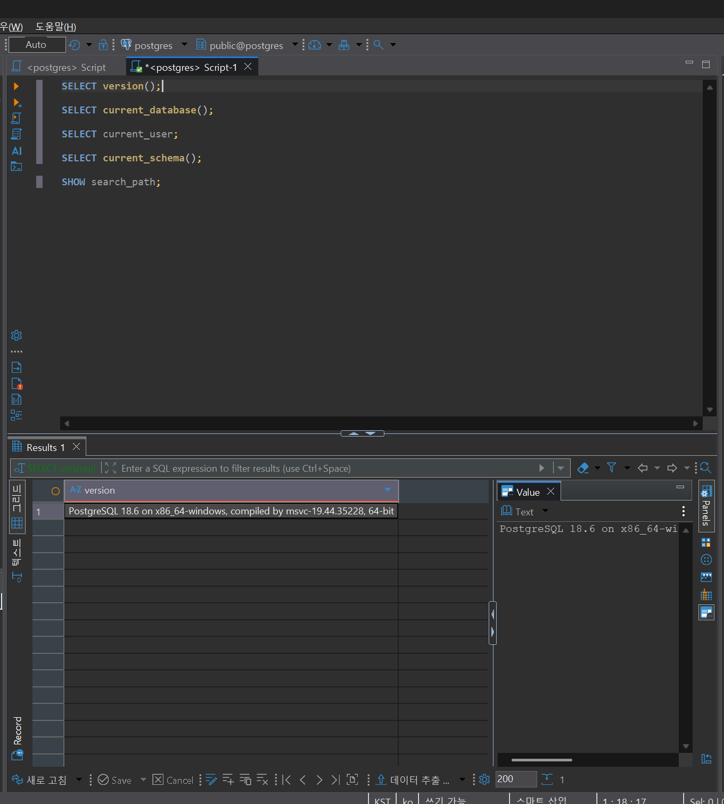

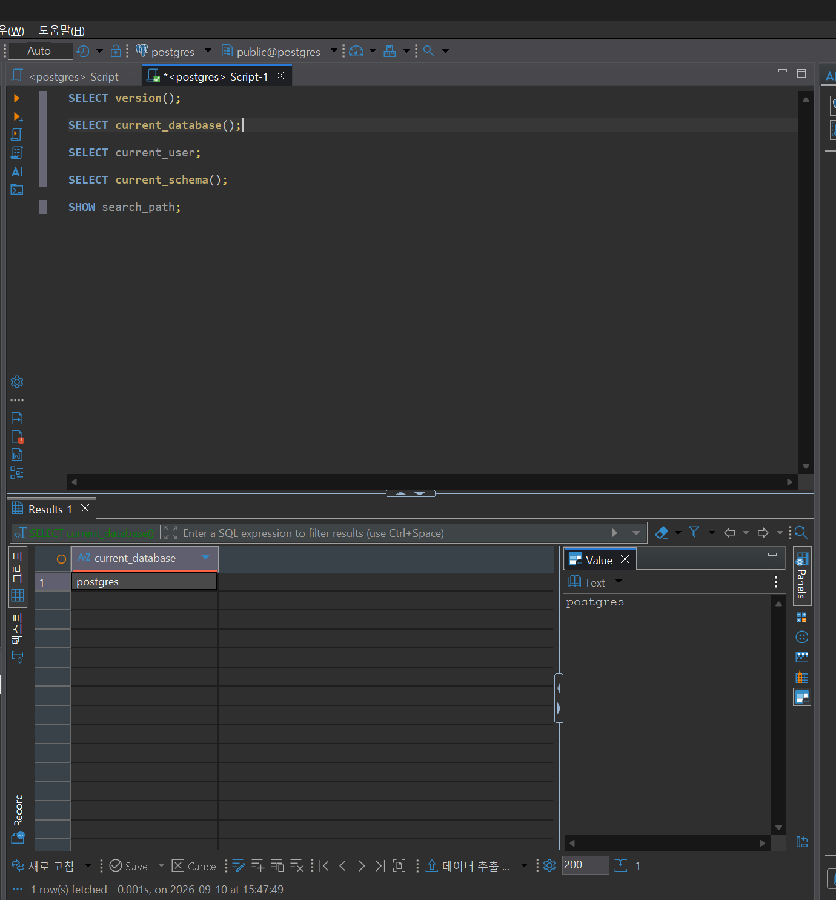

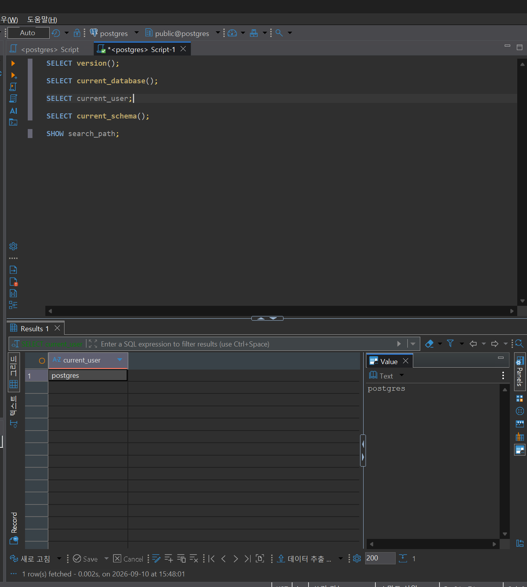

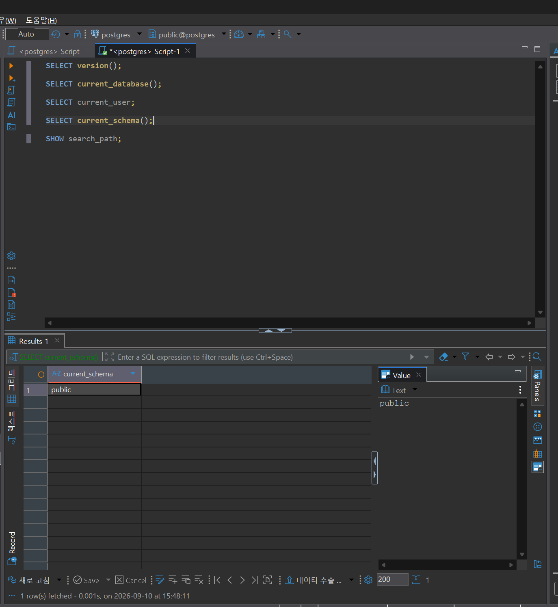

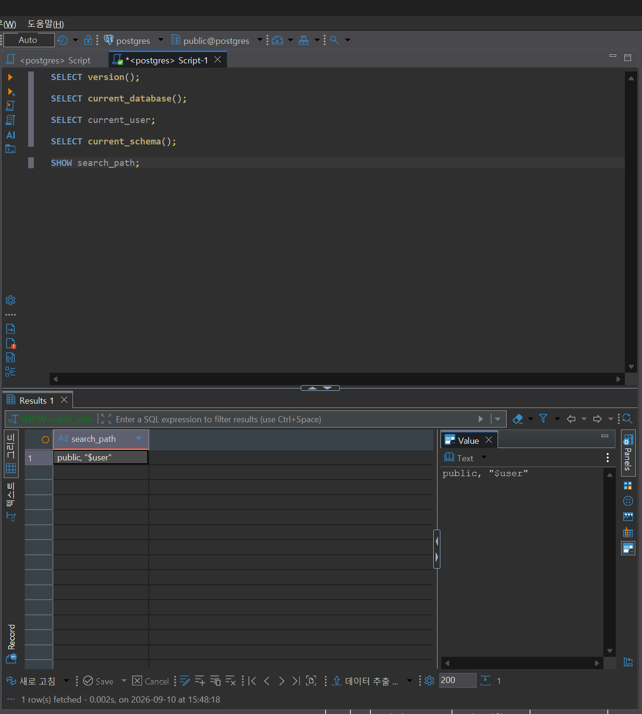

---

# 2. 데이터베이스 안의 스키마와 테이블 관찰

## 2-1. 스키마 조회 결과

실행한 SQL:

```sql
SELECT schema_name
FROM information_schema.schemata
ORDER BY schema_name;
```

관찰한 스키마 이름 중 3개 이내를 적습니다.

```text
1. information_schema
2. practice
3. public
```

### `public`은 무엇인가요?

```text
나의 설명: public은 PostgreSQL 데이터베이스 안에 기본적으로 제공되는 스키마이다. SQL에서 스키마 이름을 따로 지정하지 않으면 객체가 public 스키마에 생성되거나 조회될 수 있다.
```

### 데이터베이스와 스키마는 같은 것인가요?

```text
나의 설명: 아니다. 데이터베이스는 여러 데이터와 객체를 포함하는 상위 공간이고, 스키마는 하나의 데이터베이스 안에서 테이블 등의 객체를 구분하고 정리하는 하위 공간이다.
```

## 2-2. 현재 보이는 테이블 조회

```sql
SELECT table_schema, table_name
FROM information_schema.tables
WHERE table_type = 'BASE TABLE'
  AND table_schema NOT IN ('pg_catalog', 'information_schema')
ORDER BY table_schema, table_name;
```

```text
조회된 사용자 테이블 수 또는 눈에 띈 테이블: 사용자 테이블은 1개이며, practice 스키마의 members 테이블이 조회되었다.

아직 테이블이 거의 없어도 괜찮은 이유: 현재 데이터베이스에 사용자가 직접 만든 일반 테이블만 조회되기 때문이다. 필요한 테이블은 이후 실습에서 새로 만들 수 있으므로 테이블이 적게 조회되어도 실행 오류는 아니다.
```

## 2-3. 관찰 정리

```text
PostgreSQL 서버 안에는 여러 데이터베이스가 있을 수 있다.
한 데이터베이스 안에는 여러 스키마가 있을 수 있다.
스키마 안에는 테이블과 같은 데이터베이스 객체가 존재한다.
```

---

# 3. TEMP TABLE로 테이블·행·열·키 직접 확인

## 3-1. 임시 테이블 생성 완료 확인

- [X] `ch02_students` 생성
- [X] `ch02_courses` 생성
- [X] `ch02_enrollments` 생성

각 테이블의 **한 행 의미**를 적습니다.

| 테이블 | 한 행의 의미 |
| --- | --- |
| `ch02_students` | 학생 한 명 |
| `ch02_courses` | 개설된 강의 한 개 |
| `ch02_enrollments` | 한 학생이 한 강의를 신청한 수강신청 한 건 |

## 3-2. 열의 의미 확인

### `ch02_students`

| 열 | 값의 의미 | 내부 식별자 / 업무 식별자 / 일반 속성 |
| --- | --- | --- |
| `id` | 데이터베이스 내부에서 학생 행을 구분하는 번호 | 내부 식별자 |
| `student_number` | 학교 업무에서 학생을 식별하는 학번 | 업무 식별자 |
| `name` | 학생의 이름 | 일반 속성 |
| `major` | 학생의 전공 | 일반 속성 |

### `ch02_enrollments`

| 열 | 값의 의미 | PK / FK / 일반 속성 |
| --- | --- | --- |
| `id` | 수강신청 한 건을 고유하게 구분하는 번호 | PK |
| `student_id` | 수강신청한 학생을 참조하는 값 | FK |
| `course_id` | 신청한 강의를 참조하는 값 | FK |
| `status` | 신청, 수강 중, 완료 등의 현재 상태 | 일반 속성 |

## 3-3. 입력된 행 수

```text
students 행 수: 3
courses 행 수: 2
enrollments 행 수: 3
```

## 3-4. 내부 식별자와 업무 식별자

```text
students.id가 필요한 이유: 데이터베이스 내부에서 각 학생 행을 안정적이고 고유하게 구분하고, 다른 테이블에서 해당 학생을 참조하기 위해 필요하다.

student_number가 필요한 이유: 학교의 실제 업무에서 학생을 구분하고 학적 정보를 확인하기 위해 필요하다.

둘을 항상 같은 값으로 사용하지 않아도 되는 이유: 두 값의 사용 목적과 변경 가능성이 다르기 때문이다. 학번의 형식이나 업무 정책이 변경되더라도 내부 id는 그대로 유지하여 테이블 간 관계를 안정적으로 보존할 수 있다.
```

## 3-5. 숫자처럼 보이는 학번을 문자열로 저장한 이유

```text
나의 설명: 학번은 더하거나 계산하기 위한 숫자가 아니라 학생을 구분하는 식별값이기 때문이다. 문자열로 저장하면 앞자리의 0을 보존할 수 있고, 하이픈이나 문자 등이 포함되는 형식으로 바뀌어도 대응하기 쉽다.
```

---

# 4. 테이블과 조회 결과는 다르다

## 4-1. 원본 테이블 행 수

```text
ch02_students 전체 행 수: 3
```

## 4-2. 일부 열만 조회

실행 SQL:

```sql
SELECT name, major
FROM ch02_students
ORDER BY id;
```

```text
원본 테이블의 열 수와 조회 결과의 열 수가 다른 이유: 원본 ch02_students 테이블에는 id, student_number, name, major의 열 4개가 있지만, SELECT 문에서 name과 major만 지정했기 때문에 조회 결과에는 열 2개만 나타났다. 
```

## 4-3. 조건을 적용한 조회

실행 SQL:

```sql
SELECT id, student_number, name, major
FROM ch02_students
WHERE major = '컴퓨터공학'
ORDER BY id;
```

```text
원본 테이블 행 수: 3
조회 결과 행 수: 1
원본 테이블의 데이터가 삭제된 것인가?: 아니다.
그렇게 판단한 이유: WHERE 조건은 원본 테이블에서 조건에 맞는 행만 조회 결과에 보여 줄 뿐이다. major가 컴퓨터공학인 김민지 학생만 표시되었지만, 원본 테이블에는 학생 3명의 데이터가 그대로 저장되어 있다.
```

## 4-4. 정렬 결과 비교

```sql
SELECT id, name
FROM ch02_students
ORDER BY name ASC;

SELECT id, name
FROM ch02_students
ORDER BY name DESC;
```

```text
ASC 결과의 첫 학생: 김민지
DESC 결과의 첫 학생: 이준호

이 실험을 통해 ORDER BY에 대해 알게 된 점: ORDER BY에서 ASC를 사용하면 이름이 오름차순으로 정렬되고, DESC를 사용하면 그 반대 순서로 정렬된다. 또한 ORDER BY를 명시하지 않은 조회 결과의 행 순서는 항상 보장된다고 가정하면 안 된다.
```

## 4-5. 증거 화면

권장 경로:

```text
assignments/chapter02/images/step04_result_set.png
```

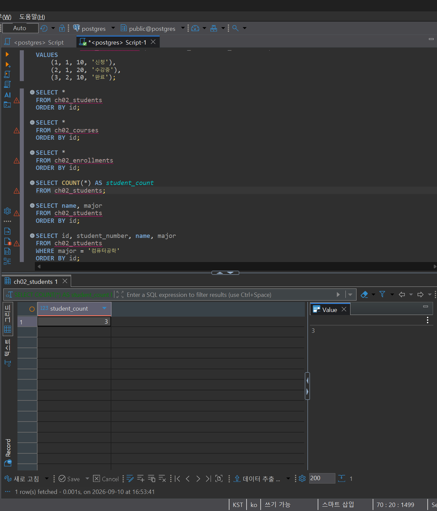

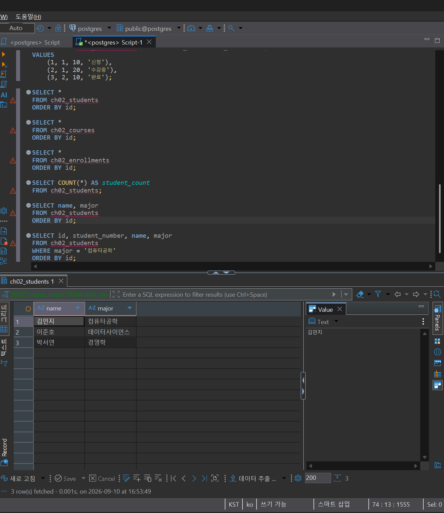

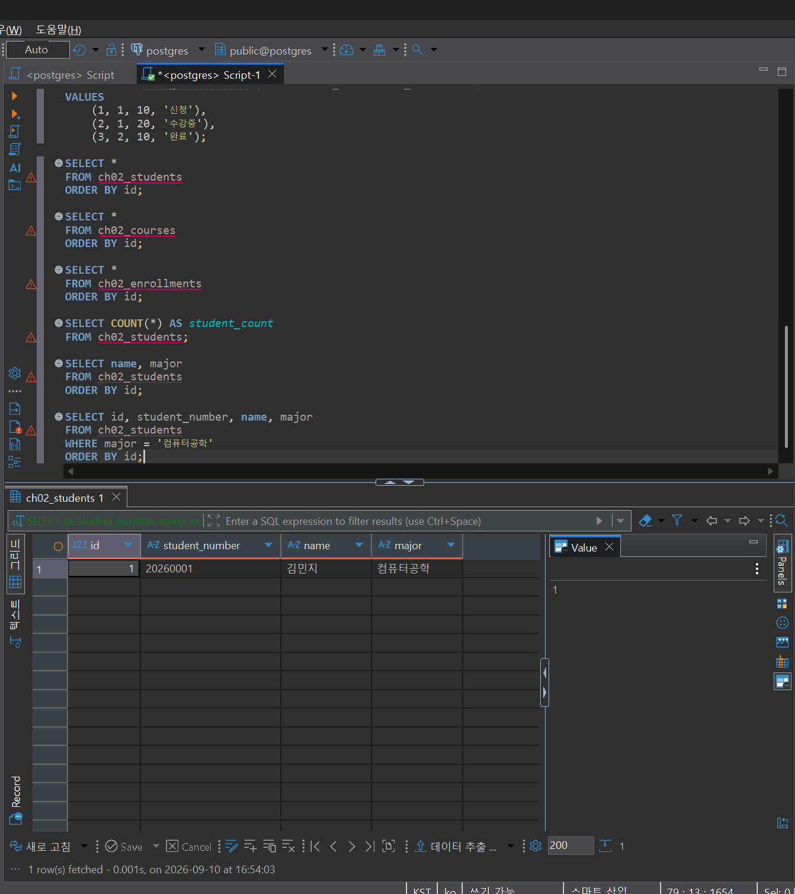

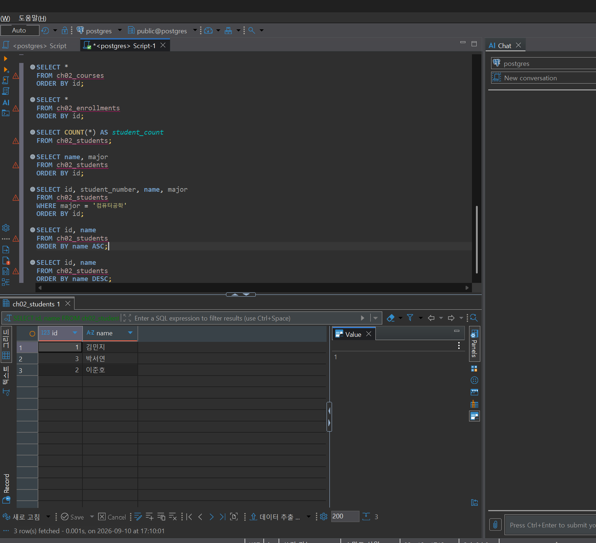

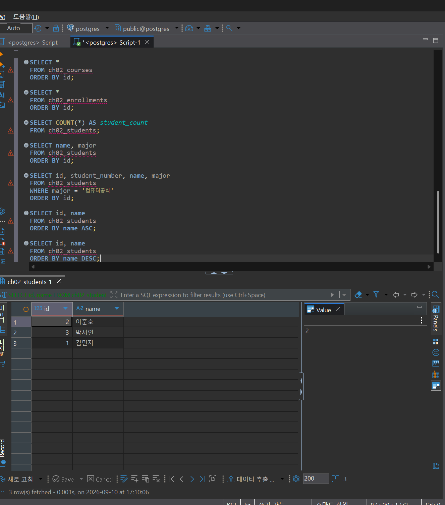
---

# 5. PK와 FK를 실제로 관찰

## 5-1. 정상 데이터의 관계 읽기

다음 SQL 결과를 보고 작성합니다.

```sql
SELECT
    e.id AS enrollment_id,
    s.name AS student_name,
    c.title AS course_title,
    e.status
FROM ch02_enrollments AS e
JOIN ch02_students AS s
    ON s.id = e.student_id
JOIN ch02_courses AS c
    ON c.id = e.course_id
ORDER BY e.id;
```

```text
한 행이 의미하는 것: 학생 한 명이 강의 한 개를 신청한 수강신청 한 건과 그 현재 상태를 의미한다.

같은 student_id가 여러 enrollment 행에서 반복될 수 있는 이유: 학생 한 명이 여러 강의를 신청할 수 있으므로 같은 학생을 참조하는 student_id가 여러 수강신청 행에서 반복될 수 있다.

같은 course_id가 여러 enrollment 행에서 반복될 수 있는 이유: 강의 한 개를 여러 학생이 신청할 수 있으므로 같은 강의를 참조하는 course_id가 여러 수강신청 행에서 반복될 수 있다.
```

## 5-2. 기본키 중복 오류 관찰

중복 PK 입력을 시도한 결과:

```text
실행 성공 / 실패: 실패

오류 메시지에서 확인한 핵심 단어: SQL Error [23505], 중복된 키 값, ch02_students_pkey, (id)=(1) 키가 이미 있습니다.

왜 실패했다고 생각하는가: ch02_students 테이블에서 id는 각 학생 행을 고유하게 구분하는 기본키이다. 기존에 id가 1인 행이 있으므로 같은 id를 가진 새로운 행의 저장을 PostgreSQL이 거부했다.
```

## 5-3. 존재하지 않는 학생을 참조하는 FK 오류 관찰

존재하지 않는 `student_id`를 사용한 수강신청 입력 결과:

```text
실행 성공 / 실패: 실패
오류 메시지에서 확인한 핵심 단어: SQL Error [23503]이 발생했으며, student_id 값 999가 ch02_students 테이블에 존재하지 않아 외래키 제약조건을 위반했다.
왜 실패했다고 생각하는가: ch02_enrollments.student_id는 ch02_students.id를 참조한다. 학생 테이블에 ID가 999인 학생이 없으므로, 존재하지 않는 학생의 수강신청이 저장되지 않도록 PostgreSQL이 입력을 거부했다.
```

## 5-4. PK와 FK의 차이 정리

```text
PK는 한 테이블 안에서 각각의 행을 중복 없이 고유하게 구분하기 위한 키이다.

FK는 다른 테이블의 PK를 참조하여 두 테이블 사이의 관계를 표현하고, 존재하지 않는 데이터를 참조하지 못하게 하기 위한 키이다.

FK 값이 여러 행에서 반복될 수 있는 이유는 학생 한 명이 여러 강의를 신청하거나 강의 하나에 여러 학생이 신청할 수 있기 때문이며, 하나의 학생 또는 강의를 참조하는 FK 값이 여러 수강신청 행에서 반복될 수 있기 때문이다.
```

## 5-5. 증거 화면

권장 경로:

```text
assignments/chapter02/images/step05_pk_fk.png
```

> 오류 메시지는 전체 화면이 아니라 테이블명·constraint·참조 오류가 보이는 정도만 캡처합니다.

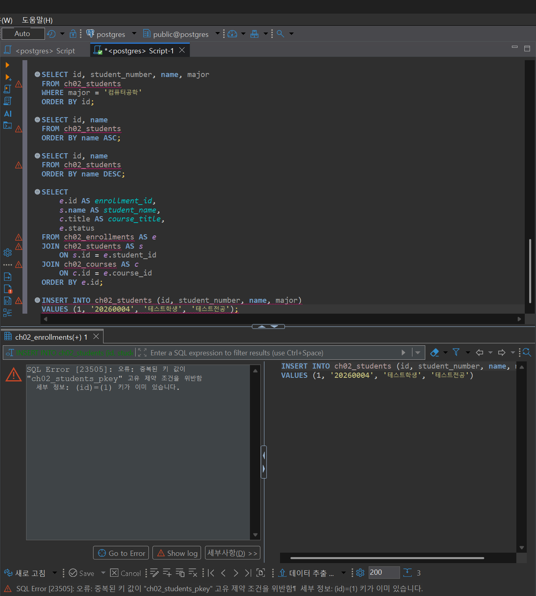

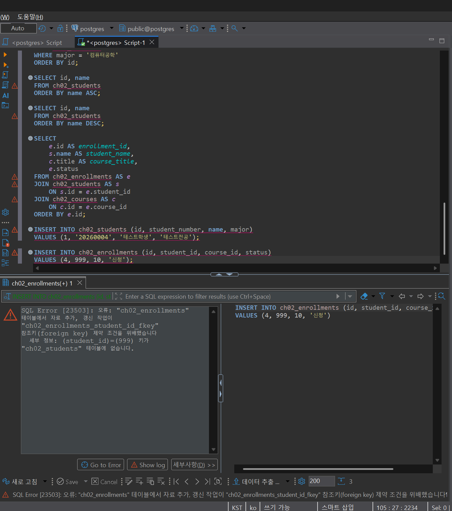
---

# 6. 관계와 카디널리티를 자연어로 설명

현재 임시 데이터 기준으로 작성합니다.

```text
학생 한 명은 여러 수강신청을 가질 수 있는가?: 그렇다. 현재 데이터에서도 김민지 학생은 다른 두 강의에 대한 수강신청을 가지고 있다.

강의 한 개는 여러 수강신청을 가질 수 있는가?: 그렇다. 현재 데이터에서도 데이터베이스 입문 강의는 김민지 학생과 이준호 학생의 수강신청과 연결되어 있다.

수강신청 한 건은 학생 몇 명을 참조하는가?: 학생 한 명을 참조한다.

수강신청 한 건은 강의 몇 개를 참조하는가?: 강의 한 개를 참조한다.
```

아래 구조를 완성합니다.

```text
students 1 ── N enrollments N ── 1 courses
```

### 학생과 강의가 N:M 관계라고 볼 수 있는 이유

```text
나의 설명: 학생 한 명은 여러 강의를 수강할 수 있고, 강의 한 개에도 여러 학생이 참여할 수 있기 때문에 학생과 강의는 N:M 관계이다. 이 관계를 직접 두 테이블에 저장하지 않고, enrollments 연결 테이블에 학생 ID와 강의 ID를 저장하여 두 개의 1:N 관계로 표현한다.
```

> 아직 0개 허용 여부, 필수 관계, 삭제 정책까지 확정하지 않습니다. 그런 규칙은 Chapter 05~06에서 다룹니다.

---

# 7. AI가 만든 테이블 구조 직접 검토

## 7-1. AI에게 묻기 전에 내가 먼저 찾은 문제

다음 구조를 보고 최소 4개를 적습니다.

```sql
CREATE TABLE student_courses (
    student_name VARCHAR(50),
    student_email VARCHAR(100),
    course_title VARCHAR(100),
    instructor_name VARCHAR(50)
);
```

```text
문제 1. 행을 구분하는 PK가 존재하지 않는다.
문제 2. 학생의 정보 여러 행 중 일부 정보가 수정되면 학생의 이름과 이메일이 달라지는 문제가 생긴다.
문제 3. 강의 제목과 교수자 이름이 연결되어있지 않아 하나가 바뀌어도 다른 행이 바뀌지 않는다.
문제 4. 학생이나 강의를 이름으로 구분하기 어렵다.
```

## 7-2. AI 검토 요청 프롬프트

사용한 핵심 프롬프트를 기록합니다.

```text
내가 작성한 답안은 다음과 같아. 답안 검토해주고, 테이블에 존재하는 각 문제에 대해 맞게 작성했는지, 틀린 점이나 추가 문제가 있다면 수정하여 작성해줘.
```

## 7-3. AI 제안과 나의 판단

| AI의 지적 또는 제안 | 동의 / 수정 / 보류 | 나의 근거 |
| --- | --- | --- |
| 각 행을 고유하게 식별할 PK가 없다. | 동의 | 현재 구조에는 기본키가 정의되어 있지 않아 수강신청 한 건을 고유하게 구분하기 어렵다. |
| 학생 정보가 반복 저장되어 일부 행만 수정하면 정보가 불일치할 수 있다. | 동의 | 같은 학생의 이메일이 여러 행에 저장되면 변경 시 모든 관련 행을 수정해야 한다. |
| 문제 3의 원인은 연결 부재가 아니라 강의 정보의 반복 저장이다. | 수정 | 내가 쓴 ‘연결되어 있지 않다’는 표현을 수정한다. 같은 행의 강의 제목과 교수자 이름은 함께 저장되지만, 다른 행에 반복된 정보까지 자동으로 수정되지는 않는다. |
| 이름이나 제목만으로 학생과 강의를 구분하기 어렵다. | 동의 | 동명이인이나 제목이 같은 강의가 있을 수 있어 별도의 고유 식별자가 필요하다. |
| 동일 학생의 동일 강의 수강 기록 중복을 막아야 한다. | 보류 | 재수강이나 학기별 수강을 허용하는지에 따라 중복의 기준이 달라지므로 업무 규칙을 먼저 확인해야 한다. |
| NOT NULL 제약조건이 없어 불완전한 기록이 저장될 수 있다. | 보류 | NULL을 허용하는 것은 사실이지만, 어떤 열을 필수로 입력할지는 업무 규칙을 확인한 뒤 결정해야 한다. |
| 수강 기록을 삭제하면 학생이나 강의 정보까지 사라질 수 있다. | 동의 | 이 테이블에만 정보를 저장한다면 학생이나 강의의 마지막 수강 기록을 삭제할 때 해당 정보도 함께 사라질 수 있다. |

## 7-4. 본문과 대조한 항목

AI 설명 중 최소 하나를 `chapter02.md`와 비교합니다.

```text
AI가 설명한 내용: student_courses 테이블에는 각 행을 고유하게 식별할 PK가 없으므로 수강신청 한 건을 명확하게 구분하기 어렵다.

본문에서 확인한 내용: 기본키는 자신의 테이블에서 각 행을 고유하게 구분하는 열 또는 열 조합이다.

일치 / 부분 일치 / 수정 필요: 일치

내가 최종적으로 이해한 내용: 이 테이블을 수강신청 기록으로 사용한다면, 학생 이름이나 강의 제목만으로는 각 기록을 구분하기 어렵다. 수강신청 한 건을 구분할 PK가 필요하다.
```

## 7-5. 증거 화면

권장 경로:

```text
assignments/chapter02/images/step07_ai_review.png
```
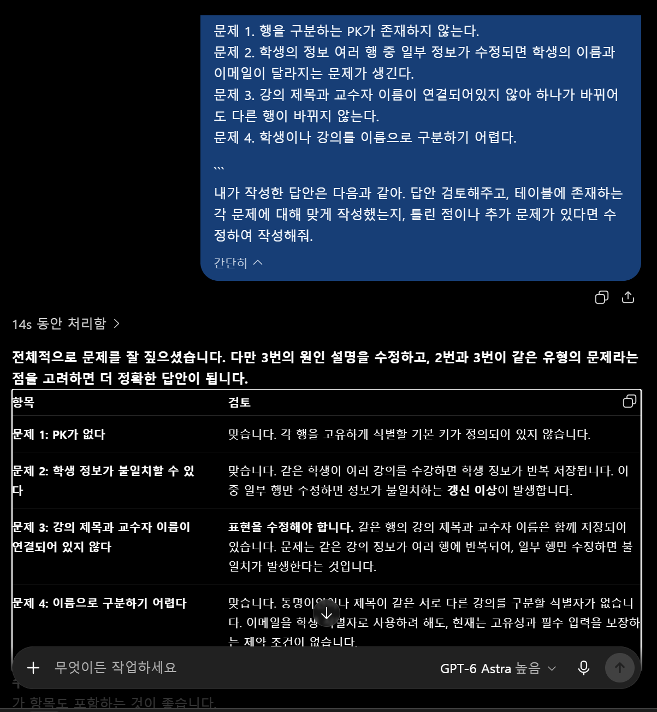
---

# 8. Chapter 01의 개인 서비스 아이디어를 DB 용어로 다시 표현

Chapter 01에서 정한 개인 서비스 주제를 그대로 사용하거나 새 주제를 정해도 됩니다.

## 8-1. 서비스 기본 정보

```text
서비스 이름: 외식업 가맹점 운영 관리 서비스

서비스 목적: 프랜차이즈 본사와 가맹점주가 가맹점, 메뉴, 주문과 매출 정보를 관리하고 가맹점 운영 상황을 확인할 수 있도록 하는 것이다.
```

## 8-2. PostgreSQL 구조 후보

```text
데이터베이스 이름 후보: franchise_operations_db
스키마 이름 후보: operations
```

> 아직 실제 데이터베이스나 스키마를 생성하지 않아도 됩니다.

## 8-3. 테이블 후보와 한 행 의미

최소 3개를 작성합니다.

| 테이블 후보 | 한 행의 의미 | 내부 ID 후보 | 업무 식별자 후보 |
| --- | --- | --- | --- |
| stores | 특정 주소에서 운영되는 가맹점 한 곳 | store_id | store_code |
| owners | 가맹점을 운영하거나 관리하는 가맹점주 한 명 | owner_id | owner_code |
| menus | 이름과 기본 가격 등의 정보를 가진 메뉴 한 개 | menu_id | menu_code |
| orders | 특정 가맹점에서 특정 시각에 발생한 주문 한 건 | order_id | order_number | 
| order_items | 한 주문에 포함된 메뉴 한 종류와 수량 한 건 | order_item_id | order_number와 line_number의 조합 |

## 8-4. FK 후보

```text
1. orders.store_id → stores.store_id
   이유: 각 주문이 어느 가맹점에서 발생했는지를 나타내기 위해 필요하다.

2. order_items.order_id → orders.order_id
   이유: 각 주문 항목이 어느 주문에 포함되어 있는지를 나타내기 위해 필요하다.

3. order_items.menu_id → menus.menu_id
   이유: 각 주문 항목이 어떤 메뉴를 나타내는지 연결하기 위해 필요하다.
```

## 8-5. 자연어 관계 문장

```text
1. 한 가맹점에서는 여러 주문이 발생할 수 있지만, 주문 한 건은 한 가맹점에서 발생한다.
2. 주문 한 건에는 여러 주문 항목이 포함될 수 있지만, 주문 항목 한 건은 하나의 주문에 속한다.
3. 메뉴 한 개는 여러 주문 항목에 포함될 수 있지만, 주문 항목 한 건은 하나의 메뉴를 참조한다.
```

## 8-6. 아직 확정하지 않을 정책

```text
Q1. 한 명의 가맹점주가 여러 가맹점을 운영하거나, 하나의 가맹점을 여러 명이 공동으로 운영할 수 있는가?
Q2. 메뉴 가격은 모든 가맹점에서 동일한가, 아니면 가맹점·주문 채널·행사에 따라 달라질 수 있는가?
Q3. 취소·환불된 주문은 삭제할 것인가, 상태와 금액 변경 이력으로 보존할 것인가?
```

---

# 9. AI를 개인 구조의 검토자로 사용

## 9-1. 사용한 프롬프트

```text
나는 데이터베이스를 처음 배우는 학생이며, 현재 테이블, 행의 의미, PK, FK와 관계를 공부하고 있습니다.

내가 설계한 서비스는 외식업 가맹점 운영 관리 서비스입니다. 프랜차이즈 본사와 가맹점주가 가맹점, 메뉴, 주문과 매출 정보를 관리하는 것이 목적입니다.

현재 생각한 테이블은 다음과 같습니다.

1. stores
- 한 행: 가맹점 한 곳
- PK 후보: store_id
- 업무 식별자 후보: store_code

2. owners
- 한 행: 가맹점주 한 명
- PK 후보: owner_id
- 업무 식별자 후보: owner_code

3. menus
- 한 행: 메뉴 한 개
- PK 후보: menu_id
- 업무 식별자 후보: menu_code

4. orders
- 한 행: 특정 가맹점에서 발생한 주문 한 건
- PK 후보: order_id
- 업무 식별자 후보: order_number

5. order_items
- 한 행: 한 주문에 포함된 메뉴 한 종류와 수량 한 건
- PK 후보: order_item_id
- 업무 식별자 후보: order_number와 line_number의 조합

FK 후보는 다음과 같습니다.

- orders.store_id → stores.store_id
- order_items.order_id → orders.order_id
- order_items.menu_id → menus.menu_id

아직 다음 정책은 확정하지 않았습니다.

- 한 가맹점주가 여러 가맹점을 운영할 수 있는가?
- 하나의 가맹점을 여러 가맹점주가 공동 운영할 수 있는가?
- 메뉴 가격이 가맹점, 주문 채널 또는 행사에 따라 달라질 수 있는가?
- 취소와 환불 기록을 어떻게 보존할 것인가?

이 구조를 검토하고 다음 형식으로 답해주세요.

1. 구조를 확정하기 전에 확인해야 할 유용한 질문 3개 이상
2. 내가 너무 빨리 결정했거나 아직 보류해야 할 내용 2개 이상
3. 수정이 필요한 구조가 있다면 ‘수정 전 / 수정 후 / 수정 이유’ 형식으로 3개 제안

확정되지 않은 업무 정책을 임의로 결정하지 말고, 아직 배우지 않은 복잡한 SQL이나 완성된 ERD는 만들지 마세요.
```

## 9-2. AI가 질문한 내용 중 유용했던 것

```text
1. 한 가맹점주가 여러 가맹점을 운영하거나 하나의 가맹점을 여러 가맹점주가 공동으로 운영할 수 있는가?
2. 메뉴는 본사 공통 메뉴인지, 가맹점별로 별도 메뉴와 가격을 운영할 수 있는가?
3. 주문 전체 취소뿐 아니라 일부 메뉴나 수량의 환불도 가능하며, 매출은 어떤 금액과 시점을 기준으로 계산하는가?
```

## 9-3. AI가 너무 빨리 결정한 내용 또는 내가 보류한 내용

```text
1. owners와 stores의 관계를 곧바로 stores.owner_id 하나로 연결하는 것은 보류했다. 공동 운영이 가능한지에 따라 별도의 연결 테이블이 필요할 수 있기 때문이다.
2. store_code, owner_code, menu_code, order_number가 각각 전체 서비스에서 중복되지 않는 업무 식별자라고 확정하는 것을 보류했다. 코드의 발급 범위, 변경 가능성과 재사용 여부를 먼저 확인해야 하기 때문이다.
```

## 9-4. 검토 후 수정한 구조

| 수정 전 | 수정 후 | 수정 이유 |
| --- | --- | --- |
| order_items의 한 행을 한 주문에 포함된 메뉴 한 종류와 수량 한 건으로 정의 | order_items의 한 행을 한 주문에 포함된 주문 상세 한 줄로 정의 | 같은 메뉴라도 옵션, 가격 또는 할인 조건이 다르면 서로 다른 주문 상세 행으로 저장될 수 있기 때문이다. |
| order_number와 line_number의 조합을 주문 항목의 업무 식별자 후보로 설정 | (order_id, line_number)를 DB 내부에서 주문 상세 행을 구분하는 조합 후보로 정하고, 업무 식별자는 주문 번호의 발급 범위를 확인한 뒤 결정한다. | order_id와 line_number를 함께 쓰면 어느 주문의 몇 번째 항목인지 구분할 수 있다. 업무용 주문 번호가 어느 범위에서 중복될 수 있는지는 더 확인해야 한다. |
| order_items에 주문 당시 가격을 기록할 속성이 없음 | order_items에 unit_price_at_order 속성 후보를 추가 | 메뉴 가격이 바뀌어도 주문 당시 단가를 확인할 수 있기 때문이다. 실제 매출 계산에는 수량, 할인과 취소·환불 기준도 함께 확인해야 한다. |

---

# 10. 최종 개념 정리

아래 문장을 본인의 말로 완성합니다.

```text
PostgreSQL은 데이터를 테이블 형태로 저장하고 관계와 제약조건을 관리하며 SQL을 처리하는 관계형 DBMS이다.

DBeaver 또는 psql은 PostgreSQL에 접속하여 SQL을 작성, 실행하고 그 결과를 확인하는 클라이언트 도구이다.

데이터베이스와 스키마의 차이는 데이터베이스가 여러 데이터와 객체를 담는 큰 단위이고, 스키마는 하나의 데이터베이스 안에서 테이블 등의 객체를 구분하고 관리하는 이름 공간이라는 점이다.

테이블 한 행은 해당 테이블이 표현하는 대상이나 사건 한 건을 의미한다.

조회 결과가 원본 테이블과 다른 이유는 SQL이 원본에서 필요한 행과 열을 골라 결과로 보여주기 때문이다. 일부만 조회하거나 정렬해도 원본 데이터는 바뀌지 않는다.

내부 식별자와 업무 식별자의 차이는 내부 식별자는 데이터베이스에서 행을 안정적으로 구분하고 참조하기 위한 값이고, 업무 식별자는 학번이나 주문 번호처럼 실제 업무에서 대상을 구분하기 위해 사용하는 값이라는 점이다.

PK는 자신의 테이블에서 각 행을 중복 없이 고유하게 구분하며 NULL을 허용하지 않는 열 또는 열의 조합이다.

FK는 다른 테이블이나 같은 테이블의 키를 참조하는 열 또는 열의 조합이다. FK 제약조건은 존재하지 않는 값을 참조하는 입력을 막는다.
```

---

# 11. 이번 Chapter에서 새롭게 알게 된 점

최소 3개를 작성합니다.

```text
1. SELECT로 일부 열을 선택하거나 WHERE로 행을 걸러도 원본 테이블의 데이터가 삭제되는 것은 아니며, 조회 결과만 달라진다는 것을 알게 되었다.

2. PK는 각 행을 고유하게 구분하고, FK는 참조하는 대상이 존재하는지 확인한다. 실제로 중복 PK와 존재하지 않는 학생 ID를 입력했을 때 오류가 발생하는 것을 확인했다.

3. 학생 한 명이 여러 수강신청에 연결될 수 있으므로 FK 값은 여러 행에서 반복될 수 있다는 것을 알게 되었다.

4. AI의 제안을 적용하기 전에 실제 운영 규칙을 확인해야 한다는 것을 알게 되었다. 공동 운영이 가능한지, 주문 번호가 가맹점마다 중복될 수 있는지에 따라 필요한 구조가 달라질 수 있기 때문이다.
```

## 아직 헷갈리는 내용

```text
1. 내부 ID와 업무 식별자를 함께 사용할 때, 업무 식별자의 중복을 어느 범위까지 허용해야 하는지 판단하는 방법이 헷갈린다.

2. 한 가맹점에 여러 점주가 연결되는 경우, 연결 테이블의 한 행과 PK·FK를 구체적으로 어떻게 정해야 하는지 더 공부하고 싶다.
```

## AI에게 다시 질문하고 싶은 내용

```text
한 명의 가맹점주가 여러 가맹점을 운영하고, 하나의 가맹점을 여러 가맹점주가 공동 운영할 수 있다면 연결 테이블을 어떻게 구성해야 하는지 궁금하다.
```

---

# 12. 제출 전 자기 점검

- [X] PostgreSQL에서 현재 database / schema / search_path를 확인했다.
- [X] DBMS, database, schema, table을 구분해서 설명할 수 있다.
- [X] TEMP TABLE 3개를 생성하고 직접 데이터를 조회했다.
- [X] 각 테이블의 한 행 의미를 작성했다.
- [X] 테이블과 조회 결과가 다르다는 것을 실제 SQL로 확인했다.
- [X] `ORDER BY`를 사용하지 않으면 업무 순서를 가정하면 안 된다는 점을 이해했다.
- [X] 내부 식별자와 업무 식별자의 차이를 설명할 수 있다.
- [X] PK 중복 입력 실패를 직접 확인했다.
- [X] 존재하지 않는 FK 참조 실패를 직접 확인했다.
- [X] FK 값이 반복될 수 있는 이유를 설명할 수 있다.
- [X] AI가 만든 테이블을 내가 먼저 검토했다.
- [X] AI 설명 중 최소 하나를 본문과 대조했다.
- [X] 개인 서비스의 테이블 후보를 3개 이상 작성했다.
- [X] 개인 서비스의 FK 후보와 미확정 정책을 기록했다.
- [X] 실제 비밀번호·API Key·민감한 접속 정보가 포함되지 않았는지 확인했다.
- [X] 이미지 링크가 GitHub에서 정상적으로 보이는지 확인했다.

---

# 13. GitHub 제출 정보

답안 파일 권장 위치:

```text
assignments/chapter02/chapter02_answer.md
```

이미지 권장 위치:

```text
assignments/chapter02/images/
```

LMS 제출 URL 형식:

```text
https://github.com/<본인-GitHub-ID>/<본인-저장소>/blob/main/assignments/chapter02/chapter02_answer.md
```

## 최종 확인

- [ ] 위 URL을 로그아웃 상태 또는 다른 브라우저에서 열어도 확인 가능하다.
- [ ] Markdown이 정상 렌더링된다.
- [ ] 이미지가 깨지지 않는다.
- [ ] LMS에 교수자 템플릿 URL이 아니라 **내 답안 파일 URL**을 제출했다.
