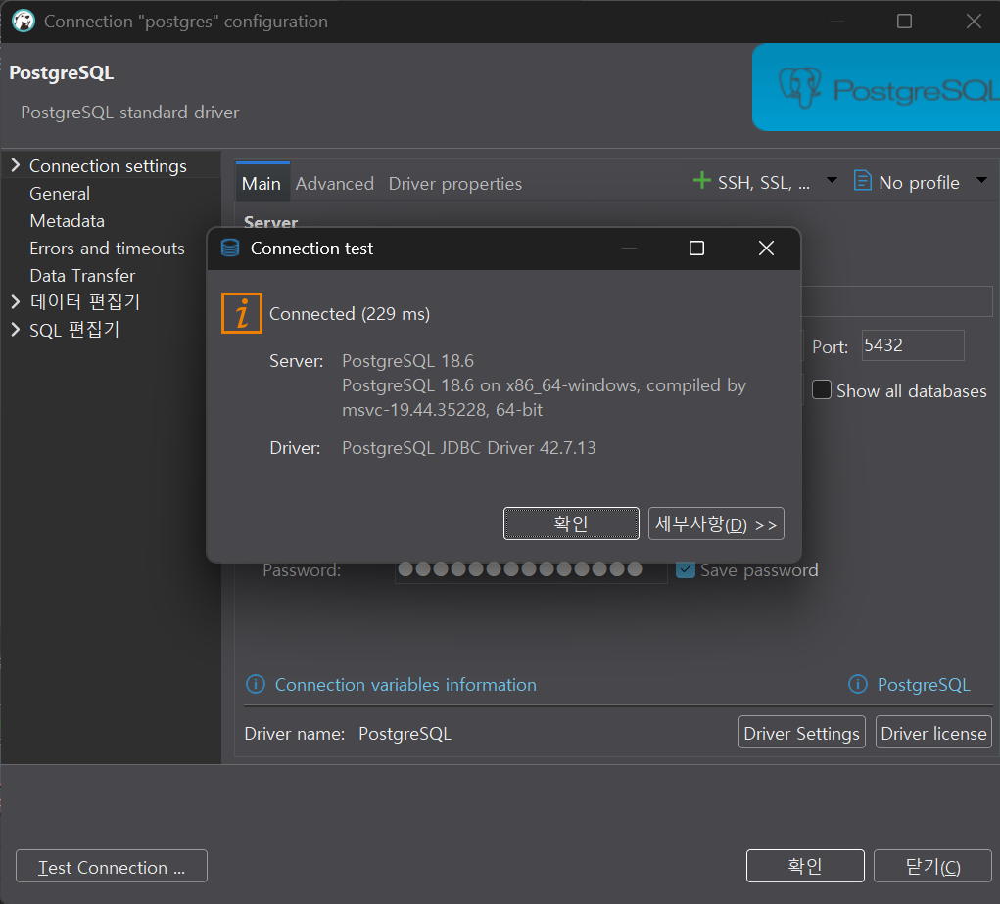
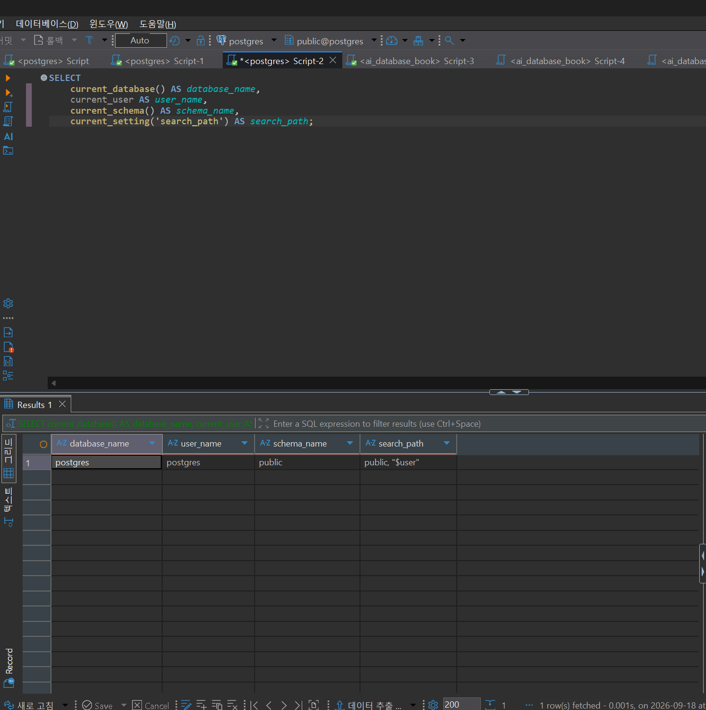
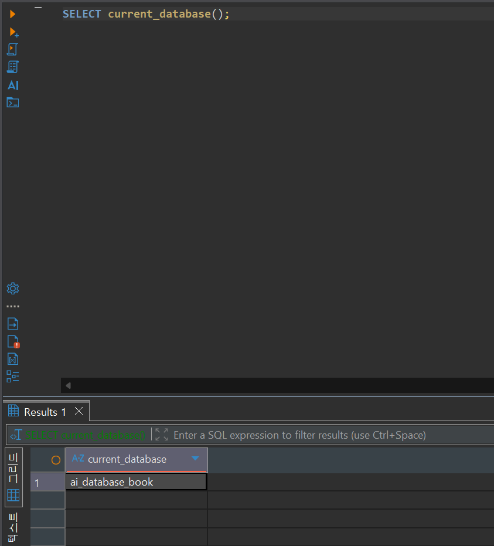
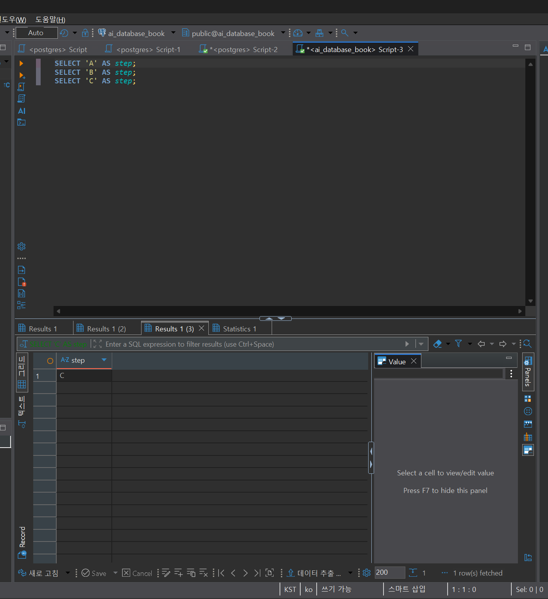

# Chapter 03 확장 실습 답안 템플릿

> **과제:** PostgreSQL과 DBeaver로 실습 환경 검증하기  
> **사용 방법:** 이 파일을 내려받아 본인의 GitHub 저장소에 `chapter03_answer.md`라는 이름으로 저장한 뒤 실습하면서 바로 작성합니다.  
> **제출 방법:** LMS에는 파일을 직접 업로드하지 않고, **본인 GitHub 저장소의 `chapter03_answer.md` 파일 URL**을 제출합니다.

---

## 제출 전 보안 주의

이 과제 파일과 캡처 화면에는 다음 정보를 올리지 않습니다.

```text
실제 PostgreSQL 비밀번호
전체 DB 접속 URL
API Key / Token
개인정보
공개할 필요가 없는 사내 서버 주소
```

LMS에서 제출자를 확인할 수 있으므로 공개 저장소의 답안 파일에 학번이나 실명을 반드시 적을 필요는 없습니다.

```text
GitHub 계정 또는 별칭: rudah7725
과제 작성일: 2026-09-18
사용한 AI 도구: ChatGPT
```

---

# 1. PostgreSQL과 DBeaver 환경 확인

## 1-1. 내 환경

| 항목 | 작성 내용 |
|---|---|
| 운영체제 | Windows |
| PostgreSQL 버전 | PostgreSQL 18.6, 64-bit |
| DBeaver 버전 | 26.2.0 |
| Host | localhost |
| Port | 5432 |
| Database | postgres |
| Username | postgres |

> 비밀번호는 기록하지 않습니다.

## 1-2. PostgreSQL과 DBeaver 역할 설명

```text
PostgreSQL은: 데이터를 저장하고 관리하며 SQL을 실행하는 관계형 DBMS이다.

DBeaver는: PostgreSQL에 접속해 SQL을 작성하고 결과를 확인하는 클라이언트 프로그램이다.

두 프로그램의 차이는: PostgreSQL은 실제 데이터를 보관하고 SQL을 처리하며, DBeaver는 사용자가 PostgreSQL에 명령을 보내고 결과를 볼 수 있게 해 준다.
```

---

# 2. 연결 테스트와 첫 SQL

## 2-1. DBeaver 연결 결과

- [x] PostgreSQL 연결 유형 선택
- [x] Host 확인
- [x] Port 확인
- [x] Database 확인
- [x] Username 확인
- [x] Test Connection 성공

### 연결 성공 화면

권장 이미지 경로:

```text
assignments/chapter03/images/step02_connection.png
```



## 2-2. 첫 SQL 실행

```sql
SELECT 1 + 1 AS result;
```

실행 전 예상:

```text
2
```

실제 결과:

```text
2
```

이 결과가 의미하는 것:

```text
DBeaver에서 작성한 SQL이 PostgreSQL에 전달되어 정상적으로 실행되고, 계산 결과가 다시 DBeaver에 표시되었다는 뜻이다. 다만 이 결과만으로 ai_database_book에 연결되었다고 판단할 수는 없으므로 현재 데이터베이스를 별도로 확인해야 한다.
```

---

# 3. 현재 연결 위치를 SQL로 검증

다음 SQL을 실행합니다.

```sql
SELECT version();
SELECT current_database();
SELECT current_user;
SELECT current_schema();
SHOW search_path;
SHOW transaction_read_only;
SHOW TimeZone;
```

## 3-1. 결과 기록

| 확인 항목 | 실제 결과 | 내가 이해한 의미 |
|---|---|---|
| version() | PostgreSQL 18.6 on x86_64-windows, compiled by msvc-19.44.35228, 64-bit | 현재 연결된 PostgreSQL 서버의 버전과 실행 환경을 나타낸다. |
| current_database() | postgres | 현재 SQL이 실행되고 있는 데이터베이스는 postgres이다. |
| current_user | postgres | 현재 PostgreSQL 세션에 postgres 사용자로 접속해 있다. |
| current_schema() | public | 현재 search_path에서 우선 사용되는 스키마는 public이다. |
| search_path | public, "$user" | 스키마 이름을 생략했을 때 public과 사용자 이름에 해당하는 스키마 순서로 객체를 찾는다. |
| transaction_read_only | off | 현재 트랜잭션이 읽기 전용으로 강제된 상태는 아니다. |
| TimeZone | Asia/Seoul | 현재 세션에서 날짜와 시간을 해석하고 표시할 때 서울 시간대를 사용한다. |

## 3-2. 반드시 설명할 것

### DBeaver 연결 이름과 `current_database()`는 왜 같은 개념이 아닌가요?

```text
DBeaver 연결 이름은 사용자가 연결을 구분하기 위해 붙인 화면상의 이름이지만, current_database()는 현재 PostgreSQL 세션이 실제로 접속한 데이터베이스 이름을 서버에서 조회한 결과이기 때문이다.
```

### `current_schema()`와 `search_path`는 어떤 관계가 있나요?

```text
search_path는 스키마 이름을 생략했을 때 객체를 찾는 순서를 나타내고, current_schema()는 그 검색 경로에서 현재 우선 사용되는 스키마를 보여 준다. 현재 환경에서는 public이 우선 사용된다.
```

### `transaction_read_only = off`라는 결과만으로 모든 테이블을 만들 권한이 있다고 단정할 수 있나요?

```text
단정할 수 없다. off는 현재 트랜잭션이 읽기 전용으로 강제되지 않았다는 뜻이며, 실제 테이블 생성 가능 여부는 데이터베이스와 스키마에 부여된 CREATE 권한 등을 별도로 확인해야 한다.
```

## 3-3. 증거 화면

권장 경로:

```text
assignments/chapter03/images/step03_location_check.png
```


---

# 4. `ai_database_book` 데이터베이스 확인

## 4-1. 현재 데이터베이스

```sql
SELECT current_database();
```

실제 결과:

```text
ai_database_book
```

- [x] 결과가 `ai_database_book`이다.
- [x] 다른 DB라면 올바른 연결로 전환했다.

## 4-2. 연결을 바꾼 뒤 다시 검증

```text
전환 전 데이터베이스: postgres
전환 후 데이터베이스: ai_database_book
전환 여부를 판단한 근거: 연결을 변경한 뒤 SELECT current_database();를 다시 실행했고, 결과가 ai_database_book으로 나온 것을 확인했다.
```


### 화면에서 보이는 연결 이름만 믿지 않고 SQL을 다시 실행해야 하는 이유

```text
DBeaver의 연결 이름은 사용자가 임의로 정할 수 있으므로 실제 접속한 데이터베이스와 다를 수 있다. SELECT current_database();를 실행하면 현재 세션이 실제로 접속한 데이터베이스를 확인할 수 있다.
```

---

# 5. SQL 실행 범위 실험

SQL Editor에 다음 세 문장을 입력합니다.

```sql
SELECT 'A' AS step;
SELECT 'B' AS step;
SELECT 'C' AS step;
```

## 5-1. 한 문장 실행

```text
내가 실행한 문장: SELECT 'A' AS step;
실제 결과: A가 한 건 표시되었다. 
```

## 5-2. 선택 영역 실행

```text
선택한 문장:
SELECT 'A' AS step;
SELECT 'B' AS step;
실제 결과: 선택한 A와 B 문장이 모두 실행되었고, 각 결과가 별도의 결과 탭으로 표시되었다.
```

## 5-3. 전체 스크립트 실행

```text
실제 결과: A, B, C 세 문장이 모두 실행되었고 결과 탭이 세 개 생성되었다.
결과 탭 또는 실행 순서에서 관찰한 점: 각 SELECT 문의 결과가 실행 순서대로 별도의 결과 탭에 표시되었다. 첫 번째 탭에서는 A, 두 번째 탭에서는 B, 세 번째 탭에서는 C를 확인할 수 있었다.
```

## 5-4. 결과 해석

```text
한 문장 실행과 전체 스크립트 실행의 차이: 한 문장 실행은 커서가 있는 SQL 한 문장만 실행하지만, 전체 스크립트 실행은 편집기에 있는 여러 SQL 문장을 순서대로 모두 실행한다.

변경 SQL에서 실행 범위를 잘못 선택하면 위험한 이유: 조회문만 실행하려고 했더라도 같은 스크립트에 UPDATE나 DELETE 같은 변경 SQL이 포함되어 있으면 의도하지 않은 데이터 변경까지 함께 실행될 수 있기 때문이다.
```

### 증거 화면

권장 경로:

```text
assignments/chapter03/images/step05_execution_scope.png
```


---

# 6. 제공된 환경 확인 SQL 실행

Public 저장소의 Chapter 03 파일을 사용합니다.

```text
code/chapter03/setup_check.sql
code/chapter03/setup_validate_local.sql
```

## 6-1. `setup_check.sql`

실행 결과에서 확인한 항목:

```text
PostgreSQL 버전: PostgreSQL 18.6, 64-bit
현재 DB: ai_database_book
현재 사용자: postgres
현재 스키마: public
search_path: public, "$user"
읽기 전용 여부: off
TimeZone: Asia/Seoul
1 + 1 결과: 2
public 스키마 존재 여부: true
public USAGE 권한: true
public CREATE 권한: true
```

### 이 파일을 여러 번 실행해도 비교적 안전한 이유

```text
이 파일은 환경 정보를 확인하는 SELECT와 SHOW 문만 포함하고 있으며, 데이터를 추가, 수정, 삭제하거나 데이터베이스 구조를 변경하는 SQL이 없기 때문이다.
```

## 6-2. `setup_validate_local.sql`

```text
실행 결과: Chapter 03 recommended local environment validation passed
PASS / FAIL: PASS
```

실패했다면 실패 항목:

```text
해당 없음.
```

그 실패가 실제 문제인지 환경 차이인지 판단한 근거:

```text
모든 권장 로컬 환경 검사를 통과했으므로 실패나 환경 차이가 확인되지 않았다.
```

---

# 7. 안전한 오류 진단 실습

실제 오류가 있었다면 그 오류를 사용합니다. 오류가 없었다면 **데이터를 삭제하거나 서버를 강제로 중지하지 말고**, 안전한 SQL 문법 오류를 하나 만들어 관찰합니다.

예:

```sql
SELEC 1;
```

> 오류를 확인한 뒤 올바른 `SELECT 1;`로 복구합니다.

## 7-1. 오류 기록

```text
오류 메시지 핵심 문장: SQL Error [42601]: syntax error at or near "SELEC", 위치: 1

내가 먼저 생각한 원인 1: SELECT 문의 철자가 틀렸을 것이다.

내가 먼저 생각한 원인 2: PostgreSQL 서버나 연결에 문제가 생겼을 수 있다.

실제로 확인한 방법: 오류 메시지에 syntax error와 SELEC가 표시된 것을 확인했다. SELEC를 SELECT로 수정해 다시 실행했고, SELECT current_database();도 실행해 연결 상태를 확인했다.

실제 원인: SELECT의 마지막 T가 빠진 SQL 문법 오류이다.

수정한 내용: SELEC 1;을 SELECT 1;로 수정했다.
```

## 7-2. 수정 후 재검증

```sql
SELECT 1;
SELECT current_database();
```

```text
재검증 결과: SELECT 1;의 결과로 1이 정상적으로 표시되었고, SELECT current_database();의 결과로 ai_database_book이 표시되었다. 문법 오류가 해결되었으며 현재 데이터베이스 연결도 정상임을 확인했다.
```

## 7-3. 오류를 유형으로 분류

- [ ] 서버 실행 문제
- [ ] Host 문제
- [ ] Port 문제
- [ ] Database 문제
- [ ] Username/인증 문제
- [x] SQL 문법 문제
- [ ] 권한 문제
- [ ] 기타

선택 이유:

```text
PostgreSQL이 SELEC 근처에서 syntax error가 발생했다고 반환했고, SELECT로 철자를 수정하자 정상 실행되었기 때문이다. 서버나 연결 문제였다면 문법 오류 메시지를 반환하거나 수정한 SQL을 정상 실행하기 어려웠을 것이다.
```

---

# 8. AI를 오류 분석 보조 도구로 사용

## 8-1. AI에게 전달한 프롬프트

비밀번호·개인정보·전체 접속 URL은 제거하고 기록합니다.

```text
나는 PostgreSQL과 DBeaver를 처음 배우는 학생입니다.

ai_database_book에 연결된 상태에서 다음 SQL을 실행했습니다.

SELEC 1;

오류 메시지는 다음과 같습니다.

SQL Error [42601]: syntax error at or near "SELEC"
위치: 1

내가 먼저 생각한 원인은 다음 두 가지입니다.

1. SELECT 문의 철자가 틀렸을 수 있다.
2. PostgreSQL 서버나 현재 연결에 문제가 생겼을 수 있다.

오류를 바로 하나의 원인으로 단정하지 말고 다음 형식으로 분석해 주세요.

1. 오류 메시지에서 확인되는 사실
2. 가능한 원인 후보
3. 각 원인을 확인하는 안전한 방법
4. 확인 결과에 따라 다음에 할 행동
5. 실행하면 위험할 수 있어 피해야 할 명령

실제 비밀번호, 개인정보와 전체 접속 URL은 포함하지 않았습니다.
```

## 8-2. AI 답변 검토

| AI가 제안한 확인 방법 | 실제로 확인했는가? | 결과 | 수용 / 수정 / 거절 |
| --- | --- | --- | --- |
| `SELEC`을 `SELECT`로 수정한다. | 확인함 | 마지막 `T`가 빠진 것을 확인했다. | 수용 |
| 수정한 `SELECT 1;`을 실행한다. | 확인함 | 결과로 `1`이 정상적으로 표시되었다. | 수용 |
| `SELECT current_database();`를 실행한다. | 확인함 | `ai_database_book`이 표시되었다. | 수용 |

### AI가 오류 원인을 너무 빨리 단정한 부분이 있었나요?

```text
아니다. AI는 철자 오류의 가능성이 가장 높다고 설명했지만 연결 문제를 바로 배제하지 않고, 수정한 SQL과 현재 데이터베이스를 직접 확인하도록 제안했다.
```

### 오류 메시지와 실제 환경 중 무엇을 확인해서 최종 판단했나요?

```text
오류 코드 42601과 SELEC 근처에서 문법 오류가 발생했다는 메시지를 확인했다. 이후 SELECT 1;의 결과가 1로 나오고, SELECT current_database();의 결과가 ai_database_book으로 나온 것을 확인해 철자 오류로 최종 판단했다.
```

### AI 활용에서 가장 유용했던 점

```text
오류 메시지에서 확인할 부분과 안전하게 검증할 순서를 정리해 준 점이 가장 유용했다. 특히 서버나 설정을 바로 변경하지 않고 간단한 SQL부터 확인할 수 있었다.
```

### AI 답변을 그대로 실행하지 않고 확인해야 하는 이유

```text
AI는 내 실제 데이터베이스 상태를 직접 확인할 수 없고 잘못된 명령을 제안할 수도 있기 때문이다. 따라서 명령의 의미와 위험성을 먼저 확인하고 실제 실행 결과를 기준으로 판단해야 한다.
```

---

# 9. Chapter 01~02 개인 서비스와 연결

앞에서 선택한 개인 서비스가 PostgreSQL을 사용한다고 가정합니다.

```text
서비스 이름: 외식업 가맹점 운영 관리 서비스

사용할 데이터베이스 이름 후보: franchise_operations_db

사용할 스키마 이름 후보: operations

앞으로 만들고 싶은 테이블 후보 3개:
1. stores
2. menus
3. orders
```

### 아직 SQL을 만들지 않고 이름과 역할만 정하는 이유

```text
가맹점, 메뉴, 주문을 어떤 기준으로 구분하고 서로 어떻게 연결할지 먼저 정해야 하기 때문이다. 업무 규칙이 확정되지 않은 상태에서 SQL부터 작성하면 나중에 테이블 구조를 다시 수정해야 할 수 있다.
```

### Chapter 02에서 정리했던 한 행의 의미 중 수정할 부분이 있나요?

```text
order_items의 한 행을 처음에는 ‘한 주문에 포함된 메뉴 한 종류와 수량 한 건’이라고 표현했지만, ‘한 주문에 포함된 주문 상세 한 줄’로 수정하는 것이 적절해 보인다. 같은 메뉴라도 옵션이나 주문 당시 가격, 할인 조건이 다르면 별도의 주문 상세 행으로 저장될 수 있기 때문이다.
```

---

# 10. 초보자용 연결 가이드 작성

친구가 자신의 PC에서 같은 실습을 시작한다고 가정합니다. 아래 순서를 자신의 말로 작성합니다.

```text
1. PostgreSQL 서버가 실행되는지 확인하는 방법: DBeaver에서 PostgreSQL 연결을 선택하고 Test Connection을 실행한다. 연결이 실패하면 오류 메시지를 확인하고 PostgreSQL 서비스가 실행 중인지 점검한다.

2. DBeaver에서 PostgreSQL 연결을 만드는 방법: 새 PostgreSQL 연결을 만들고 Host, Port, Database, Username을 입력한 뒤 Test Connection으로 접속 여부를 확인한다.

3. Host / Port / Database / Username의 의미: Host는 PostgreSQL 서버가 있는 위치이고, Port는 서버와 통신할 때 사용하는 번호이다. Database는 접속할 데이터베이스 이름이며, Username은 PostgreSQL에 접속하는 사용자 계정이다.

4. ai_database_book에 연결되었는지 확인하는 방법: DBeaver에 표시된 연결 이름만 보지 않고 SELECT current_database();를 실행하여 결과가 ai_database_book인지 확인한다.

5. 현재 위치를 확인하는 SQL:
SELECT current_database();
SELECT current_user;
SELECT current_schema();
SHOW search_path;

6. 한 문장과 전체 스크립트 실행을 구분해야 하는 이유: 한 문장 실행은 현재 선택한 SQL만 실행하지만 전체 스크립트 실행은 여러 SQL을 모두 실행한다. 실행 범위를 잘못 선택하면 원하지 않은 데이터 변경 명령까지 함께 실행될 수 있다.

7. 비밀번호를 GitHub나 AI 프롬프트에 넣으면 안 되는 이유: GitHub에 공개되거나 외부 서비스로 전달되어 다른 사람이 데이터베이스에 접근할 수 있기 때문이다. 비밀번호와 전체 접속 URL 같은 민감한 정보는 답안과 화면 캡처에서도 제외해야 한다.
```

---

# 11. 최종 성찰

아래 문장은 반드시 본인의 말로 작성합니다.

```text
1. DBeaver와 PostgreSQL의 가장 중요한 차이는 PostgreSQL은 데이터를 저장하고 처리하는 DBMS이고, DBeaver는 PostgreSQL에 접속해 SQL을 실행하고 결과를 확인하는 도구라는 점이다.

2. 내가 지금 어느 데이터베이스에 연결되어 있는지 확인할 때 화면 이름만 보지 않고 SELECT current_database();를 직접 실행해 실제 데이터베이스 이름을 확인해야 한다.

3. PostgreSQL 오류가 발생했을 때 가장 먼저 해야 할 일은 오류 메시지를 읽고 어떤 부분에서 오류가 발생했는지 확인하는 것이다.

4. AI를 오류 해결에 사용할 때 가장 중요한 것은 AI의 제안을 바로 실행하지 않고 실제 환경에서 안전하게 검증하는 것이다.
```

---

# 12. 제출 체크리스트

- [x] `chapter03_answer.md`의 빈 필수 항목을 작성했다.
- [x] PostgreSQL과 DBeaver의 역할 차이를 설명했다.
- [x] `current_database/current_user/current_schema/search_path`를 실제로 확인했다.
- [x] `ai_database_book` 연결 여부를 SQL로 검증했다.
- [x] SQL 실행 범위 세 가지를 비교했다.
- [x] `setup_check.sql`을 실행했다.
- [x] `setup_validate_local.sql` 결과를 확인했다.
- [x] 오류 원인을 먼저 스스로 추정한 뒤 AI를 사용했다.
- [x] AI 제안을 실제 환경에서 검증했다.
- [x] 핵심 캡처 3~4장만 골라 넣었다.
- [x] 캡처에 비밀번호·개인정보·전체 접속 URL이 없다.
- [x] Markdown 이미지가 GitHub 웹 화면에서 실제로 보인다.
- [x] 최종 답안 파일을 commit/push했다.

---

# 13. LMS 제출 URL

아래 형식의 **본인 GitHub 파일 URL**을 LMS에 제출합니다.

```text
https://github.com/<본인-GitHub-ID>/<본인-저장소>/blob/main/assignments/chapter03/chapter03_answer.md
```

내 제출 URL:

```text
https://github.com/rudah7725/database-course-2026-2/blob/main/assignments/chapter03/chapter03_answer.md
```

> 저장소 메인 URL, 교수자 템플릿 URL, Raw URL이 아니라 **작성 완료된 본인 `chapter03_answer.md` 파일 화면 URL**을 제출합니다.
