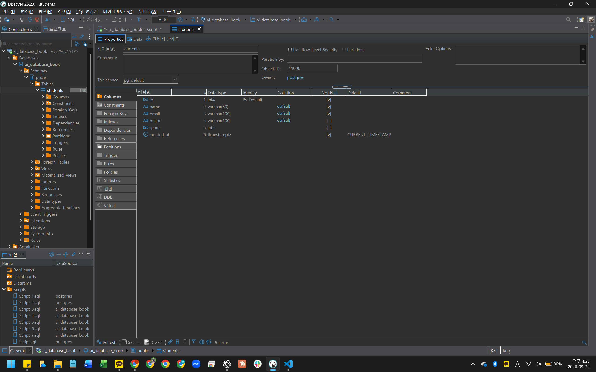
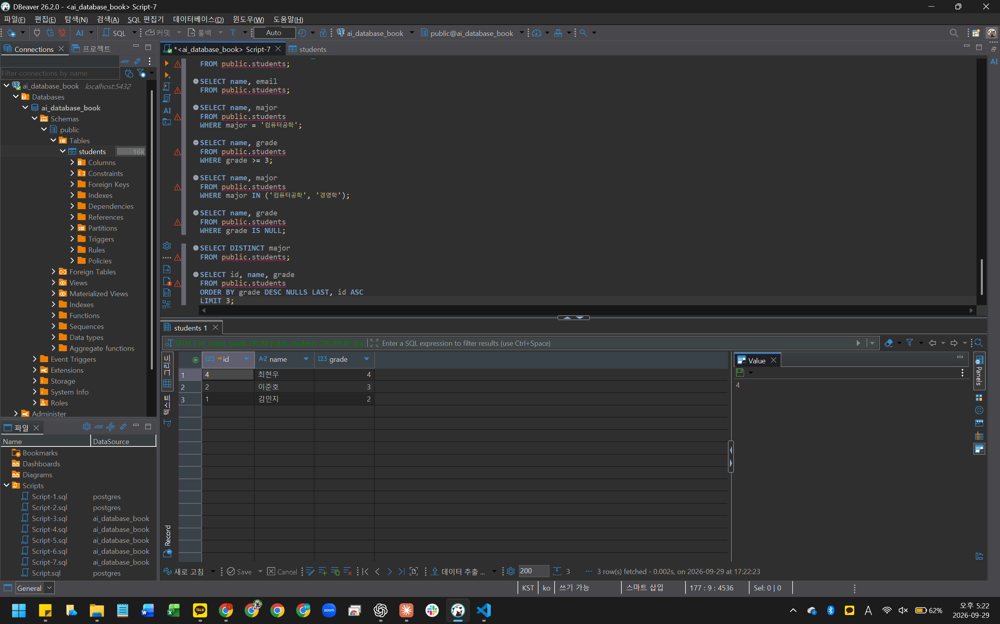
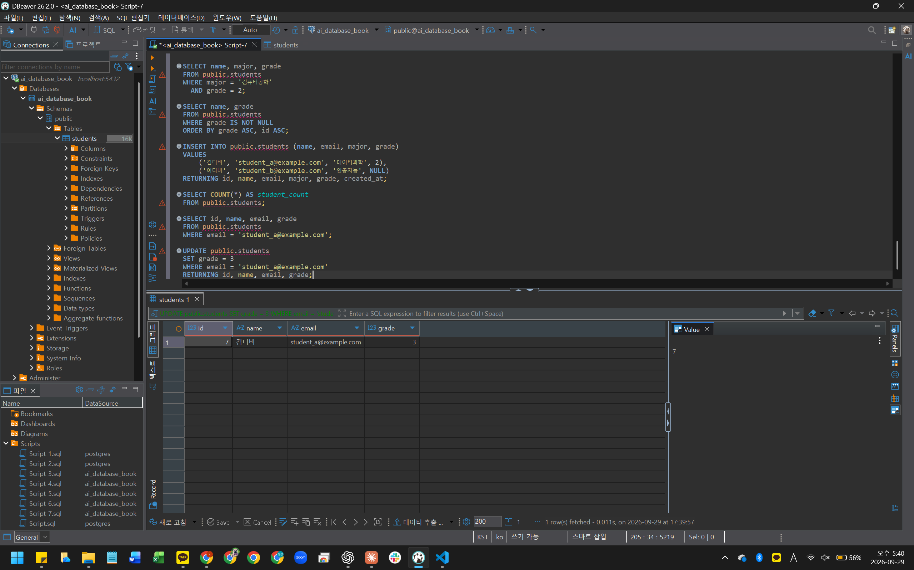
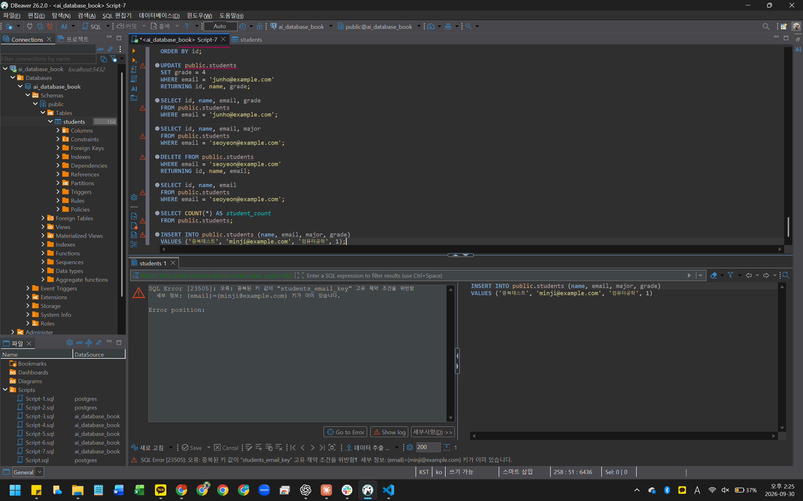

# Chapter 04 확장 실습 답안 템플릿

> **과제:** 관계형 데이터베이스와 SQL 시작하기  
> **사용 방법:** 이 파일을 내려받아 본인의 GitHub 저장소에 `chapter04_answer.md`라는 이름으로 저장한 뒤 실습하면서 바로 작성합니다.  
> **제출 방법:** LMS에는 파일을 직접 업로드하지 않고, **본인 GitHub 저장소의 `chapter04_answer.md` 파일 URL**을 제출합니다.

---

## 제출 전 주의

이 파일과 캡처 화면에는 실제 비밀번호, 전체 DB 접속 URL, API Key, 개인정보를 기록하지 않습니다.

```text
GitHub 계정 또는 별칭: rudah7725
과제 작성일: 2026-09-29~2026-10-01
사용한 AI 도구: ChatGPT
```

---

# 1. 실습 환경과 시작 상태 확인

다음을 실행합니다.

```sql
SELECT current_database();
SELECT current_user;
SELECT current_schema();
SHOW search_path;
SHOW transaction_read_only;
```

| 확인 항목 | 실제 결과 | 의미 |
| --- | --- | --- |
| current_database() | ai_database_book | 현재 연결된 데이터베이스가 실습에 사용할 DB |
| current_user | postgres | 현재 SQL을 실행하는 사용자 |
| current_schema() | public | 현재 기본으로 사용하는 스키마 |
| search_path | public, "$user" | 명시된 검색 순서는 public 다음 현재 사용자 이름의 스키마이다. 해당 스키마가 없거나 사용 권한이 없으면 건너뛴다. |
| transaction_read_only | off | 현재 트랜잭션이 읽기 전용으로 제한되어 있지 않다. 다만 이 값만으로 테이블 생성 권한까지 확인한 것은 아니다. |

- [x] 현재 DB가 `ai_database_book`이다.
- [x] 변경 가능한 연결인지 확인했다.
- [x] 실행할 SQL 범위를 확인했다.
- [x] Auto-commit 상태를 확인했다.

### 변경 SQL을 실행하기 전에 현재 DB와 실행 범위를 확인해야 하는 이유

```text
연결된 DB를 확인하지 않으면 실습용 DB가 아닌 다른 DB의 데이터를 바꿀 수 있다.
또 실행 범위를 확인하지 않으면 한 문장만 실행하려다가 다른 SQL까지 함께 실행할 수 있다.
따라서 변경 SQL을 실행하기 전에 현재 DB와 실행할 문장을 확인해야 한다.
UPDATE나 DELETE를 할 때는 같은 WHERE 조건으로 SELECT하여 대상 행도 먼저 확인해야 한다.
```

---

# 2. `public.students` 구조 생성

## 2-1. 실행 전 예상

```text
테이블 이름: public.students
한 행의 의미: 학생 한 명의 정보를 나타낸다. id, 이름, 이메일, 전공, 학년, 생성 시각을 저장한다.
예상 행 수: 처음에는 1행이라고 예상했다. 테이블 생성만으로는 데이터가 들어가지 않으므로 0행이라는 점을 이해했다.
기본키: id
필수 열: id, name, email, created_at (처음 빠뜨린 email은 SQL과 AI 설명을 참고해 보완했다.)
중복을 막는 열: id, email (처음 빠뜨린 id를 보완했다.)
자동 생성 열: id, created_at (처음 빠뜨린 id를 보완했다.)
```

## 2-2. 실행 파일

```text
code/chapter04/01_create_students.sql
```

## 2-3. 실행 후 확인

```text
테이블 생성 성공 여부: 성공했다. DBeaver에서 students 테이블과 6개 열을 확인했다.
실제 행 수: 생성 직후 0행이었다. SELECT COUNT(*) AS student_count FROM public.students;의 결과가 0이었다.
DBeaver에서 확인한 위치: ai_database_book 연결 → Databases → ai_database_book → Schemas → public → Tables → students → Properties → Columns / Constraints
```

### 각 열의 역할

| 열 | 타입 | NULL 가능? | 역할 |
| --- | --- | --- | --- |
| id | INTEGER (DBeaver 표시: int4) | 불가능 | 각 학생 행을 구분하는 기본키이다. 생략하면 IDENTITY 설정으로 번호가 생성된다. |
| name | VARCHAR(50) | 불가능 | 학생의 이름을 저장한다. |
| email | VARCHAR(100) | 불가능 | 학생의 이메일을 저장한다. UNIQUE 조건으로 같은 이메일의 중복 입력을 막는다. |
| major | VARCHAR(100) | 가능 | 학생의 전공을 저장한다. |
| grade | INTEGER (DBeaver 표시: int4) | 가능 | 학생의 학년을 저장한다. |
| created_at | TIMESTAMPTZ | 불가능 | 행의 생성 시각을 저장한다. 생략하면 DEFAULT CURRENT_TIMESTAMP가 적용된다. |

### `id`를 학번이나 학생 수로 해석하면 안 되는 이유

```text
id는 테이블 안에서 각 행을 구분하기 위한 번호이며 학교에서 정한 학번은 아니다.
또 행이 삭제되거나 번호가 생성된 뒤 입력이 실패하면 번호 사이가 비어 있을 수 있다.
따라서 가장 큰 id를 학생 수로 생각하면 안 되고, 실제 학생 행 수는 COUNT(*)로 확인해야 한다.
```

### 증거 화면

권장 경로:

```text
assignments/chapter04/images/step02_table.png
```



---

# 3. 샘플 데이터 6명 입력

## 3-1. 실행 전 예상

```text
현재 행 수: 0행
실행 후 예상 행 수: 6행
예상되는 NULL 포함 학생: 실행 전 예상은 따로 기록하지 않았다. 실행 후 윤서진의 major와 grade가 NULL인 것을 확인했다.
```

## 3-2. 실행 파일

```text
code/chapter04/02_insert_students.sql
```

## 3-3. 실제 결과

```text
실제 행 수: 6행. 전체 조회에서 6명을 확인했고, COUNT(*)로 다시 확인한 결과도 6이었다.
이준호 grade: 3
박서연 존재 여부: 존재한다.
윤서진 major: NULL
윤서진 grade: NULL
```

### 예상과 실제 비교

```text
예상과 실제가 일치했는가: 예상한 6행과 실제 6행이 일치했다.
다르다면 이유: 행 수에는 차이가 없었다. 다만 NULL이 들어갈 학생은 사전 예상을 기록하지 않았으므로 실행 후 확인한 결과로 구분해 기록했다.
```

### `created_at` 값이 여러 행에서 같을 수 있는 이유

```text
실제 결과에서 6명의 created_at이 모두 2026-09-29 16:41:17.046 +0900으로 같았다.
교수님 스크립트는 세 INSERT를 BEGIN부터 COMMIT까지 하나의 트랜잭션으로 묶는다.
AI의 설명을 통해 CURRENT_TIMESTAMP는 각 행을 넣는 순간이 아니라 트랜잭션 시작 시각을 사용한다는 점을 알았다.
따라서 이 실행에서 여러 행의 created_at이 같은 것은 오류가 아니다.
```

---

# 4. SELECT 복습과 결과 검증

각 문제는 **SQL 실행 전에 예상 행 수를 먼저 작성**합니다.

| 번호 | 조회 문제 | 예상 행 수 | 실제 행 수 | 일치? | 다르면 이유 |
| ---: | --- | ---: | ---: | --- | --- |
| 1 | 전체 학생 | 6 | 6 | 일치 | 차이 없음. 예상대로 샘플 학생 6명이 모두 조회됐다. 이 표는 가상 학생 추가와 수정·삭제 전 결과이다. |
| 2 | 이름·이메일만 조회 | 6 | 6 | 일치 | 차이 없음. 조회하는 열만 선택했으므로 학생 수는 6명 그대로였다. |
| 3 | 특정 전공 | 2 | 2 | 일치 | 차이 없음. 컴퓨터공학 전공인 김민지와 최현우 2명이 조회됐다. |
| 4 | 특정 학년 이상 | 2 | 2 | 일치 | 차이 없음. grade >= 3 조건에 맞는 이준호와 최현우 2명이 조회됐다. |
| 5 | 두 전공 중 하나 | 3 | 3 | 일치 | 차이 없음. 컴퓨터공학 또는 경영학인 김민지, 박서연, 최현우 3명이 조회됐다. |
| 6 | `grade IS NULL` | 1 | 1 | 일치 | 차이 없음. 학년 값이 NULL인 윤서진 1명만 조회됐다. |
| 7 | 전공 `DISTINCT` | 5 | 5 | 일치 | 차이 없음. 중복 전공이 한 번씩 표시되어 NULL을 포함한 5행이 조회됐다. |
| 8 | 정렬 후 상위 3명 | 3 | 3 | 일치 | 차이 없음. 학년 내림차순, id 오름차순으로 정렬하고 LIMIT 3을 적용해 최현우, 이준호, 김민지 3명이 조회됐다. |

## 4-1. 내가 직접 작성한 SQL 2개

```sql
-- SQL 1
-- AI가 제안한 SQL에서 grade = 2 조건을 채우고 결과를 예상한 뒤 실행했다.
SELECT name, major, grade
FROM public.students
WHERE major = '컴퓨터공학'
  AND grade = 2;
```

```text
이 SQL의 한 행 의미: 컴퓨터공학 전공이면서 2학년인 학생 한 명이다.
예상 행 수: 1행, 김민지
실제 행 수: 1행, 김민지 / 컴퓨터공학 / 2가 조회됐다.
```

```sql
-- SQL 2
-- AI가 제안한 SQL에서 IS NOT NULL 조건을 채우고 결과를 예상한 뒤 실행했다.
SELECT name, grade
FROM public.students
WHERE grade IS NOT NULL
ORDER BY grade ASC, id ASC;
```

```text
이 SQL의 한 행 의미: 학년 값이 있는 학생 한 명이다.
예상 행 수: 5행이며 첫 번째 학생은 박서연이다.
실제 행 수: 5행. 박서연(1), 김민지(2), 정하늘(2), 이준호(3), 최현우(4) 순서로 조회됐다.
```

## 4-2. `= NULL` 대신 `IS NULL`을 사용하는 이유

```text
NULL은 0 또는 빈 문자열과는 다르게 값이 존재하지 않는 상태이다.
따라서 = NULL로 비교하면 참이 되지 않으므로 NULL인지 확인할 때는 IS NULL을 사용한다.
```

## 4-3. `ORDER BY` 없이 결과 순서를 믿으면 안 되는 이유

```text
정렬 기준을 정해야 원하는 순서대로 결과를 확인할 수 있기 때문이다.
ORDER BY가 없으면 조회 순서가 보장되지 않는다.
LIMIT 3은 행 수만 제한하므로 어떤 학생 세 명을 고를지 정하려면 정렬 기준이 필요하다.
학년이 같은 경우도 있으므로 id를 추가 정렬 기준으로 사용했다.
```

## 4-4. `DISTINCT`가 원본 데이터를 삭제하는 기능인가요?

```text
아니다. 조회 결과에서 중복 전공이 한 번만 표시된 것이다.
전공을 DISTINCT로 조회하면 NULL을 포함하여 5행이 나오지만, 원본 학생 6행이 삭제되는 것은 아니다.
```

### 증거 화면

권장 경로:

```text
assignments/chapter04/images/step04_select.png
```



---

# 5. 내 가상 학생 2명 추가

실명·실제 이메일 대신 가상 데이터를 사용합니다.

## 5-1. 실행 전 계획

```text
학생 A
이름: 김디비
이메일: student_a@example.com
전공: 데이터과학
학년: 2

학생 B
이름: 이디비
이메일: student_b@example.com
전공: 인공지능
학년 또는 NULL: NULL

현재 행 수: 6행
추가 후 예상 행 수: 8행
```

## 5-2. 내가 실행한 INSERT

```sql
INSERT INTO public.students (name, email, major, grade)
VALUES
    ('김디비', 'student_a@example.com', '데이터과학', 2),
    ('이디비', 'student_b@example.com', '인공지능', NULL)
RETURNING id, name, email, major, grade, created_at;
```

## 5-3. 실제 결과

```text
RETURNING 또는 확인 SELECT 결과: 2행이다. 김디비는 id 7, grade 2이고 이디비는 id 8, grade NULL이었다. 두 학생의 created_at은 2026-09-29 17:37:08.953 +0900이었다.
실제 전체 행 수: COUNT(*)로 8행을 확인했다.
예상과 일치 여부: 예상한 8행과 일치했다.
```

### 내가 일부 값을 NULL로 둔 이유 또는 NULL을 사용하지 않은 이유

```text
이디비의 학년은 NULL을 허용하는 grade 열에 값이 없는 경우를 실습하기 위해 NULL로 두었다.
NULL은 0학년이라는 뜻이 아니라 학년 값이 없는 상태이다.
```

---

# 6. 안전한 UPDATE

내가 추가한 가상 학생 한 명만 수정합니다.

## 6-1. 먼저 대상 확인 SELECT

```sql
SELECT id, name, email, grade
FROM public.students
WHERE email = 'student_a@example.com';
```

```text
예상 대상 행 수: 추가한 김디비 한 명을 대상으로 했다. 별도 사전 답변은 기록하지 않았다.
실제 대상 행 수: 1행. id 7, 김디비, student_a@example.com, grade 2였다.
```

## 6-2. UPDATE

```sql
UPDATE public.students
SET grade = 3
WHERE email = 'student_a@example.com'
RETURNING id, name, email, grade;
```

```text
예상 영향 행 수: 1행이며 전체 학생 수는 8명 그대로일 것으로 예상했다.
실제 영향 행 수: 1행
RETURNING 결과: id 7, 김디비, student_a@example.com, grade 3
```

## 6-3. UPDATE 후 재조회

```sql
-- 각각 실행한 결과: 김디비 1행의 grade는 3, 전체 학생 수는 8명이었다.
SELECT id, name, email, grade
FROM public.students
WHERE email = 'student_a@example.com';

SELECT COUNT(*) AS student_count
FROM public.students;
```

### `WHERE` 없는 UPDATE를 실행하면 위험한 이유

```text
특정 학생만 수정하려고 해도 WHERE가 없으면 모든 학생 행이 수정 대상이 된다.
이번 UPDATE에서 WHERE를 빼면 김디비뿐 아니라 다른 학생들의 grade도 모두 3으로 바뀔 수 있다.
그래서 같은 WHERE 조건의 SELECT로 대상을 먼저 확인해야 한다. WHERE 없는 UPDATE는 실행하지 않았다.
```

### 증거 화면

권장 경로:

```text
assignments/chapter04/images/step06_update.png
```



---

# 7. 안전한 DELETE

내가 추가한 가상 학생 한 명을 삭제합니다.

## 7-1. 삭제 전 확인

```sql
SELECT id, name, email, grade
FROM public.students
WHERE email = 'student_b@example.com';
```

```text
예상 대상 행 수: 추가한 이디비 한 명을 대상으로 했다. 삭제 영향 예상은 대상 조회 후 기록했다.
실제 대상 행 수: 1행이다. id 8, 이디비, student_b@example.com, grade NULL이었다.
```

## 7-2. DELETE

```sql
DELETE FROM public.students
WHERE email = 'student_b@example.com'
RETURNING id, name, email, grade;
```

```text
예상 영향 행 수: 1행이며 전체 학생 수는 8명에서 7명으로 줄어들 것으로 예상했다.
실제 영향 행 수: 1행이다.
RETURNING 결과: 삭제한 id 8, 이디비, student_b@example.com, grade NULL이 표시됐다.
```

## 7-3. 삭제 후 재조회

```sql
SELECT id, name, email, grade
FROM public.students
WHERE email = 'student_b@example.com';

SELECT COUNT(*) AS student_count
FROM public.students;
```

```text
삭제 후 같은 조건의 SELECT 결과 행 수: 0행이었다. 별도로 실행한 COUNT(*) 결과는 7이었다.
```

### `DELETE` 성공 메시지만 보고 끝내지 않고 다시 SELECT해야 하는 이유

```text
DELETE가 정상 실행되었어도 내가 원한 학생을 정확히 삭제했는지는 다시 확인해야 하기 때문이다.
같은 조건으로 조회하여 이디비가 없는지 확인하고, 전체 학생 수도 7명인지 확인했다.
RETURNING에 보인 1행은 삭제한 학생의 정보이지, 그 학생이 계속 남아 있다는 뜻은 아니다.
WHERE를 뺐다면 당시 학생 8명 모두가 삭제 대상이 됐을 것이다. 이 위험한 SQL은 실행하지 않았다.
```

---

# 8. 본문 기준 UPDATE·DELETE 상태 검증

`04_update_delete_students.sql`을 본문 시작 상태에서 실행했다면 다음을 확인합니다.

```text
최종 학생 수: 6명
이준호 grade: 4
박서연 존재 여부: 없다. 같은 이메일로 다시 조회한 결과가 0행이었다.
```

본문 기준 기대 상태와 비교합니다.

```text
학생 수 = 5
이준호 grade = 4
박서연 = 0행
```

### 내 실제 결과가 기준과 다르다면 원인

```text
교재는 최초 학생 6명에서 박서연을 삭제하여 5명이 되는 흐름이다.
나는 가상 학생을 추가하고 이디비만 삭제했으므로 김디비가 남아 있는 7명 상태에서 시작했다.
그래서 이준호의 학년을 바꾼 뒤 박서연 한 명을 삭제하면 최종 학생은 6명이다.
교재보다 한 명 많은 원인은 김디비가 남아 있기 때문이지, 박서연 삭제가 실패했기 때문은 아니다.

04_update_delete_students.sql 전체는 실행하지 않았다. 전체 스크립트는 시작 6명과 종료 5명을 확인하므로 내 상태와 맞지 않았다.
현재 7명 상태를 조회한 뒤, AI 안내에 따라 해당 파일의 이준호 UPDATE와 박서연 DELETE 부분을 각각 실행하고 SELECT로 확인했다.
이준호는 1행 수정되었고 grade가 3에서 4로 바뀌었다. 박서연은 1행 삭제되었으며 COUNT(*)는 6이었다.
```

---

# 9. 의도한 실패 2개 관찰

> 실패 테스트는 데이터베이스 규칙이 실제로 데이터를 보호하는지 확인하는 실험입니다.

## 9-1. 중복 이메일 `UNIQUE` 오류

내가 사용한 SQL:

```sql
INSERT INTO public.students (name, email, major, grade)
VALUES ('중복테스트', 'minji@example.com', '컴퓨터공학', 1);
```

```text
오류 메시지 핵심 단서: SQL Error [23505], students_email_key 고유 제약조건 위반, (email)=(minji@example.com) 키가 이미 있다는 메시지였다.
왜 실패해야 맞는가: 이미 김민지가 사용하는 이메일이므로 이름이 달라도 같은 이메일을 다시 넣으면 안 되기 때문이다. 나도 중복돼서 실패할 것 같다고 답했다.
어떤 규칙이 작동했는가: email 열의 UNIQUE 제약조건이다.
실패 후 기존 데이터가 어떻게 유지되었는가: 같은 이메일로 조회했을 때 기존 id 1, 김민지 한 행만 나왔다. 중복테스트 학생은 추가되지 않았다.
```

## 9-2. 이름 `NULL` 입력 `NOT NULL` 오류

내가 사용한 SQL:

```sql
INSERT INTO public.students (name, email, major, grade)
VALUES (NULL, 'null_name@example.com', '컴퓨터공학', 1);
```

```text
오류 메시지 핵심 단서: SQL Error [23502], students의 name 열에 있는 null 값이 not null 제약조건을 위반했다는 메시지였다.
왜 실패해야 맞는가: name은 필수 열이므로 NULL을 넣을 수 없기 때문이다. 나는 NULL이라서 실패하는 것 같다고 답했고, AI 설명을 통해 name의 NOT NULL 조건 때문이라고 구체적으로 정리했다.
어떤 규칙이 작동했는가: name 열의 NOT NULL 제약조건이다. major와 grade에는 NULL이 허용된다. 실패 후 해당 이메일로 조회한 결과는 0행이고, COUNT(*)는 6으로 유지됐다.
```

### 실패한 INSERT 뒤 자동 생성 `id` 번호에 빈 구간이 생길 수 있어도 문제라고 단정할 수 없는 이유

```text
입력에 실패했는데도 id에 빈 번호가 생길 수 있는 이유는 자동 생성 번호가 이미 사용되었을 수 있기 때문이다.
실제 NOT NULL 오류의 실패한 자료에는 id 11이 표시됐지만, 저장된 학생 수는 6명이었다.
id는 학생 수가 아니라 각 학생을 구별하는 식별자이므로 연속된 번호일 필요가 없다.
학생 수는 가장 큰 id가 아니라 COUNT(*)로 확인해야 한다.
```

### 증거 화면

권장 경로:

```text
assignments/chapter04/images/step09_constraint_error.png
```



---

# 10. `verify_students.sql`로 최종 상태 확인

실행 파일:

```text
code/chapter04/verify_students.sql
```

```text
현재 전체 학생 수: 6명. 검증 파일 전체가 아니라 '전체 상태', '주요 실습 상태', '현재 데이터' 조회 부분을 각각 실행했다.
NULL 개수: major가 NULL인 학생 1명, grade가 NULL인 학생 1명이다. 둘 다 윤서진이다.
이준호 grade: 4
박서연 존재 여부: 없다. seoyeon_exists는 false로, DBeaver에서는 체크되지 않은 [ ]로 표시됐다.
현재 데이터 상태에서 예상과 다른 부분: 처음에는 이준호를 3학년, 박서연 조회 결과를 1행이라고 답했다. 앞서 확인한 수정·삭제 결과를 다시 짚고, 실행 전 최종 예상을 4학년과 0행으로 정정했다. 정정한 예상과 실제 결과는 일치했다.
```

### 검증 SQL을 따로 두면 좋은 이유

```text
SQL은 정상 실행되었어도 내가 원하는 결과대로 실행되지 않았을 수 있기 때문이다.
예를 들어 WHERE 조건을 잘못 적어도 SQL 자체는 정상 실행될 수 있다.
따라서 SELECT로 의도한 행과 값이 정확히 변경됐는지 다시 확인해야 한다.
검증용 SQL을 따로 두면 INSERT, UPDATE, DELETE를 다시 실행하지 않고 현재 상태만 안전하게 확인할 수 있다.
```

---

# 11. AI를 SQL 작성자가 아니라 검토자로 활용

먼저 본인이 SQL을 작성한 뒤 AI에게 검토를 요청합니다.

## 11-1. 내가 작성한 SQL

```sql
UPDATE public.students
SET grade = 3
WHERE email = 'student_a@example.com';
```

## 11-2. AI에게 전달한 핵심 요청

```text
김디비의 학년을 3으로 설정하는 SQL을 작성해 보았다.
내가 작성한 SQL이 문법적으로 맞고, 의도한 김디비 한 명의 학년만 변경하는지 검토해 달라고 요청했다.
```

## 11-3. AI 검토 결과

| AI 제안 | 수용 / 수정 / 거절 | 실제 검증 결과 | 나의 이유 |
| --- | --- | --- | --- |
| UPDATE 전에 같은 WHERE 조건으로 SELECT하여 대상과 현재 학년을 확인하자. | 수용 | 이메일로 조회했을 때 id 7, 김디비, student_a@example.com, grade 3인 한 행이 나왔다. | 의도한 학생 한 명이 맞는지 먼저 확인할 수 있기 때문이다. |
| 이미 목표 값인 3학년이므로 같은 UPDATE를 다시 실행하지 말자. | 수용 | 현재 grade가 3인 것을 SELECT로 확인했고, 이번 검토에서는 UPDATE를 다시 실행하지 않았다. | 목표 상태가 이미 충족되어 있고, 앞선 실습에서 2→3 수정과 재조회도 확인했기 때문이다. |
| 이름 조건으로 바꾸지 말고 이메일 조건을 유지하자. | 수용 | 앞서 email의 UNIQUE 제약조건과 중복 입력 실패를 확인했다. 이번 이메일 조회 결과도 김디비 한 행이었다. | 이름에는 중복 제한이 없어 동명이인이 있을 수 있지만, 이메일은 UNIQUE여서 한 학생을 지정하기에 적합하기 때문이다. |

### AI가 예상한 영향 행 수와 실제 결과가 같았나요?

```text
AI가 예상한 SELECT 결과는 김디비 한 행이었고, 실제 조회도 한 행으로 일치했다.
이번 검토에서는 UPDATE를 다시 실행하지 않았으므로 이번 UPDATE의 실제 영향 행 수를 확인했다고 기록하지 않는다.
앞선 6번 실습에서는 UPDATE가 김디비 한 행에 적용되어 grade가 2에서 3으로 바뀌었고, 전체 학생 수는 당시 8명 그대로였다.
현재 전체 학생 수는 이후 삭제 실습을 거쳐 6명이다.
```

### AI 답변을 실행 전에 검토해야 하는 이유

```text
AI가 작성한 SQL이 문법은 맞더라도 내 의도와는 달라서 내가 의도하는 방향과 다른 결과가 나올 수 있기 때문이다.
따라서 실행 전에 대상 테이블, WHERE 조건과 변경할 값을 확인하고, 실제 조회 결과와 비교해야 한다.
```

---

# 12. 내 서비스 테이블 하나 확장 설계

Chapter 01~03에서 정한 개인 서비스에서 **테이블 하나**를 선택합니다.

```text
서비스 이름: 외식업 가맹점 운영 관리 서비스
테이블 이름: stores
한 행의 의미: 가맹점 한 곳의 기본 정보를 나타낸다.
```

| 열 이름 | 저장할 값 | 타입 후보 | NULL 가능? | UNIQUE 후보? | 이유 |
| --- | --- | --- | --- | --- | --- |
| store_id | DB 내부 가맹점 식별 번호 | INTEGER, IDENTITY | 불가(PK 후보) | 예(PK 후보) | 각 가맹점 행을 구별한다. |
| store_code | 본사가 부여하는 가맹점 관리 코드 | VARCHAR(20) | 불가 후보 | 예, 본사 내 중복 없이 부여한다는 설계 가정 | 사람이 업무에서 사용하는 식별자이며, 예시는 ST001이다. |
| store_name | 가맹점명 | VARCHAR(100) | 불가 | 아니오 | 이름은 필수이지만 중복을 금지할 업무 규칙은 확인되지 않아 UNIQUE는 적용하지 않는다. |
| address | 가맹점 주소 | VARCHAR(255) | 불가 | 아니오 | 주소는 필수이지만 같은 건물에 여러 가맹점이 있을 수 있으므로 UNIQUE는 적용하지 않는다. |
| phone | 가맹점 전화번호 | VARCHAR(30) | 가능 | 아니오 | 미정이면 NULL을 허용하고 중복 금지 규칙이 없어 UNIQUE는 적용하지 않는다. 앞자리 0과 하이픈 보존을 위해 문자형을 후보로 잡았다. |
| opened_on | 개점일 | DATE | 가능 | 아니오 | 실제 개점 전에는 NULL을 허용한다. 여러 가맹점의 개점일이 같을 수 있다. |

```text
PK 후보: store_id
업무 식별자 후보: store_code
아직 미확정인 규칙: 가맹점 코드의 형식과 변경·재사용 정책, 점주와 가맹점의 관계 등이다. 현재 설계에서는 가맹점명·주소·전화번호에 UNIQUE를 적용하지 않기로 했다.
```

## 선택: CREATE TABLE 초안

> 아직 확정되지 않은 업무 규칙은 억지로 제약조건으로 만들지 않습니다.

```sql

```

### AI에게 검토받은 뒤 수정한 부분

```text
처음에는 가맹점주와 직전 월 또는 분기 매출액도 stores에 넣을 항목으로 생각했다.
AI 설명을 참고하여 이번에는 가맹점의 기본 정보 6개 열로 구성하기로 했다. 타입과 길이는 후보이며 실제 테이블을 생성하지는 않았다.
개점 준비 중인 가맹점도 등록할 수 있도록 가맹점명과 주소는 필수로 하되 전화번호와 개점일은 NULL을 허용하자는 제안을 수용했다.
중복 제한은 store_id와 store_code에만 두고, 나머지 열은 중복 금지 규칙이 확인되지 않았거나 같은 값이 나올 수 있으므로 UNIQUE를 적용하지 않기로 했다.
가맹점주는 owners에서 관리하고 연결하는 방향으로 두되, 공동 운영이나 여러 매장 운영 여부가 미정이므로 owner_id 하나로 관계를 확정하지 않았다.
월·분기 매출은 기간과 주문·취소·환불 처리 기준에 따라 달라지므로 stores의 고정된 기본 정보에서 제외하고, 주문 데이터로 계산하거나 별도 집계하는 방향으로 남겨두었다.
```

---

# 13. 최종 성찰

아래 문장은 본인의 말로 작성합니다.

```text
1. SQL 실행 성공과 올바른 대상 선택이 다른 이유는
   SQL 문법이 맞아 정상 실행되더라도 내 의도와 다른 행을 선택하여 다른 결과가 나올 수 있기 때문이다.

2. UPDATE와 DELETE 전에 SELECT를 먼저 해야 하는 이유는
   수정하거나 삭제할 대상을 정확히 정하고, WHERE 조건에 해당하는 행이 내가 의도한 대상인지 확인하기 위해서이다.

3. 영향받은 행 수를 확인해야 하는 이유는
   의도한 대상 수와 실제 수정하거나 삭제한 행 수가 같은지 확인하기 위해서이다.
   한 명만 수정하려 했는데 6행이 영향을 받았다면 WHERE 조건에 해당하는 학생이 여러 명이거나 조건을 빠뜨렸는지 의심해야 한다.

4. UNIQUE 또는 NOT NULL 오류를 '보호 장치가 정상 동작한 결과'라고 볼 수 있는 이유는
   중복 이메일이나 필수 값이 없는 데이터가 저장되는 것을 막아 테이블에 정한 규칙을 지켜 주었기 때문이다.
   처음에는 데이터를 훼손할 수 있어서라고 생각했는데, AI의 설명을 듣고 규칙에 맞지 않는 데이터의 저장을 막는다는 뜻으로 이해했다.

5. AI가 SQL을 만들어 주더라도 내가 반드시 확인해야 하는 것은
   AI가 내 의도에 맞게 SQL을 작성했는지이다.
   특히 대상 테이블과 WHERE 조건이 내가 의도한 행을 선택하는지, 변경할 값과 예상 영향 행 수가 맞는지 확인해야 한다.
```

---

# 14. 제출 체크리스트

- [x] `chapter04_answer.md`를 본인 저장소에 만들었다.
- [x] 현재 DB와 실행 환경을 확인했다.
- [x] `public.students`를 생성했다.
- [x] 샘플 6명 입력 결과를 검증했다.
- [x] SELECT 문제에서 실행 전 예상 행 수를 작성했다.
- [x] 가상 학생 2명을 추가했다.
- [x] UPDATE 전후를 SELECT로 확인했다.
- [x] DELETE 전후를 SELECT로 확인했다.
- [x] UNIQUE 오류를 관찰했다.
- [x] NOT NULL 오류를 관찰했다.
- [x] `verify_students.sql`로 상태를 확인했다.
- [x] AI 제안을 실제 SQL 결과와 비교했다.
- [x] 개인 서비스 테이블 하나를 확장 설계했다.
- [x] 핵심 캡처는 3~4장 정도로 제한했다.
- [x] 비밀번호·개인정보가 캡처에 없다.
- [x] Markdown 이미지가 GitHub 웹 화면에서 정상 표시된다.
- [x] commit/push를 완료했다.

---

# 15. LMS 제출 URL

아래 형식의 **본인 GitHub 파일 URL**을 LMS에 제출합니다.

```text
https://github.com/<본인-GitHub-ID>/<본인-저장소>/blob/main/assignments/chapter04/chapter04_answer.md
```

내 제출 URL:

```text
https://github.com/rudah7725/database-course-2026-2/blob/main/assignments/chapter04/chapter04_answer.md
```

> 교수자 템플릿 URL이나 저장소 메인 URL이 아니라 **작성 완료된 본인 `chapter04_answer.md` 파일 화면 URL**을 제출합니다.
