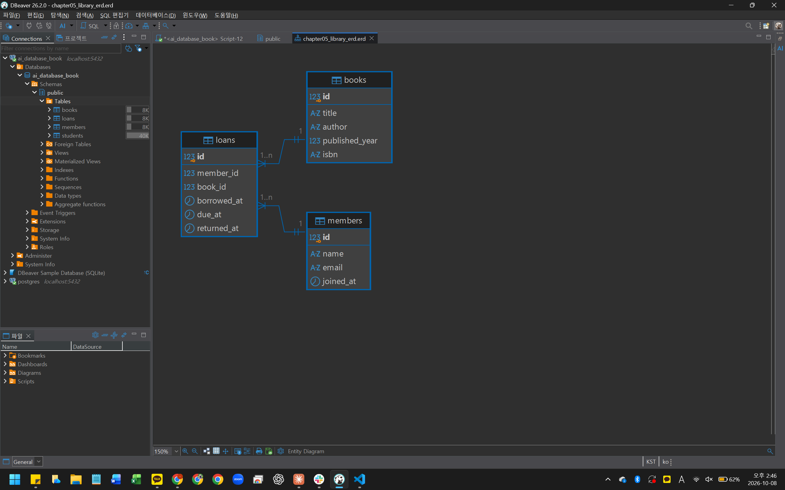
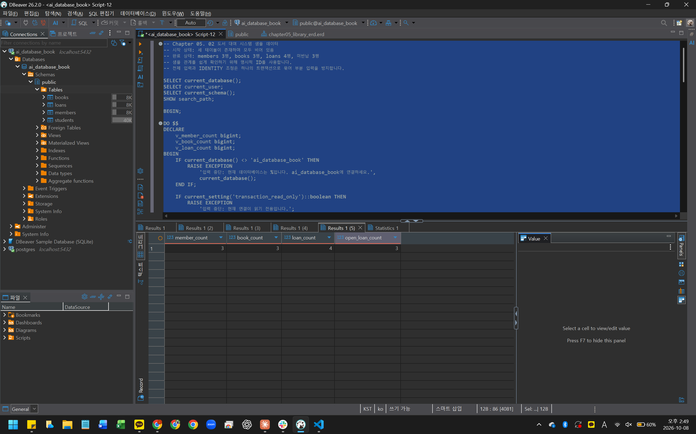
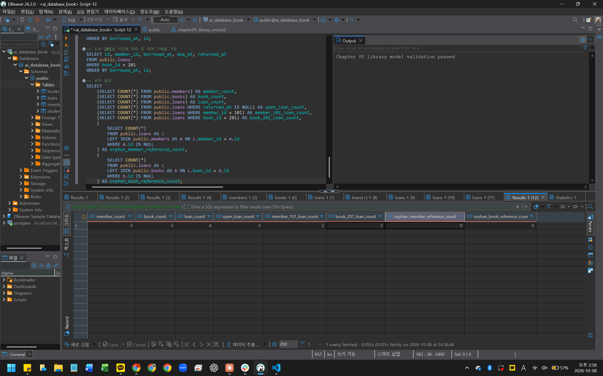
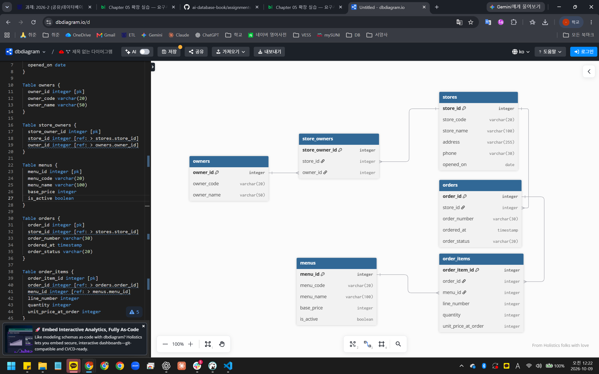

# Chapter 05 확장 실습 답안 템플릿

> **과제:** 요구사항에서 데이터 모델과 ERD 만들기  
> **사용 방법:** 이 파일을 내려받아 본인의 GitHub 저장소에 `chapter05_answer.md`라는 이름으로 저장한 뒤 실습하면서 바로 작성합니다.  
> **제출 방법:** LMS에는 파일을 직접 업로드하지 않고, **본인 GitHub 저장소의 `chapter05_answer.md` 파일 URL**을 제출합니다.

---

## 제출 전 주의

이 파일과 캡처 화면에는 실제 비밀번호, 전체 DB 접속 URL, API Key, 개인정보를 기록하지 않습니다.

```text
GitHub 계정 또는 별칭: rudah7725
과제 작성일: 2026-10-07
사용한 AI 도구: ChatGPT
```

---

# 1. Chapter 05 핵심 개념 복습

본문을 보지 않고 먼저 작성합니다.

```text
요구사항에서 바로 테이블부터 만들면 위험한 이유: 무엇이 테이블이고 무엇이 속성인지 구분하지 않고 만들면 같은 정보가 반복 저장되거나 관계가 빠질 수 있다.

한 행의 의미를 먼저 정해야 하는 이유: 한 행이 무엇을 뜻하는지 정해야 들어갈 열과 PK를 정할 수 있고, 집계할 때 무엇을 세는지 헷갈리지 않는다.

확정 요구사항과 미확정 정책을 구분해야 하는 이유: 정해지지 않은 정책을 미리 제약조건으로 만들면 실제 규칙과 다를 때 구조를 다시 고쳐야 하기 때문이다.

PK와 업무상 고유값 후보의 차이: PK는 DB 안에서 행을 구분하고 참조하기 위한 값이고, 업무상 고유값은 이메일이나 학번처럼 업무에서 대상을 구분하는 값이다. 업무상 고유값은 바뀌거나 중복될 수 있어서 바로 UNIQUE로 정하면 안 된다.

N:M 관계를 그대로 두지 않고 연결 테이블을 검토하는 이유: 두 테이블만으로 저장하면 한 칸에 여러 값을 넣거나 같은 행을 반복해야 하고, 연결 테이블을 두면 1:N 두 개로 나누어 신청일 같은 관계 정보도 저장할 수 있기 때문이다.
```

---

# 2. 도서 대여 요구사항 R-01~R-07 다시 분해

| 요구사항 | 관리 대상 / 사건 | 속성 후보 | 관계 / 규칙 후보 | 미확정 질문 |
| --- | --- | --- | --- | --- |
| R-01 | 회원 (대상) | 회원 번호(식별자) | 도서관이 회원을 관리한다 | 탈퇴한 회원의 기록은 남기는가? |
| R-02 | 회원 (대상) | 이름, 이메일, 가입일 | 세 값은 회원마다 저장한다 | 이메일이 회원마다 고유한가? |
| R-03 | 도서 (대상) | 제목, 저자, 출판연도, ISBN | 제목과 저자를 관리하고, 출판연도와 ISBN도 저장할 수 있다 | ISBN이 없는 책이나 저자가 여러 명인 책도 있는가? |
| R-04 | 대여 (사건) | 대여한 회원 (회원 번호 참조) | 회원 한 명은 여러 대여 기록을 가질 수 있다 | 한 회원이 동시에 빌릴 수 있는 최대 권수가 있는가? |
| R-05 | 대여 (사건) | 대여된 도서 (도서 번호 참조) | 도서 한 권은 시간에 따라 여러 대여 기록을 가질 수 있다 | 같은 책을 두 명이 동시에 빌릴 수 있는가? |
| R-06 | 대여 (사건) | 대여일, 반납예정일, 실제반납일 | 대여 기록마다 날짜를 저장한다 | 반납예정일은 어떻게 정하고, 연체는 어떻게 처리하는가? |
| R-07 | 대여 (사건) | 실제반납일 | 미반납이면 실제반납일은 NULL일 수 있다 | 반납일이 대여일보다 빠르면 막아야 하는가? |

### 본문과 비교한 뒤 수정한 내용

```text
처음에 놓친 부분: R-04, R-05는 관계만 있고 속성은 없다고 생각해서 속성 후보를 비워 뒀다.

처음에 잘못 분류한 부분: R-03에서 ISBN은 없어도 되는 값이라고 적었는데, ISBN 없는 책을 허용할지는 아직 안 정해진 부분이었다.

수정한 이유: 대여 기록에는 누가 어떤 책을 빌렸는지가 있어야 해서 회원 번호와 도서 번호를 넣었다. ISBN은 요구사항에 저장할 수 있다고만 되어 있어서 미확정 질문으로 옮겼다.
```

---

# 3. 확정 규칙과 미확정 정책 구분

## 3-1. 확정된 규칙

```text
1. 회원은 이름, 이메일, 가입일을 가진다. (R-02)
2. 도서는 제목과 저자를 가지고, 출판연도와 ISBN도 저장할 수 있다. (R-03)
3. 대여 기록은 회원 한 명과 도서 한 건을 연결하고, 회원 한 명은 여러 번 대여할 수 있다. (R-04)
4. 같은 도서는 시간에 따라 여러 번 대여될 수 있다. (R-05)
5. 대여 기록에는 대여일, 반납예정일, 실제반납일을 저장하고, 반납 전에는 실제반납일이 비어 있을 수 있다. (R-06, R-07)
```

## 3-2. 미확정 질문

최소 5개를 작성합니다.

```text
Q1. 회원 이메일은 회원마다 달라야 하는가?
Q2. ISBN은 도서마다 달라야 하는가? 같은 ISBN의 책이 여러 권 있으면 어떻게 구분하는가?
Q3. 같은 도서를 여러 명이 동시에 대여할 수 있는가?
Q4. 대여 기록이 있는 회원이나 도서를 삭제할 수 있는가? 삭제하면 대여 기록은 어떻게 하는가?
Q5. 한 도서에 저자가 여러 명이면 어떻게 저장하는가?
```

### 미확정 정책을 바로 `UNIQUE`, `CHECK`, 삭제 규칙으로 구현하면 위험한 이유

```text
나중에 정책이 다르게 정해지면 정상 데이터가 입력되지 않거나 필요한 기록이 함께 지워질 수 있다. 예를 들어 ISBN에 UNIQUE를 걸면 같은 책 복본을 등록할 수 없고, 회원 삭제 시 대여 기록까지 지우게 하면 대여 이력이 사라진다.
```

---

# 4. 엔터티·속성·사건 후보 구분

| 후보 | 대상 엔터티 / 사건 엔터티 / 속성 | 판단 근거 | 독립 식별 필요? |
| --- | --- | --- | --- |
| 회원 | 대상 엔터티 | 이름, 이메일, 가입일 등 여러 속성을 가지고 여러 명이 저장된다 | 필요 |
| 도서 | 대상 엔터티 | 제목, 저자 등 여러 속성을 가지고 대여 기록이 참조한다 | 필요 |
| 대여 기록 | 사건 엔터티 | 같은 회원과 도서 사이에서도 시간에 따라 반복해서 생기고, 날짜 속성을 가진다 | 필요 |
| 이메일 | 속성 | 회원 한 명을 설명하는 값이다 | 불필요 |
| ISBN | 속성 | 도서 한 건을 설명하는 값이다 | 불필요 |
| 반납예정일 | 속성 | 대여 기록 한 건마다 정해지는 날짜다 | 불필요 |

### “명사가 보이면 무조건 테이블”이 아닌 이유

```text
이메일이나 반납예정일처럼 다른 대상을 설명하는 값도 명사로 나오기 때문이다. 따로 식별하고 여러 건을 저장해야 하는 대상만 테이블로 만들고, 나머지는 속성으로 둔다.
```

---

# 5. 테이블별 한 행의 의미와 키 후보

| 테이블 | 한 행의 의미 | PK 후보 | 업무상 고유값 후보 | FK 후보 |
| --- | --- | --- | --- | --- |
| `members` | 회원 한 명 | `id` | `email` (고유 여부 미확정) | 없음 |
| `books` | 대여 대상으로 관리하는 도서 한 건 (실물 복본은 구분하지 않음) | `id` | `isbn` (고유 여부, 필수 여부 미확정) | 없음 |
| `loans` | 회원 한 명이 도서 한 건을 대여한 사건 한 번 | `id` | 없음 | `member_id` → `members.id`, `book_id` → `books.id` |

### `members.email`을 지금 바로 UNIQUE라고 확정하지 않는 이유

```text
이메일이 회원마다 달라야 한다는 요구사항이 없다. 가족이 같은 이메일을 쓰거나 탈퇴한 회원의 이메일로 다시 가입하는 경우를 허용할지 아직 정하지 않았다.
```

### `books.isbn`을 지금 바로 NOT NULL + UNIQUE라고 확정하지 않는 이유

```text
ISBN이 없는 도서를 허용할지, 같은 ISBN의 책이 여러 권일 때 어떻게 구분할지 아직 정하지 않았다. 이 상태에서 NOT NULL이나 UNIQUE를 걸면 정책이 정해졌을 때 정상 데이터가 들어가지 않을 수 있다.
```

---

# 6. 관계를 양방향 문장으로 작성

## 6-1. `members ↔ loans`

```text
회원 한 명은 대여 기록을 여러 건 가질 수 있고, 한 번도 대여하지 않았다면 0건일 수도 있다.

대여 기록 한 건은 반드시 회원 한 명에게 속한다.

카디널리티: members 1 : N loans
선택성에서 확인할 점: 가입만 하고 대여하지 않은 회원이 있을 수 있으므로 회원 쪽에서는 대여 기록이 없어도 된다. 대여 기록에는 회원이 꼭 있어야 하므로 member_id는 NOT NULL이다.
```

## 6-2. `books ↔ loans`

```text
도서 한 건은 시간에 따라 대여 기록을 여러 건 가질 수 있고, 아직 대여되지 않았다면 0건일 수도 있다.

대여 기록 한 건은 반드시 도서 한 건을 가리킨다.

카디널리티: books 1 : N loans
선택성에서 확인할 점: 새로 들어온 책처럼 대여 기록이 없는 도서가 있을 수 있다. 대여 기록에는 도서가 꼭 있어야 하므로 book_id는 NOT NULL이다. 1:N은 시간 전체의 이력이고, 같은 시점에 한 명만 빌릴 수 있는지는 따로 정해야 한다.
```

## 6-3. `members ↔ books`를 직접 N:M으로 저장하지 않고 `loans`를 두는 이유

```text
회원과 도서는 N:M 관계지만 두 테이블 중 한쪽에 상대 id를 넣으면 한 칸에 여러 값을 넣거나 행을 반복해야 한다. loans를 두면 1:N 관계 두 개로 나눌 수 있고, 대여일 같은 대여 정보를 저장할 곳도 생긴다.
```

### `loans`가 단순 연결표가 아니라 사건 엔터티라고 볼 수 있는 이유

```text
같은 회원이 같은 책을 다시 빌리면 새 행이 생기고, 각 행이 대여일, 반납예정일, 실제반납일을 따로 가진다. 회원과 도서의 연결 여부만 기록하는 것이 아니라 대여라는 사건 한 번을 기록하기 때문이다.
```

---

# 7. 도서 대여 ERD 초안

아래 항목이 보이도록 ERD를 작성합니다.

```text
members
books
loans
PK
FK
주요 속성
1:N 관계
```

권장 이미지 경로:

```text
assignments/chapter05/images/step07_library_erd.png
```

Markdown 예시:

```markdown

```


### ERD를 그린 뒤 수정한 부분

```text
처음에는 관계선 끝이 점으로만 보여서 1:N이 잘 드러나지 않았다. 그래서 표기법을 Crow's Foot으로 바꾸고 배율을 키웠다. 테이블, 열, 관계는 바꾸지 않았다.
DBeaver는 FK 열을 따로 표시하지 않으므로 FK는 관계선으로 확인했다. loans.member_id → members.id, loans.book_id → books.id이다.
DBeaver는 loans 쪽을 1..n으로 표시하지만, 6번에서 정리한 것처럼 대여 기록이 없는 회원과 도서도 있을 수 있다.
```

---

# 8. PostgreSQL로 도서 대여 모델 구현 확인

## 8-1. 현재 환경 확인

```sql
SELECT current_database();
SELECT current_user;
SELECT current_schema();
SHOW search_path;
SHOW transaction_read_only;
```

```text
현재 DB: ai_database_book
현재 사용자: postgres
현재 스키마: public
search_path: public, "$user"
읽기 전용 여부: off (읽기 전용 아님)
```

- [x] 현재 DB가 `ai_database_book`이다.
- [x] 실행 범위를 확인했다.
- [x] Auto-commit 상태를 확인했다.

## 8-2. 스키마 생성 SQL 실행

사용 파일:

```text
code/chapter05/01_library_schema.sql
```

실행 전 예상:

```text
생성될 테이블 수: 3개 (members, books, loans)
생성 순서: members → books → loans
각 테이블 예상 행 수: 세 테이블 모두 0행
```

실행 후 실제:

```text
members 존재: 있음 (to_regclass 결과 members)
books 존재: 있음 (to_regclass 결과 books)
loans 존재: 있음 (to_regclass 결과 loans)
각 테이블 행 수: members 0, books 0, loans 0
```

### `loans`를 마지막에 만드는 이유

```text
loans의 member_id와 book_id가 members.id와 books.id를 참조하기 때문이다. 참조할 부모 테이블이 먼저 있어야 FK를 만들 수 있다.
```

---

# 9. 샘플 데이터 입력과 관계 관찰

사용 파일:

```text
code/chapter05/02_library_seed.sql
```

## 9-1. 실행 전 예상

```text
members 예상 행 수: 3
books 예상 행 수: 3
loans 예상 행 수: 4
미반납 예상 건수: 3
회원 101 대여 예상 건수: 2
도서 201 대여 예상 건수: 2
```

## 9-2. 실제 결과

```text
members 실제 행 수: 3
books 실제 행 수: 3
loans 실제 행 수: 4
미반납 실제 건수: 3
회원 101 대여 실제 건수: 2 (1001, 1002)
도서 201 대여 실제 건수: 2 (1001, 1003)
```

### 샘플 데이터에서 확인한 1:N 관계

```text
loans에서 member_id 101이 두 번(1001, 1002) 나와서 회원 한 명이 여러 대여 기록을 가진다. book_id 201도 두 번(1001, 1003) 나오는데, 1001이 4월 2일에 반납된 뒤 1003이 4월 3일에 시작되어 같은 책이 시간에 따라 여러 번 대여된 것이다. 같은 id가 반복되는 것은 오류가 아니라 1:N 관계이기 때문이다.
```

### `returned_at = NULL`이 의미하는 것

```text
아직 반납하지 않은 대여라는 뜻이다. 값을 모르는 것이 아니라 반납이라는 일이 아직 일어나지 않은 것이다. 1002, 1003, 1004 세 건이 해당한다.
```

### 증거 화면

권장 경로:

```text
assignments/chapter05/images/step09_seed_result.png
```



---

# 10. 검증 SQL 실행

사용 파일:

```text
code/chapter05/03_library_validation.sql
```

## 10-1. 결과 기록

```text
members = 3
books = 3
loans = 4
미반납 건수 = 3
회원 101 대여 이력 = 2
도서 201 대여 이력 = 2
회원 참조 고아 행 = 0
도서 참조 고아 행 = 0
loans FK 개수 = 2 (FK가 2개가 아니면 검증 실패 오류가 나는데, 통과 메시지가 나왔다)
검증 최종 메시지 = Chapter 05 library model validation passed
```

### 단순히 테이블 3개가 생성되었다고 설계 검증이 끝난 것이 아닌 이유

```text
테이블이 있다는 것만으로는 FK가 제대로 연결됐는지, 샘플 데이터가 요구사항대로 저장됐는지 알 수 없다. 이번 검증에서는 고아 참조가 0건이고, 회원 101과 도서 201에 대여 기록이 2건씩 있으며, 미반납 3건이 NULL로 표현되는 것까지 확인했다.
```

### 증거 화면

권장 경로:

```text
assignments/chapter05/images/step10_validation.png
```



---

# 11. 작은 시나리오로 모델 검증

아래 시나리오를 현재 모델이 표현할 수 있는지 판단합니다.

| 시나리오 | 표현 가능? | 이유 | 추가 확인할 정책 |
| --- | --- | --- | --- |
| 회원 A가 서로 다른 책 2권을 대여 | 가능 | loans에 같은 member_id로 book_id가 다른 행 2개를 넣으면 된다 (샘플의 회원 101) | 한 회원의 최대 대여 권수 |
| 같은 책을 시간 차를 두고 다시 대여 | 가능 | 같은 book_id로 대여일이 다른 행이 새로 생긴다 (샘플의 도서 201) | 없음 |
| 아직 반납하지 않은 대여 | 가능 | returned_at을 NULL로 둔다 | 연체 처리 기준 |
| 회원은 있지만 대여 기록이 없음 | 가능 | members에만 행이 있고 loans에는 없으면 된다 | 없음 |
| ISBN이 없는 도서 | 가능 | isbn이 NULL을 허용한다 | ISBN 없는 도서를 허용할지 |
| 같은 ISBN의 실물 복본 2권 | 어려움 | books 한 행이 실물 한 권이 아니라 간소화된 도서 항목이라서 두 행을 넣어도 복본인지 중복 등록인지 구분할 수 없다 | 복본을 따로 관리할지 |
| 한 도서에 저자 2명 | 어려움 | author가 열 하나라서 한 칸에 두 이름을 넣어야 한다 | 여러 저자를 저장할지 |
| 같은 도서를 두 명이 동시에 대여 | 막을 수 없음 | 같은 book_id로 미반납 행을 두 개 넣어도 들어간다 | 동시 대여를 허용할지 |

### 현재 Chapter 05 모델의 한계 3가지

```text
1. 같은 ISBN의 실물 책 여러 권을 구분하지 못한다.
2. 저자가 여러 명인 도서를 제대로 저장하지 못한다.
3. 같은 책이 동시에 두 번 대여되는 것을 막지 못한다.
```

---

# 12. Chapter 01~04 개인 서비스 요구사항 작성

지금까지 선택한 개인 서비스 아이디어를 사용합니다.

```text
서비스 이름: 외식업 가맹점 운영 관리 서비스
서비스 목적: 프랜차이즈 본사 담당자가 여러 가맹점의 주문 기록을 같은 기준으로 모아 가맹점별 매출과 메뉴별 판매량을 비교할 수 있게 한다.
```

## 12-1. 요구사항

최소 8개를 작성합니다.

```text
P05-R01. 본사는 가맹점을 관리하며, 가맹점은 가맹점 코드, 가맹점명, 주소, 전화번호, 개점일을 가진다.
P05-R02. 본사는 가맹점주를 관리하며, 가맹점주는 점주 코드와 이름을 가진다.
P05-R03. 본사는 메뉴를 관리하며, 메뉴는 메뉴 코드, 메뉴명, 기본 가격을 가진다.
P05-R04. 가맹점에서는 시간에 따라 여러 주문이 발생하고, 주문은 주문 번호, 주문 시각, 주문 상태를 가진다.
P05-R05. 주문 한 건에는 여러 주문 항목이 포함될 수 있고, 주문 항목마다 메뉴와 수량을 저장한다.
P05-R06. 같은 메뉴는 여러 주문에서 반복해서 주문될 수 있다.
P05-R07. 주문 항목에는 주문 당시 단가를 저장하며, 메뉴의 기본 가격이 바뀌어도 과거 주문의 단가는 바뀌지 않는다.
P05-R08. 기간별 가맹점 매출과 메뉴별 판매량은 따로 저장하지 않고 주문 기록으로 계산한다.
P05-R09. 더 이상 판매하지 않는 메뉴가 생겨도 과거 주문 기록의 메뉴 정보는 남아 있어야 한다.
```

> 화면 기능보다 **저장해야 할 사실, 반복 사건, 상태와 관계**를 중심으로 작성합니다.

## 12-2. 미확정 질문

최소 3개를 작성합니다.

```text
P05-Q01. 한 가맹점을 여러 점주가 함께 운영하거나, 한 점주가 여러 가맹점을 운영할 수 있는가?
P05-Q02. 가맹점 코드는 바뀌거나 폐점 후 다른 가맹점에 다시 쓸 수 있는가?
P05-Q03. 매출에 포함하는 주문은 무엇인가? 결제 완료 여부와 환불을 어떻게 반영하는가?
P05-Q04. 매출 기간은 주문일과 결제일 중 무엇으로 나누는가?
P05-Q05. 판매 중지된 메뉴를 새 주문에서 선택하지 못하게 막을 것인가?
```

---

# 13. 개인 서비스 모델 초안

## 13-1. 엔터티·사건 후보표

| 후보 | 대상 / 사건 | 한 행의 의미 | 주요 속성 | PK 후보 | 업무 식별자 후보 |
| --- | --- | --- | --- | --- | --- |
| 가맹점 `stores` | 대상 | 가맹점 한 곳의 기본 정보 | store_code, store_name, address, phone, opened_on | store_id | store_code (변경과 재사용은 미확정) |
| 가맹점주 `owners` | 대상 | 가맹점주 한 명 | owner_code, owner_name | owner_id | owner_code |
| 메뉴 `menus` | 대상 | 본사에서 관리하는 메뉴 한 개 | menu_code, menu_name, base_price, is_active | menu_id | menu_code |
| 주문 `orders` | 사건 | 특정 가맹점에서 발생한 주문 한 건 | store_id, order_number, ordered_at, order_status | order_id | order_number (고유 범위는 미확정) |
| 주문 항목 `order_items` | 사건 | 한 주문에 포함된 주문 상세 한 줄 | order_id, menu_id, line_number, quantity, unit_price_at_order | order_item_id | order_id와 line_number 조합 |
| 가맹점 운영 관계 `store_owners` | 연결 (공동 운영과 여러 매장 운영을 허용할 때의 안) | 점주 한 명과 가맹점 한 곳의 운영 관계 | store_id, owner_id | store_owner_id | store_id와 owner_id 조합 |

## 13-2. 관계 문장

최소 3쌍을 양방향으로 작성합니다.

```text
관계 1:
가맹점 한 곳은 주문을 여러 건 가질 수 있고, 아직 주문이 없을 수도 있다.
주문 한 건은 반드시 가맹점 한 곳에서 발생한다.

관계 2:
주문 한 건은 주문 항목을 여러 개 가질 수 있다.
주문 항목 한 줄은 반드시 주문 한 건에 속한다.

관계 3:
메뉴 한 개는 여러 주문 항목에서 참조될 수 있고, 아직 주문되지 않은 메뉴는 0건이다.
주문 항목 한 줄은 반드시 메뉴 한 개를 가리킨다.

관계 4:
가맹점과 점주의 관계는 공동 운영과 여러 매장 운영을 허용하는지(P05-Q01)에 따라 정한다.
store_owners는 둘 다 허용할 때의 안이다.
```

## 13-3. N:M 관계 검토

```text
N:M 관계 후보: 주문과 메뉴 (한 주문에 여러 메뉴, 한 메뉴가 여러 주문), 가맹점과 점주 (공동 운영과 여러 매장 운영을 허용할 경우)
연결 테이블 후보: order_items, store_owners
연결 테이블 한 행의 의미: order_items는 한 주문에 포함된 주문 상세 한 줄, store_owners는 점주 한 명과 가맹점 한 곳의 운영 관계
연결 테이블 자체에 필요한 사건 속성: order_items는 수량, 주문 당시 단가, 줄 번호. store_owners는 이번 초안에서 없음 (운영 이력은 다루지 않음)
```

---

# 14. 개인 서비스 ERD 초안

ERD에 최소 다음을 표시합니다.

```text
테이블 3개 이상
각 테이블 PK
주요 속성
필요한 FK
관계선
카디널리티
```

권장 이미지 경로:

```text
assignments/chapter05/images/step14_my_erd.png
```



### ERD의 각 테이블이 어떤 요구사항에서 나왔는지 설명

| 테이블 | 근거 요구사항 ID | 한 행의 의미 |
| --- | --- | --- |
| `stores` | P05-R01 | 가맹점 한 곳의 기본 정보 |
| `owners` | P05-R02 | 가맹점주 한 명 |
| `store_owners` | P05-R02, P05-Q01 | 점주 한 명과 가맹점 한 곳의 운영 관계 (공동 운영과 여러 매장 운영을 허용할 때의 안) |
| `menus` | P05-R03, P05-R09 | 본사에서 관리하는 메뉴 한 개 |
| `orders` | P05-R04 | 특정 가맹점에서 발생한 주문 한 건 |
| `order_items` | P05-R05, P05-R06, P05-R07 | 한 주문에 포함된 주문 상세 한 줄 |

---

# 15. 요구사항 추적표

| 요구사항 ID | 데이터 모델 반영 위치 | 검증 방법 | 상태 |
| --- | --- | --- | --- |
| P05-R01 | `stores` (store_code, store_name, address, phone, opened_on) | 가상 가맹점 2곳을 한 행씩 저장할 수 있는지 확인 | 반영 |
| P05-R02 | `owners` (owner_code, owner_name), `store_owners` | 가상 점주를 저장하고 가맹점과 연결할 수 있는지 확인 | 확인필요 (공동 운영과 여러 매장 운영 여부 P05-Q01) |
| P05-R03 | `menus` (menu_code, menu_name, base_price) | 가상 메뉴 2개를 저장할 수 있는지 확인 | 반영 |
| P05-R04 | `orders` (store_id FK, order_number, ordered_at, order_status) | 한 가맹점에 주문 2건을 연결할 수 있는지 확인 | 반영 |
| P05-R05 | `order_items` (order_id FK, menu_id FK, quantity) | 주문 한 건에 주문 항목 2줄을 연결할 수 있는지 확인 | 반영 |
| P05-R06 | `order_items.menu_id` FK | 같은 메뉴가 서로 다른 주문의 항목에 들어갈 수 있는지 확인 | 반영 |
| P05-R07 | `order_items.unit_price_at_order` | 메뉴 기본 가격을 바꾼 뒤에도 기존 주문 항목의 단가가 그대로인지 확인 | 반영 |
| P05-R08 | 별도 테이블 없음, `orders`와 `order_items`로 계산 | 주문 기록으로 가맹점별 합계를 계산할 수 있는지 확인 | 확인필요 (매출 기준 P05-Q03, Q04) |
| P05-R09 | `menus.is_active` | 판매 중지한 메뉴를 지우지 않고 표시해도 기존 주문 항목이 그 메뉴를 계속 참조하는지 확인 | 반영 (새 주문 차단 여부는 P05-Q05) |

### ERD 그림만으로 요구사항 누락을 발견하기 어려운 이유

```text
ERD에는 테이블과 관계만 보여서, 요구사항 하나가 어디에도 반영되지 않았거나 근거 없는 열이 들어가도 그림만 보고는 알기 어렵다. 예를 들어 주문 당시 단가를 따로 저장해야 한다는 P05-R07은 열 하나로만 나타나서 추적표로 연결해 봐야 빠졌는지 확인할 수 있다.
```

---

# 16. 개인 서비스 작은 데이터 시나리오 검증

가상 데이터만 사용합니다.

```text
사용자/대상 A: 가맹점 강남점 (ST001), 점주 김가상 (O001)
사용자/대상 B: 가맹점 신촌점 (ST002), 점주는 김가상 (P05-Q01이 허용될 경우의 예시). 아직 주문이 없다.
대상 X: 메뉴 불고기버거 (M01), 기본 가격 6,000원
대상 Y: 메뉴 콜라 (M02), 기본 가격 2,000원
사건 1: 강남점 주문 1번. 불고기버거 2개(단가 6,000원)와 콜라 1개(단가 2,000원)
사건 2: 강남점 주문 2번. 불고기버거 1개(단가 6,000원)
사건 3: 본사가 불고기버거 기본 가격을 6,500원으로 바꾼다.
사건 4: 강남점 주문 3번. 불고기버거 1개(단가 6,500원)
사건 5: 본사가 콜라 판매를 중지한다.
```

### 이 시나리오를 현재 ERD로 저장할 수 있는가?

```text
사건 1~4는 저장할 수 있다. stores 2행, owners 1행, store_owners 2행, menus 2행, orders 3행, order_items 4행이 된다. 불고기버거는 서로 다른 주문의 항목에 반복해서 들어가고, 가격을 바꿔도 주문 1번과 2번의 unit_price_at_order는 6,000원으로 남는다. 주문이 없는 신촌점은 orders에 행이 없을 뿐 stores에는 저장된다.
사건 5는 처음 ERD로는 저장할 수 없었다. 판매 중지를 표시할 열이 없었기 때문이다.
```

### 저장하기 어려운 상황 또는 모호한 부분

```text
콜라 판매를 중지하려면 menus에서 콜라 행을 지워야 했는데, 그러면 주문 1번의 콜라 항목이 참조할 메뉴가 사라진다.
주문 2번이 취소되면 order_status로 표시할 수는 있지만 매출에 넣을지는 정하지 않았다 (P05-Q03). 주문 번호를 가맹점마다 1번부터 매길 수 있는지도 정하지 않았다. 신촌점을 점주 두 명이 함께 운영하는 경우는 store_owners로 저장할 수 있지만 허용할지는 P05-Q01에 달려 있다.
```

### 시나리오 검증 후 수정한 ERD 내용

```text
menus에 판매 여부 is_active(boolean) 열을 추가했다. 메뉴를 지우지 않고 판매 중지로만 표시하면 과거 주문 기록이 그대로 남는다. 이에 맞춰 요구사항 P05-R09를 추가했고, 판매 중지된 메뉴를 새 주문에서 막을지는 P05-Q05로 남겼다. 14번 ERD는 수정한 뒤의 그림이다.
```

---

# 17. AI를 설계자가 아니라 리뷰어로 활용

## 17-1. AI에게 전달한 핵심 자료

```text
요구사항: 12-1의 P05-R01~R09 (프롬프트에서는 R01~R09로 줄여 적음)

미확정 질문: 12-2의 P05-Q01~Q05 (프롬프트에서는 Q01~Q05)

테이블별 한 행 의미: 13-1의 6개 테이블과 PK, FK, 주요 속성

관계 문장: 13-2의 관계 4개

ERD 설명: 테이블 6개, 1:N 관계 3개, N:M을 푼 연결 테이블 2개
```

## 17-2. AI 검토 요청

실제로 사용한 프롬프트 또는 핵심 내용을 기록합니다.

```text
데이터베이스 수업 과제로 외식업 가맹점 운영 관리 서비스 데이터 모델을 만들었어. 본사가 가맹점별 매출이랑 메뉴별 판매량을 비교하는 서비스야.
ERD를 새로 만들어 주지 말고, 내가 만든 걸 검토해서 확인해야 할 질문 위주로 알려줘.
특히 요구사항에 없는 규칙을 내가 정해 버린 건 없는지, 테이블 한 행이 뭘 뜻하는지 애매한 건 없는지, PK나 FK, 1:N 관계가 이상한 건 없는지 봐줘.

요구사항:
R01 가맹점은 가맹점 코드, 가맹점명, 주소, 전화번호, 개점일을 가진다.
R02 가맹점주는 점주 코드와 이름을 가진다.
R03 메뉴는 메뉴 코드, 메뉴명, 기본 가격을 가진다.
R04 가맹점에서 여러 주문이 발생하고, 주문은 주문 번호, 주문 시각, 주문 상태를 가진다.
R05 주문 한 건에 여러 주문 항목이 있고, 항목마다 메뉴와 수량을 저장한다.
R06 같은 메뉴는 여러 주문에서 주문될 수 있다.
R07 주문 항목에 주문 당시 단가를 저장한다. 메뉴 가격이 바뀌어도 과거 단가는 그대로다.
R08 매출과 판매량은 따로 저장하지 않고 주문 기록으로 계산한다.
R09 판매 중지된 메뉴가 생겨도 과거 주문의 메뉴 정보는 남아야 한다.

미확정 질문:
Q01 한 가맹점을 여러 점주가 같이 운영할 수 있나?
Q02 가맹점 코드는 바뀌거나 다시 쓸 수 있나?
Q03 매출에 어떤 주문을 넣나? 결제, 환불은 어떻게 반영하나?
Q04 매출 기간은 주문일 기준인가 결제일 기준인가?
Q05 판매 중지 메뉴를 새 주문에서 막을 건가?

테이블별 한 행 의미:
stores 가맹점 한 곳 (store_id PK, store_code, store_name, address, phone, opened_on)
owners 점주 한 명 (owner_id PK, owner_code, owner_name)
store_owners 점주 한 명과 가맹점 한 곳의 운영 관계, 공동 운영 허용할 때의 안 (store_owner_id PK, store_id FK, owner_id FK)
menus 메뉴 한 개 (menu_id PK, menu_code, menu_name, base_price, is_active)
orders 가맹점에서 발생한 주문 한 건 (order_id PK, store_id FK, order_number, ordered_at, order_status)
order_items 주문에 포함된 주문 상세 한 줄 (order_item_id PK, order_id FK, menu_id FK, line_number, quantity, unit_price_at_order)

관계 문장:
가맹점 한 곳은 주문을 여러 건 가질 수 있고, 주문 한 건은 가맹점 한 곳에서 발생한다.
주문 한 건은 주문 항목을 여러 개 가질 수 있고, 주문 항목 한 줄은 주문 한 건에 속한다.
메뉴 한 개는 여러 주문 항목에서 참조될 수 있고, 주문 항목 한 줄은 메뉴 한 개를 가리킨다.
점주 한 명은 여러 가맹점을 운영할 수 있고, 공동 운영은 Q01에 따라 정한다.

ERD 설명:
테이블 6개로 그렸고 stores-orders, orders-order_items, menus-order_items는 1:N이야. 주문과 메뉴의 N:M은 order_items로, 가맹점과 점주의 N:M은 store_owners로 풀었어.
```

## 17-3. AI 제안 검토

| AI 제안 또는 질문 | 수용 / 수정 / 보류 / 거절 | 실제 근거 요구사항 | 나의 판단 이유 |
| --- | --- | --- | --- |
| 점주 한 명이 여러 가맹점을 운영할 수 있다는 규칙의 근거가 요구사항에 없다 | 수용 | P05-R02, P05-Q01 | 관계 4를 확정처럼 썼는데 Chapter 04부터 여러 매장 운영도 미정이었다. Q01에 포함하고 관계 문장을 고쳤다 |
| ERD 설명에서 N:M을 store_owners로 풀었다고 쓴 표현이 Q01을 확정한 것처럼 들린다 | 수용 | P05-Q01 | 13-1, 13-3, 14에 허용할 때의 안이라고 표시하고 관계 문장도 같은 표현으로 맞췄다 |
| 주문과 주문 항목의 FK가 반드시 있어야 한다면 NOT NULL이어야 하지 않나 | 수용 — ERD 미반영 | P05-R04, P05-R05 | 주문과 주문 항목의 필수 관계에는 동의한다. 다만 현재 ERD에는 NOT NULL을 반영하지 않았으며, Chapter 06에서 제약조건을 구현할 때 적용할 예정이다. |
| 메뉴 삭제가 주문 항목까지 연쇄 삭제되면 R09와 충돌한다 | 수용 | P05-R09 | is_active를 둔 이유와 같다. 삭제 규칙은 Chapter 06에서 정한다 |
| 같은 주문에 같은 메뉴가 두 줄로 들어갈 수 있나, (order_id, line_number) 중복을 막아야 하나 | 보류 | P05-R05, P05-R06 | 요구사항만으로는 정할 수 없고, 미확정 정책을 바로 UNIQUE로 만들지 않는다 |
| order_number는 전체에서 유일한가, 가맹점 안에서만 유일한가 | 보류 | P05-R04 | 13-1과 16에서도 미확정으로 남긴 내용과 같다 |
| 과거 주문의 메뉴명도 그대로 보여야 하나 | 거절 | P05-R09 | R09는 메뉴 정보가 남아 있으면 되고 당시 메뉴명 보존까지 요구하지 않는다 |

### AI가 요구사항에 없는 정책을 임의로 확정한 부분이 있었나요?

```text
없었다. 대부분 질문으로 제시했고, 메뉴명 이력도 필수라고 단정하지 말라고 했다. 오히려 내가 관계 4에서 여러 매장 운영을 확정처럼 쓴 것을 찾아 주었다.
```

### AI 검토를 받고도 채택하지 않은 제안 하나와 그 이유

```text
과거 주문의 메뉴명을 따로 보존하는 것이다. R09는 판매를 중지해도 메뉴 정보가 남아 있으면 되는 요구사항이고, 메뉴명 이력까지 요구하지 않아서 열을 늘릴 근거가 없다.
```

---

# 18. 선택 — PostgreSQL DDL 초안

> 이 단계는 완성된 구현이 아니라 **현재 데이터 모델을 SQL 구조로 옮겨 보는 연습**입니다. Chapter 06에서 정규화와 제약조건을 더 엄격하게 검토합니다.

```sql
-- 개인 서비스 DDL 초안

```

### 아직 구현하지 않은 미확정 정책

```text
1.
2.
3.
```

---

# 19. 최종 성찰

아래 문장은 반드시 본인의 말로 작성합니다.

```text
1. 요구사항에서 바로 테이블을 만들지 않고 중간 설계 과정을 거쳐야 하는 이유는
   요구사항의 모호한 부분과 데이터 사이의 관계를 먼저 정리하기 위해서 이다.

2. 테이블의 한 행 의미가 중요한 이유는
   무엇을 하나의 데이터로 저장하는지 명확해야 중복과 혼동을 막을 수 있기 때문 이다.

3. 미확정 정책을 그대로 남겨 두는 것이 좋은 설계 활동일 수 있는 이유는
   확인되지 않은 규칙을 임의로 확정하는 실수를 피할 수 있기 때문 이다.

4. N:M 관계에서 연결 엔터티가 필요한 이유는
   양쪽 데이터의 연결을 각각의 행으로 저장하고, 그 관계의 속성도 기록하기 위해서 이다.

5. AI가 ERD를 만들어 주더라도 사람이 반드시 확인해야 하는 것은
   요구사항에 없는 규칙이 추가되지 않았는지, 한 행의 의미와 PK, FK 및 관계가 적절한지 이다.
```

---

# 20. 제출 체크리스트

- [x] `chapter05_answer.md`를 본인 저장소에 만들었다.
- [x] R-01~R-07을 직접 재분해했다.
- [x] 확정 규칙과 미확정 질문을 구분했다.
- [x] `members/books/loans`의 한 행 의미를 설명했다.
- [x] 관계를 양방향 문장으로 작성했다.
- [x] 도서 대여 ERD를 작성했다.
- [x] `01_library_schema.sql`을 실행했다.
- [x] `02_library_seed.sql`을 실행했다.
- [x] `03_library_validation.sql` 결과를 확인했다.
- [x] 작은 시나리오로 모델의 한계를 확인했다.
- [x] 개인 서비스 요구사항을 8개 이상 작성했다.
- [x] 개인 서비스 미확정 질문을 3개 이상 작성했다.
- [x] 개인 서비스 ERD를 작성했다.
- [x] 요구사항 추적표를 작성했다.
- [x] 개인 서비스 작은 데이터 시나리오를 검증했다.
- [x] AI 제안을 수용/수정/보류/거절로 판단했다.
- [x] 핵심 캡처 또는 ERD 이미지 3~4장 이내로 정리했다.
- [ ] 이미지가 GitHub 웹 화면에서 실제로 보인다.
- [ ] 답안 파일을 commit/push했다.

---

# 21. LMS 제출 URL

아래 형식의 **본인 GitHub 파일 URL**을 LMS에 제출합니다.

```text
https://github.com/<본인-GitHub-ID>/<본인-저장소>/blob/main/assignments/chapter05/chapter05_answer.md
```

내 제출 URL:

```text
https://github.com/rudah7725/database-course-2026-2/blob/main/assignments/chapter05/chapter05_answer.md
```

> 저장소 메인 URL, 교수자 템플릿 URL, Raw URL이 아니라 **작성 완료된 본인 `chapter05_answer.md` 파일 화면 URL**을 제출합니다.
