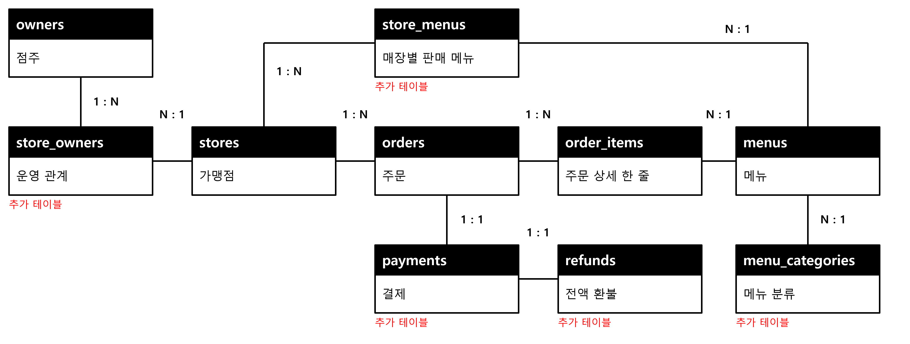

# 데이터베이스 프로젝트 1차 기획안

> 외식업 가맹점 운영 관리 서비스의 목적, 핵심 기능과 예상 데이터 구조를 정리한 초안이다.

## 1. 프로젝트명

외식업 가맹점 운영 관리 서비스

## 2. 프로젝트 주제 및 비즈니스 모델

프랜차이즈 본사 담당자가 여러 가맹점의 운영 현황을 확인할 수 있는 서비스를 만들고자 한다. 가맹점, 메뉴, 주문 정보를 연결해 관리하고, 기간별 가맹점 매출과 메뉴별 판매량을 비교하여 운영 의사결정을 돕는 것이 목적이다.

비즈니스 모델은 프랜차이즈 본사가 내부 업무에 사용하는 운영 관리 서비스이다. 본사는 가맹점별 현황을 확인하고 관리가 필요한 매장이나 메뉴를 살펴볼 수 있다. 이번 프로젝트에서는 본사 내부 사용을 가정하며, 외부 고객에게 판매하거나 구독료를 받는 방식은 범위에 포함하지 않는다.

## 3. 해결하고자 하는 문제

이 프로젝트에서는 본사가 여러 가맹점에서 발생한 주문과 판매 정보를 종합하여 매장별 운영 상황을 비교하기 어렵다는 문제를 해결하고자 한다. 

예를 들어 본사 담당자가 지난달 가맹점별 매출과 메뉴별 판매량을 확인하려고 할 때, 매장별 자료의 기간이나 취소와 환불 처리 기준이 다르면 바로 비교하기 어렵다. 이때 주문 기록을 연결해 관리하고 같은 기준으로 집계하면, 합계의 근거가 되는 주문까지 확인할 수 있다.

이때 매장마다 개점일이나 영업일 수 등 비교 조건이 다를 수 있으므로, 매출의 차이만으로 운영에 문제가 있다고 판단하지는 않으며, 이 서비스는 현황을 확인하는 자료를 생성하는 데 초점을 둔다.

## 4. 주요 사용자

- 주요 사용자: 여러 가맹점의 운영 현황을 관리하는 프랜차이즈 본사 담당자
- 보조 사용자 후보: 자기 매장의 정보를 확인하는 가맹점주

1차에서는 본사 담당자의 사용을 우선 설계한다. 가맹점주의 직접 접속 기능과 구체적인 조회, 수정 권한은 이후 요구사항을 정리하면서 결정한다. `owners`는 업무상 점주를 뜻하며 로그인 계정과 같다고 가정하지 않는다.

## 5. 핵심 기능

1. **가맹점과 메뉴 관리:** 가맹점 기본 정보와 메뉴 정보를 등록, 조회, 수정한다. 사용하지 않는 메뉴는 판매 중지 상태로 관리하는 방안을 검토한다.
2. **주문 등록 및 상세 조회:** 가맹점과 메뉴를 선택하고 수량, 주문 당시 단가를 입력한다. 주문 한 건에 포함된 상세 내역을 확인한다.
3. **기간별 가맹점 매출 비교:** 기간을 선택해 가맹점별 매출을 집계하고 매출순으로 정렬한다. 주문이 없는 가맹점도 0원으로 표시하는 것을 목표로 한다.
4. **메뉴별 판매량 조회:** 기간과 가맹점으로 검색 범위를 좁혀 메뉴별 판매 수량을 확인한다. 판매량은 주문 건수나 주문 상세 행 수와 구분한다.
5. **결제와 전액 환불 기록:** 주문의 결제 완료 여부와 전액 환불 내역을 확인하고 매출 집계에 반영한다.

실습용 가맹점, 메뉴, 주문 데이터를 준비하고, 앱에서도 주문을 직접 등록할 수 있도록 계획한다. 결제와 환불은 상태와 금액을 기록하는 모의 기능이며 실제 결제는 하지 않는다. 외부 POS, 배달 플랫폼, 결제 대행사 연동과 재고, 직원, 고객 관리, 부분 환불은 이번 초기 구현 범위에서 제외한다.

### 예상 사용 방식

본사 담당자가 가맹점과 메뉴를 등록한다. 샘플 주문을 불러오거나 앱에서 주문과 상세 항목을 입력한다. 이후 기간을 선택해 매출과 판매량을 조회하고, 궁금한 가맹점의 주문 내역을 확인한다. 전액 환불을 기록한 뒤 같은 조건으로 다시 조회해 집계 결과가 바뀌었는지 확인한다.

CRUD 중 삭제는 거래 기록의 보존 여부를 고려해 구분한다. 아직 주문에서 사용하지 않은 테스트용 메뉴 등은 삭제 대상으로 검토하고, 결제가 완료된 주문과 환불 이력은 보존한다. 

### 매출 집계의 초기 설계 가정

- 결제가 완료된 주문 금액을 매출에 포함한다.
- 결제 전 취소한 주문은 매출에서 제외한다.
- 전액 환불한 주문은 기록을 보존하되 매출 집계에서 제외한다.
- 부분 환불은 이후 확장 항목으로 남긴다.

이 기준은 프로젝트 초안을 위한 가정이며 아직 실제 프랜차이즈의 정책을 확인한 결과는 아니다. 기간을 주문일과 결제일 중 어느 날짜로 구분할지, 또는 이전 기간의 주문이 나중에 환불되면 어느 기간에 반영할지 등은 2차 단계에서 정한다. 주문 상태와 결제 상태는 서로 다른 정보로 다루되, 구체적인 상태 목록과 변경 순서도 이후 보완한다.

메뉴별 판매량은 우선 결제 완료되고 전액 환불되지 않은 주문 항목의 수량 합계를 사용하는 방안으로 한다. 이는 추가 검토할 가정이며 매출 기준과 함께 확인한다.

## 6. 예상 테이블 구성 및 데이터 구조

기존 5개 후보를 바탕으로 총 10개 테이블을 제안한다. 추가 후보는 아래에 따라 검토한다. 데이터베이스 이름은 `franchise_operations_db`, 스키마 이름은 `operations`를 후보로 한다.

### 기존 답안에서 이어가는 5개 테이블

1. **가맹점 `stores`**
   - 한 행: 가맹점 한 곳의 기본 정보.
   - 주요 열 후보: `store_id`(PK), `store_code`, `store_name`, `address`, `phone`, `opened_on`.
   - 역할: 주문이 발생한 매장을 식별하고 매출을 가맹점별로 묶는 기준이 된다. Chapter 04의 기본 정보 6개 열을 유지한다.
2. **가맹점주 `owners`**
   - 한 행: 가맹점주 한 명.
   - 주요 열 후보: `owner_id`(PK), `owner_code`, `owner_name`.
   - 역할: 점주 정보를 가맹점마다 반복해서 저장하지 않고 관리한다. 실습에는 가상의 이름과 코드를 사용한다.
3. **메뉴 `menus`**
   - 한 행: 본사에서 관리하는 메뉴 한 개.
   - 주요 열 후보: `menu_id`(PK), `category_id`(FK 후보), `menu_code`, `menu_name`, `base_price`.
   - 역할: 공통 메뉴 정보를 관리한다. 기본 가격이 바뀌어도 과거 주문 당시 가격은 별도로 보존한다.
4. **주문 `orders`**
   - 한 행: 특정 가맹점에서 발생한 주문 한 건.
   - 주요 열 후보: `order_id`(PK), `store_id`(FK), `order_number`, `ordered_at`, `order_status`.
   - 역할: 주문 시각과 가맹점 등 주문 전체에 해당하는 정보를 저장한다.
5. **주문 항목 `order_items`**
   - 한 행: 한 주문에 포함된 주문 상세 한 줄.
   - 주요 열 후보: `order_item_id`(PK), `order_id`(FK), `menu_id`(FK), `line_number`, `quantity`, `unit_price_at_order`.
   - 역할: 한 주문에 여러 메뉴가 포함되는 구조를 표현한다. 같은 메뉴라도 옵션이나 단가, 할인 조건에 따라 별도 행이 될 수 있다. 옵션과 할인 기능의 실제 구현 범위는 추후 정한다.

### 이번 초안에서 추가로 제안하는 5개 테이블

6. **가맹점 운영 관계 `store_owners`**
   - 한 행: 점주 한 명과 가맹점 한 곳의 현재 운영 관계.
   - 주요 열 후보: `store_owner_id`(PK), `store_id`(FK), `owner_id`(FK). 두 FK의 조합은 중복을 막는 후보이다.
   - 필요성: 한 매장을 여러 점주가 함께 운영하는 경우를 표현한다.
   - **검토 가정:** 한 점주가 여러 매장을 운영하는 것만 허용한다면 `stores`에 `owner_id`(FK)를 두는 1:N 관계로 충분하다. 한 매장에 점주가 여러 명일 수 있을 때 이 연결 테이블이 필요하다. 소유 지분과 운영 이력은 이번 초안에서 다루지 않는다.
7. **메뉴 분류 `menu_categories`**
   - 한 행: 메뉴 분류 한 개.
   - 주요 열 후보: `category_id`(PK), `category_name`.
   - 필요성: 음식, 음료 등 공통 분류를 관리하고 분류별 검색에 사용한다.
   - **검토 가정:** 메뉴 한 개는 분류 한 개에 속하는 방안을 제안한다. 분류 이름을 메뉴마다 다르게 입력하는 문제를 줄일 수 있다.
8. **가맹점별 판매 메뉴 `store_menus`**
   - 한 행: 가맹점 한 곳과 메뉴 한 개의 판매 설정.
   - 주요 열 후보: `store_menu_id`(PK), `store_id`(FK), `menu_id`(FK), `is_available`. 가맹점과 메뉴 조합은 중복을 막는 후보이다.
   - 필요성: 해당 가맹점에서 판매하는 메뉴인지, 현재 판매 가능한지 확인한다.
   - **검토 가정:** 가맹점마다 판매 메뉴 또는 판매 여부가 다를 수 있다고 본다. 매장별 가격까지 다르게 설정할지는 미정이며, 현재 후보에는 별도 판매 가격을 넣지 않았다.
9. **결제 `payments`**
   - 한 행: 주문 한 건에 대한 결제 기록.
   - 주요 열 후보: `payment_id`(PK), `order_id`(FK), `paid_amount`, `paid_at`, `payment_status`.
   - 필요성: 주문 접수와 결제 완료를 구분하고 결제 금액과 시각을 관리한다.
   - **검토 가정:** 초기 구현에서는 주문당 결제 기록을 최대 한 건으로 단순화한다. 분할 결제와 결제 재시도 이력은 제외하며 `order_id`의 UNIQUE 적용을 검토한다.
10. **전액 환불 `refunds`**
    - 한 행: 완료된 결제 한 건의 전액 환불 기록.
    - 주요 열 후보: `refund_id`(PK), `payment_id`(FK), `refund_amount`, `refunded_at`, `reason`.
    - 필요성: 원래 결제를 지우지 않고 환불 시각, 금액, 사유를 남긴다.
    - **검토 가정:** 결제당 완료된 전액 환불은 최대 한 건으로 제한한다. `payment_id`의 UNIQUE 적용과 환불 금액이 결제 금액과 같은지 검증하는 방안을 검토한다.

### 주요 관계와 설계 이유

- 가맹점 한 곳에는 여러 주문이 연결된다. 각 주문은 하나의 가맹점을 참조하므로 `stores`와 `orders`는 1:N 관계이다.
- 한 주문에는 여러 주문 항목이 연결되고, 한 메뉴는 여러 주문 항목에서 참조된다. 주문과 메뉴의 N:M 관계를 `order_items`로 풀어 수량과 주문 당시 단가를 함께 저장한다.
- 점주와 가맹점의 N:M 관계는 `store_owners`로 표현하는 안이다. 이 관계는 공동 운영을 허용한다는 가정에 달려 있다.
- 가맹점과 메뉴의 N:M 관계는 `store_menus`로 표현하는 안이다. 주문 등록 시 선택한 메뉴가 해당 매장에서 판매 가능한지도 검증해야 한다.
- 분류 한 개에는 여러 메뉴가 속한다는 1:N 관계를 제안한다.
- 주문 한 건의 결제 기록과 결제 한 건의 전액 환불 기록은 각각 0건 또는 1건으로 단순화하는 안이다. 취소된 미결제 주문은 결제 기록이 없을 수 있다.

PK는 각 행을 구분하고, FK는 없는 가맹점이나 주문을 참조하는 기록을 막는 데 사용한다. 기본 가격과 주문 당시 단가를 분리하고, 월별, 분기별 매출은 주문, 결제, 환불 기록을 기준으로 계산하는 방향을 유지한다. 주문에 여러 항목이 있다는 이유로 결제 금액이 반복 합산되지 않도록 집계 대상을 구분할 계획이다.

### 예상 테이블 관계도

아래 그림은 위 테이블 후보를 바탕으로 그린 예상 관계도이며, 실제 데이터베이스에서 추출한 최종 ERD가 아니다. '추가 테이블'로 표시한 5개는 이번 초안에서 새로 제안한 테이블이다. 분류 한 개에는 여러 메뉴가 속하고, 각 메뉴는 한 분류를 참조한다. 그림의 결제와 환불의 1:1 관계는 주문당, 결제당 최대 한 건으로 단순화한 가정이며, 결제나 환불 기록이 없는 경우도 있다. 2차 단계에서 ERD 초안으로 구체화한다.

### 확인할 설계 질문

- 공동 운영과 여러 매장 운영을 허용할 것인가?
- 가맹점별 판매 메뉴와 가격을 어디까지 다르게 관리할 것인가?
- 매출 조회 기간의 기준 날짜와 기간을 넘긴 환불은 어떻게 처리할 것인가?
- 판매량에서 환불 수량을 어떻게 반영할 것인가?
- 본사와 점주의 조회, 수정 권한은 어떻게 구분할 것인가?

이 질문에 대한 답에 따라 테이블 구성을 수정하고, 최종 단계에서 의미 있는 테이블이 10개 이상인지 다시 확인한다.

## 7. 향후 구현 계획

### 단계별 목표

- **1차 기획:** 서비스 목적, 사용자, 핵심 기능과 테이블 후보를 설명하고 피드백을 받는다.
- **2차 고도화:** 미확정 업무 규칙을 검토하고 가맹점 관리, 주문 상세, 매출 비교 화면의 흐름과 ERD 초안을 만든다.
- **3차 분석과 설계:** 테이블 명세, PK와 FK, 정규화와 제약조건을 정리한다. PostgreSQL과 DBeaver로 샘플 데이터와 주요 SQL을 검증한다. 
- **4차 최종 구현:** 데이터베이스와 연결되는 웹 앱에서 주요 CRUD와 집계 기능을 시연한다. 실행 방법과 설계 변경 이유를 GitHub에 정리한다. 

PostgreSQL을 데이터베이스로 사용하고 DBeaver에서 SQL을 확인할 계획이다. 웹 화면과 서버의 구체적인 개발 도구는 요구사항을 정리한 뒤 선택한다. 생성형 AI는 코드와 설계를 제안하는 도구로 활용하되, 제안의 수용, 수정, 거절 이유를 기록하고 실제 결과를 확인한다.

### 적용할 데이터베이스 개념과 검증 계획

- **JOIN:** 주문, 가맹점, 메뉴를 연결해 주문 상세를 조회한다. 매출 집계에서는 가맹점 목록을 기준으로 주문이 없는 매장이 빠지지 않는지도 확인한다.
- **집계:** 매출은 결제와 환불 기준으로 계산하고 판매량은 주문 항목의 수량을 합산한다. JOIN 후 `COUNT(*)`를 주문 수나 판매 수량으로 착각하지 않는다.
- **서브쿼리:** 가맹점별 매출을 구한 결과에서 평균 이상인 가맹점을 찾는 조회를 검토한다. 평균에 포함할 가맹점의 범위도 정한다.
- **무결성:** 없는 주문의 항목 등록, 중복 가맹점 코드, 0 이하 수량 등을 막는 제약조건을 검토한다. 다른 행의 결제 금액과 환불 금액을 비교하는 규칙은 단순 열 CHECK만으로 해결한다고 가정하지 않는다.
- **트랜잭션:** 주문과 주문 항목을 함께 저장하다가 일부가 실패하면 전체를 되돌리는 업무에 적용한다. 환불 기록의 중복 처리도 검토한다.
- **인덱스:** 가맹점과 기간으로 주문을 자주 조회하는 경우 `orders(store_id, ordered_at)` 등을 후보로 두고, 실제 조회 조건과 실행 계획에 맞춰 판단한다.

샘플에는 여러 메뉴가 있는 주문, 같은 메뉴가 두 상세 행에 나뉜 주문, 주문이 없는 가맹점, 미결제 취소와 전액 환불을 포함할 계획이다. 실행 전에 예상 합계를 직접 계산하고 SQL 결과와 비교한다. JOIN 후 결제 금액이 중복 합산되거나 주문 없는 매장이 누락되는지도 확인한다.

### 기존 과제에서 발전한 내용

Chapter 01~02의 가맹점, 점주, 메뉴, 주문, 주문 항목을 출발점으로 삼았다. Chapter 03에서 수정한 주문 상세 한 줄의 의미와 Chapter 04에서 정한 가맹점 기본 정보를 유지했다. 이번에는 본사 사용 흐름을 중심으로 기능 범위를 좁히고, 판매 설정과 결제, 환불 등을 분리하는 10개 후보를 제안했다. 추가 후보와 업무 가정은 발표 피드백을 받아 수정할 예정이다.
